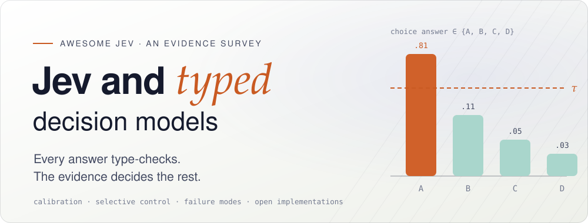

<!-- Generated by scripts/render-readme.py from data/*.json. Edit the data, then run `python3 scripts/build.py`. -->

<div align="center">
  <a href="https://eurekaleo.github.io/awesome-jev-survey/">
    <picture>
      <source media="(prefers-color-scheme: dark)" srcset="assets/readme/hero-banner-dark.svg">
      <source media="(prefers-color-scheme: light)" srcset="assets/readme/hero-banner-light.svg">
      
    </picture>
  </a>

  <p><strong><em>⭐ Star us if you find this useful!</em></strong></p>

  <a href="https://eurekaleo.github.io/awesome-jev-survey/"></a>
  <a href="paper/main.pdf"></a>
  <a href="data/"></a>
  <a href="CHANGELOG.md"></a>
  <a href="#citation-and-licence"></a>
  <a href="https://awesome.re"></a>

  <p><a href="https://eurekaleo.github.io/">Meng Luo</a></p>
</div>


## About the survey

Jev is a hosted model from TypeSafe AI, released on 15 September 2026 as its first “System One” model. Software sends a text state and typed questions; the model answers from the declared options with probabilities and never writes free text. Open projects now copy its shape. This repository reads the studies of TypeSafe’s Jev and Jev-like typed decision models, audits the open resources and traces every number to its source.

> [!IMPORTANT]
> **Four questions guide the survey.** **Meaning:** what do the probabilities mean? **Action:** when should software act on them? **Failure:** where do typed decisions fail? **Openness:** what do open implementations release?

> [!NOTE]
> Numbers are as reported by paper authors, the vendor or repository maintainers. Nothing here is a unified leaderboard, and nothing was re-run.

<p align="center"></p>
<p align="center"><sub>The evidence so far: studies by day since Jev’s launch, coloured by how each relates to Jev (figure from the survey manuscript).</sub></p>

**Explore:** [Evidence map](https://eurekaleo.github.io/awesome-jev-survey/#map) · [Findings](https://eurekaleo.github.io/awesome-jev-survey/#findings) · [Failure modes](https://eurekaleo.github.io/awesome-jev-survey/#failures) · [Open ecosystem](https://eurekaleo.github.io/awesome-jev-survey/#ecosystem) · [Literature search](https://eurekaleo.github.io/awesome-jev-survey/#literature) · [Survey (PDF)](paper/main.pdf)

**What’s new**

- **2026-10-07 · v0.3.1** — Studies from the 7 October arXiv listing, each read in full.
- **2026-10-07 · v0.3.0** — Literature through early October 2026.
- **2026-09-24 · v0.2.0** — Four new core studies from the 24 September arXiv listing.

Every release is listed in the [changelog](CHANGELOG.md).


## Repository guide

[Findings](#findings) · [Studies of hosted Jev](#studies-of-hosted-jev) · [Open and independent Jev-like models](#open-and-independent-jev-like-models) · [Systems built on typed decisions](#systems-built-on-typed-decisions) · [Peripheral study](#peripheral-study) · [Open ecosystem](#open-ecosystem) · [Background references](#background-references) · [Related reviews and catalogues](#related-reviews-and-catalogues) · [Method](#method) · [Contributing](#contributing) · [Contributors](#contributors) · [Star history](#star-history) · [Citation and licence](#citation-and-licence)

## Choose a section

Select a card to jump directly to its section.

<p align="center">
  <a href="#findings"></a>
  <a href="#studies-of-hosted-jev"></a>
  <a href="#open-and-independent-jev-like-models"></a>
  <br>
  <a href="#systems-built-on-typed-decisions"></a>
  <a href="#open-ecosystem"></a>
  <a href="#background-references"></a>
</p>

## Reading the tables

Study tables give the date of the first arXiv version and the headline as its authors report it. The links after a study’s name point to its released material; no link means none was located, which is not the same as absent. ¹ marks studies that share authors with others here: read them together, not as independent replications.

Open-model availability uses these marks:

| Mark | Meaning |
| :-: | --- |
| ● | Available |
| ◐ | Partially available |
| ◑ | Restricted |
| ◔ | Project page only |
| ○ | Not located — not the same as absent |
| – | Not applicable |

---


## Findings

Each finding is a synthesis across studies; open one to read it with its key evidence.

<details>
<summary><b>F1 · A type-valid answer can still be the wrong answer.</b></summary>

Typed interfaces remove parse and schema failures by construction. They do not ensure that the model reads the options the way the author meant: short labels can outweigh written definitions, rebinding names to rubrics can reverse a ranking, a middle option can absorb errors, and when the right answer is missing the model usually picks a wrong option instead of the exit. Order effects can change many individual answers while aggregate accuracy stays flat. The type-error rate stays at zero throughout.

**Key evidence**

- **[Type-Safe Is Not Error-Free](https://arxiv.org/abs/2609.26758v2)** — Hosted Jev AUROC .8146 → .5806 after name–rubric swap; 0% type errors
- **[Labels Override Definitions](https://arxiv.org/abs/2610.02586v1)** — The label wins over the definition — and the cause is one rendering line
- **[Ordinal-Scale Bias](https://arxiv.org/abs/2609.38827v1)** — ANLI: Neutral absorbs 51% of errors, at every position

</details>

<details>
<summary><b>F2 · A native probability makes calibration measurable, not guaranteed.</b></summary>

Every call returns a distribution, so reliability can be audited on each run. Measured calibration varies by task, construct and language; probabilities can rank well yet sit badly against a fixed threshold; temperatures fitted on a few options transfer poorly to many; and confidence stays high where the model lacks the knowledge. Thresholds and recalibration fitted on separate data help, but only for the workload they were fitted on.

**Key evidence**

- **[Decision Models for CSS Annotation](https://arxiv.org/abs/2609.24574v2)** — Median ECE 0.157 vs 0.066 for the best (verbalised) LLM
- **[Benchmarking Jev (37 datasets)](https://arxiv.org/abs/2609.37647v1)** — Binary probabilities rank well; fixed 0.5 threshold does not
- **[Decision Gates Benchmark](https://arxiv.org/abs/2610.00346v1)** — Threshold for 5% risk still admits 31% of out-of-scope requests

</details>

<details>
<summary><b>F3 · The most consistent use is a bounded first pass with confidence-gated escalation.</b></summary>

Across judging, annotation, moderation, intrusion detection, infrastructure triage and agents, the typed model is usually cheaper and faster but not the most accurate component. Gains appear when uncertain cases go to a stronger model or a person and thresholds are frozen on separate data; the strongest designs fix them in advance and test on new workloads. Savings shrink once pre-screen costs, held-out misses and cheap trained classifiers are counted, so those belong in the comparison.

**Key evidence**

- **[HydroJEV](https://arxiv.org/abs/2610.02048v1)** — Pre-registered gate: a third of SCADA reviews offloaded, accuracy kept
- **[JEV-as-a-Judge](https://arxiv.org/abs/2609.26550v4)** — Pre-specified live test: matched GPT-6 exactly, 74% escalated
- **[Decision Models for CSS Annotation](https://arxiv.org/abs/2609.24574v2)** — Low-confidence routing matches the LLM at ¼–½ of its cost

</details>

<details>
<summary><b>F4 · Speed and cost claims decompose into different mechanisms and scopes.</b></summary>

Single-request latency, per-question amortized time, batch throughput, end-to-end task time, deadline attainment under load, simulated timing and API bills are different quantities. Prefix sharing, batching, caching and pruning can explain as much as the readout does; billing every option as input can erase the price advantage against batch-priced LLMs; and a faster step can make a slower agent. None of the figures can be pooled into a single leaderboard.

**Key evidence**

- **[Replacing LLMs with Jev at the Edge](https://arxiv.org/abs/2609.22753v2)** — With caching, latencies converge: the gain is in fresh decisions
- **[JevSpawn](https://arxiv.org/abs/2610.00437v1)** — Hosted Jev inside the agent: better on 3 of 8 tasks, 1.4–2.1× slower
- **[Fast Models, Slow Evidence](https://arxiv.org/abs/2610.02267v1)** — Self-audit: a 23.9% saving was really 4.3%

</details>

<details>
<summary><b>F5 · Interface compatibility is not mechanism equivalence.</b></summary>

Open projects reproduce the request and response shape with encoders, encoder–decoders, frozen or fine-tuned decoders, diffusion reads and task-specialised models, and a frozen instruction-tuned LLM read through option identifiers can match community Jev-style models built on the same backbone. Their probabilities come from different mechanisms, they differ in what is released and in how reproducible they are, and none establishes the architecture of the commercial model. Rankings between hosted and open models change from task to task.

**Key evidence**

- **[LLM-as-Jev](https://arxiv.org/abs/2610.02076v2)** — A frozen 4B LLM already matches community Jev-style models
- **[Fast Models, Slow Evidence](https://arxiv.org/abs/2610.02267v1)** — Hosted answers drift day to day (0.5%); open model reproduces exactly
- **[Dyad](https://arxiv.org/abs/2609.36116v1)** — Native typed-decision head: 86.2% vs Jev 85.0% on JevBench

</details>

<details>
<summary><b>F6 · System-level gains need module-level attribution and the right reference.</b></summary>

Memory systems, query engines, search agents, orchestration pipelines and scientific workflows improve for many reasons at once. Attribution requires ablations, matched baselines and references that measure what the workflow reuses. When code owns pruning, lookahead or simulation, the typed model can serve as a strong evaluator; when one call must both simulate and evaluate, or step errors compound over a long trajectory, the system gets worse even as each step gets faster.

**Key evidence**

- **[JEVal and InnerJev](https://arxiv.org/abs/2610.03935v1)** — Faster steps, slower agent: success 77.6% → 66.1%
- **[JEVDB](https://arxiv.org/abs/2610.02046v1)** — Semantic SQL: pruning + typed decisions finish 540K-pair joins
- **[Mnemon](https://arxiv.org/abs/2609.36059v1)** — Memory agent: LoCoMo 91.7% with Jev judging evidence (AUC 0.94)

</details>

<details>
<summary><b>F7 · The evidence base is young, clustered and unreplicated.</b></summary>

The core preprints appeared within weeks of the launch, mostly as a single version, and several were substantially revised soon after. Several author groups contribute more than one study, some benchmarks are built by teams that also rank their own models, many community results are self-reported, and one study’s audit of its own pipeline corrected its headline deployment numbers. Hosted answers drift from day to day. None of the core results has been independently reproduced.

**Key evidence**

- **[Fast Models, Slow Evidence](https://arxiv.org/abs/2610.02267v1)** — Hosted answers drift day to day (0.5%); open model reproduces exactly
- **[JevAdvBench](https://arxiv.org/abs/2609.31142v1)** — Identical re-run changes the Score value on 38.5% of Score questions
- **[HakemBench](https://arxiv.org/abs/2610.02293v1)** — Turkish typed decisions: Jev fourth of 16 at a tenth of the leader’s time

</details>

<details>
<summary><b>F8 · A calibrated probability is not a coherent belief.</b></summary>

Probabilities from the same model can break basic rules across related questions (a statement and its negation, single labels and their union), change the decision when the same question is asked through another interface, and pile mass on the most likely option far beyond its true chance. Average calibration certifies none of this. Check coherence across complementary questions and interfaces before treating outputs as beliefs, and prefer uses that only need the ranking.

**Key evidence**

- **[Probability Axioms](https://arxiv.org/abs/2609.33209v1)** — P(X) + P(not X) misses 1 by 0.064 (open LLM readout: 0.293)
- **[Probability Contracts](https://arxiv.org/abs/2609.37470v2)** — Two interfaces, same question: different decision on 32.8% of pairs
- **[Beyond Answer Confidence](https://arxiv.org/abs/2610.01006v1)** — Confidence ≠ knowing: +0.21–0.33 overconfidence past the knowledge boundary

</details>

<details>
<summary><b>F9 · Typed decisions read what the input states; they do not reliably compute what it implies.</b></summary>

Studies of arithmetic menus, exact numbers, graph structure, packet and sensor values, games and planning meet the same boundary: answers are strong when the needed fact is written in the state and weak when it must be counted, calculated or simulated. The vendor’s own guidance is to count, convert and compare in code. Letting code compute or simulate and asking the model to evaluate the result works better. Calculation-heavy benchmark items can still look easy when they may have been seen in training.

**Key evidence**

- **[Rejection Bottleneck](https://arxiv.org/abs/2609.39496v1)** — Present 99%, rejected when absent 7% — though Boolean checks get 99%
- **[Code Owns the Simulation](https://arxiv.org/abs/2610.01834v1)** — Evaluates what is described; does not simulate what is not
- **[GraphDecide](https://arxiv.org/abs/2610.06354v1)** — Reads every edge; counts degree right 68% of the time

</details>

<details>
<summary><b>F10 · A typed output does not make a decision safe from its inputs.</b></summary>

Because the answer depends on the state, text placed in the state can move it. Injected text rarely reached an attacker’s target in one study, while in another both context-ignoring injections and injections that supply false facts redirected nearly every decision; natural context and appended opinions flip confident answers; poisoned open checkpoints carry backdoors with clean accuracy intact; and confidence gates can themselves be attacked to drain capacity. Constrained outputs limit what an attacker can make the model say, not what it decides.

**Key evidence**

- **[Decision Hijacking](https://arxiv.org/abs/2609.28613v1)** — Injection shifts probabilities (+0.043) but rarely selects the target (1.8%)
- **[JevOut](https://arxiv.org/abs/2609.30243v1)** — Natural context flips 61% of correct decisions (vs 2% neutral)
- **[Hidden Risks of Jev](https://arxiv.org/abs/2610.04985v1)** — Poisoned open checkpoints: >89% targeted redirection, clean accuracy intact

</details>

<p align="right"><sub><a href="#repository-guide">↑ Back to guide</a></sub></p>


## Studies of hosted Jev

### October 2026

| Posted | Study | Headline (as reported) |
| --- | --- | --- |
| 6&nbsp;Oct | **[BOTTLED](https://arxiv.org/abs/2610.08775v1)** [[code](https://github.com/aktsonthalia/bottled)]<br><sub>Agent in a Bottle: Can LLM Agents Turn Their Capabilities Into Cheap, Scalable Artifacts?</sub> | Agent-built artifacts: 94–97% of Jev’s quality at 2–25% of its projected cost |
| 6&nbsp;Oct | **[System One Moderation](https://arxiv.org/abs/2610.07953v1)** [[code](https://github.com/FedericoMz/som-moderation-benchmark)]<br><sub>Benchmarking System One Models in Online Moderation</sub> | Precedents help Jev pick the right rule (+5 to +22 points); Laya barely moves |
| 5&nbsp;Oct | **[Political Science Replications](https://arxiv.org/abs/2610.06625v2)**<br><sub>JEV versus LLMs: Accuracy, Cost and Calibration on Seven Political Science Replications</sub> | Same accuracy, no cost advantage at batch prices |
| 5&nbsp;Oct | **[GraphDecide](https://arxiv.org/abs/2610.06354v1)**¹ [[code](https://github.com/VictorYXL/JevGraphBench)]<br><sub>GraphDecide: Benchmarking System One Models on Graph Tasks</sub> | Reads every edge; counts degree right 68% of the time |
| 4&nbsp;Oct | **[Hidden Risks of Jev](https://arxiv.org/abs/2610.04985v1)** [[code](https://github.com/shihe98/Security_Privacy_Jev)]<br><sub>Hidden Risks of Jev: An Empirical Study of Security, Privacy, and Dual Use</sub> | Typed outputs, hijacked inputs: up to 100% injection success |
| 3&nbsp;Oct | **[Wireless Decision-Making](https://arxiv.org/abs/2610.04345v1)**<br><sub>System One Models for Wireless Decision-Making:Applications and Performance Evaluation</sub> | Wireless control: 3.5–8.5× faster than LLMs; quality depends on the task |
| 2&nbsp;Oct | **[JEVal and InnerJev](https://arxiv.org/abs/2610.03935v1)** [[code](https://github.com/amazingljy1206/InnerJev)]<br><sub>General Decision Models: Benchmarking and Insights Beyond Jev</sub> | Right mode, wrong mass: 89% placed where the truth is 36% |
| 2&nbsp;Oct | **[Candidate Coverage and Transfer](https://arxiv.org/abs/2610.03387v2)** [[code](https://github.com/luckykevvv/Decision_Model_Benchmark)]<br><sub>Benchmarking candidate coverage and rejection policy transfer in typed decision models</sub> | Rejection thresholds do not travel: 69% false rejection after transfer |
| 2&nbsp;Oct | **[HateDecide](https://arxiv.org/abs/2610.03324v1)**<br><sub>To Jev or Not? Evaluating the Accuracy and Efficiency of Structured Decision Models for Hate-Speech Moderation</sub> | Definitions move 28% of answers — without reliably improving them |
| 1&nbsp;Oct | **[HydroJEV](https://arxiv.org/abs/2610.02048v1)** [[code](https://github.com/mutianwei521/hydrojev)]<br><sub>HydroJEV: A one-second, training-free screen for cyber-attack and fault attribution in water distribution networks</sub> | Pre-registered gate: a third of SCADA reviews offloaded, accuracy kept |
| 1&nbsp;Oct | **[HakemBench](https://arxiv.org/abs/2610.02293v1)**¹ [[code](https://github.com/ufakai/hakembench)]<br><sub>HakemBench: A Turkish Benchmark of Typed Decisions</sub> | Turkish typed decisions: Jev fourth of 16 at a tenth of the leader’s time |
| 1&nbsp;Oct | **[Code Owns the Simulation](https://arxiv.org/abs/2610.01834v1)**<br><sub>Code Owns the Simulation, Jev Owns the Evaluation</sub> | Evaluates what is described; does not simulate what is not |
| 1&nbsp;Oct | **[Fast Models, Slow Evidence](https://arxiv.org/abs/2610.02267v1)** [[code](https://github.com/David-DL-Space/sys1-eval)]<br><sub>Fast Models, Slow Evidence: A Paired and Self-Audited Evaluation of System-1 Decision Models for LLM Agent Harnesses</sub> | Hosted beats open on 9 of 11 harness decisions; routing at chance for both |
| 1&nbsp;Oct | **[Jev-IDS](https://arxiv.org/abs/2610.01079v1)** [[code](https://github.com/jev-sec/jev-ids)]<br><sub>Jev-IDS: System One Models for Network Intrusion Detection</sub> | Intrusion pilot: F1 0.859, 4.8× faster than an LLM |
| 1&nbsp;Oct | **[Beyond Answer Confidence](https://arxiv.org/abs/2610.01006v1)** [[code](https://github.com/Syntheme/beyond-answer-confidence)]<br><sub>Beyond Answer Confidence: A Controlled Audit of Self-Knowledge in a Black-Box Decision Model</sub> | Confidence ≠ knowing: +0.21–0.33 overconfidence past the knowledge boundary |

### September 2026

| Posted | Study | Headline (as reported) |
| --- | --- | --- |
| 30&nbsp;Sep | **[Recommendation Reranking](https://arxiv.org/abs/2609.40241v1)**<br><sub>Decision-Oriented Recommendation Reranking: An Empirical Study of Jev</sub> | Strong reranking quality; latency between local models and pointwise LLMs |
| 30&nbsp;Sep | **[Rejection Bottleneck](https://arxiv.org/abs/2609.39496v1)**<br><sub>When the Right Answer Is Missing: An Arithmetic-Dependent Rejection Bottleneck in Jev</sub> | Present 99%, rejected when absent 7% — though Boolean checks get 99% |
| 30&nbsp;Sep | **[Network Traffic Classification](https://arxiv.org/abs/2610.00376v1)**<br><sub>A First Glance at Jev for Network Traffic Classification: Accuracy, Processing Time, and Cost</sub> | Packet numbers in, 28% accuracy out — trees trained on 8k records reach 70% |
| 30&nbsp;Sep | **[Ordinal-Scale Bias](https://arxiv.org/abs/2609.38827v1)** [[code](https://github.com/Glax147/jev_ordinal_scale_bia)]<br><sub>More Choices, Fewer Decisions: Ordinal-Scale Bias in JEV-like Direct-Decision Models</sub> | ANLI: Neutral absorbs 51% of errors, at every position |
| 29&nbsp;Sep | **[Decision Gates Benchmark](https://arxiv.org/abs/2610.00346v1)**¹<br><sub>Benchmarking System One decision models against trained classifiers and language models for automated decision gates</sub> | Threshold for 5% risk still admits 31% of out-of-scope requests |
| 29&nbsp;Sep | **[Benchmarking Jev (37 datasets)](https://arxiv.org/abs/2609.37647v1)** [[code](https://github.com/AppliedMachineLearning-Lab/jev-benchmarking)]<br><sub>Evaluating and Benchmarking the System One Model Jev</sub> | Ahead of a 27B open LLM on 27/37 datasets; pooled Choice ECE 0.028 |
| 28&nbsp;Sep | **[Cultural Values Audit](https://arxiv.org/abs/2609.36399v2)**<br><sub>Calibrated to Whom? Persona and Language Effects on Cultural Values in JEV</sub> | Persona shifts reproduce 87% (English) vs 62% (Arabic) of a human difference |
| 28&nbsp;Sep | **[Training-Free HAR](https://arxiv.org/abs/2609.36154v1)**<br><sub>More Features Are Not More Evidence: Limits of Training-Free Human Activity Recognition with Jev</sub> | Sensor activity recognition from text: macro-F1 ≤ 0.12 |
| 28&nbsp;Sep | **[Sys1Cal-v1](https://arxiv.org/abs/2609.35342v1)**<br><sub>Jev thinks "I don't know'', but doesn't say it: Introducing Sys1Cal-v1 Dataset for Probability Calibration</sub> | Known-probability test: Noul 0.92, Score 0.89, Choice 0.76 |
| 28&nbsp;Sep | **[Decide, Don’t Generate (ABSA)](https://arxiv.org/abs/2609.35293v1)** [[code](https://github.com/ZhangYiqun018/jev-dimabsa)]<br><sub>Decide, Don't Generate: Competitive Dimensional ABSA with Jev's Typed Decisions</sub> | SemEval ABSA: best regression error with 488 fitted coefficients |
| 28&nbsp;Sep | **[Source-Position Coherence](https://arxiv.org/abs/2609.35286v1)** [[code](https://github.com/MicheleLoi/Petri_studies)]<br><sub>The Argument and the Letterhead: Source-Position Coherence in AI Evaluation</sub> | Jev’s argument scores move with the stated source |
| 28&nbsp;Sep | **[JevVibe](https://arxiv.org/abs/2609.34963v1)**<br><sub>JevVibe: Efficient Classification-Guided Secure Code Generation</sub> | CWE triage: Top-1 0.46 vs 0.50 (frontier) at 1/56 of the cost |
| 28&nbsp;Sep | **[Agent Trace Security Judge](https://arxiv.org/abs/2609.34862v1)**<br><sub>JEV as a Judge for Agent Trace Security: An Empirical Comparison with Generative LLM Judges</sub> | Trace security: F1 77.8 vs 74.1 for the best LLM judge |
| 28&nbsp;Sep | **[Video Anomaly Readouts](https://arxiv.org/abs/2609.34180v1)**<br><sub>Decision Readouts for Text-Mediated Video Anomaly Detection: An Exploratory Evaluation of Jev and Qwen</sub> | Same evidence, different readout: +18 AP on one dataset, none on the other |
| 27&nbsp;Sep | **[Jev in Medicine](https://arxiv.org/abs/2609.34024v3)**<br><sub>Jev in Medicine: A Benchmark Evaluation</sub> | Medicine: parity on abstracts, −22 points on diagnostic cases |
| 27&nbsp;Sep | **[Do Decisions Add Up?](https://arxiv.org/abs/2609.33971v1)** [[code](https://github.com/samanjoy2/system-one-coherence)]<br><sub>Do System One Decisions Add Up? A Study of Probabilistic Coherence</sub> | Staged decisions disagree with direct ones; Jev loses 22.9 points on CLINC150 |
| 27&nbsp;Sep | **[Probability Contracts](https://arxiv.org/abs/2609.37470v2)**<br><sub>Probability Contracts: Accuracy, Coherence, and Decisions Across LLM Interfaces</sub> | Two interfaces, same question: different decision on 32.8% of pairs |
| 27&nbsp;Sep | **[Typed Decisions for 5G Control](https://arxiv.org/abs/2609.33689v1)**<br><sub>Type-Safe Decision Frameworks for Agentic 5G Control: A Theory-Driven Testbed Characterization of Where They Can Be Applied</sub> | Hosted Jev never meets 100 ms near-RT deadlines (warm p50 281 ms) |
| 27&nbsp;Sep | **[Speech Neuroprosthesis Rescoring](https://arxiv.org/abs/2609.33538v1)** [[code](https://github.com/gabrycina/how-much-language-model)]<br><sub>Jev Matches 7B Language Models for Speech-Neuroprosthesis Rescoring</sub> | Rescoring: WER 7.5% vs 7.8% for 7B LLMs, no GPU needed |
| 27&nbsp;Sep | **[Agent Security Decisions](https://arxiv.org/abs/2609.33401v3)** [[code](https://github.com/yxsec/system-one-security-eval)]<br><sub>Evaluating System One Models for Agent Security Decisions: Reliability, Calibration, and Selective Automation</sub> | Safe automation coverage: 7.6% (symmetric) → 47% (separate thresholds) |
| 27&nbsp;Sep | **[Probability Axioms](https://arxiv.org/abs/2609.33209v1)** [[code](https://github.com/bro789/typed-decision-coherence)]<br><sub>Beyond Calibration: Do a Typed-Decision Model's Probabilities Obey the Probability Axioms?</sub> | P(X) + P(not X) misses 1 by 0.064 (open LLM readout: 0.293) |
| 25&nbsp;Sep | **[JevAdvBench](https://arxiv.org/abs/2609.31142v1)** [[code](https://jevadvbench.github.io/JevAdvBench/)]<br><sub>JevAdvBench: A Benchmark and Black-Box Attacks for Reinforcement Learning for Calibrated Decisions Models</sub> | An appended opinion flips 12% and drains 38% of confident answers below the gate |
| 24&nbsp;Sep | **[Biosecurity Audit](https://arxiv.org/abs/2609.30454v1)** [[code](https://github.com/Georgakopoulos-Soares-lab/biosafety_knowledge_jev)]<br><sub>Auditing System-1 Models on Biosecurity-Relevant Benchmarks: Calibration, Selective Prediction, and Permutation Instability in a Non-Generative Model</sub> | Confidence = chance-normalised max probability; pooled ECE 0.034 |
| 24&nbsp;Sep | **[JevOut](https://arxiv.org/abs/2609.30243v1)** [[code](https://github.com/xzx34/JevOut)]<br><sub>JevOut: Natural Context Can Flip Decision Models</sub> | Natural context flips 61% of correct decisions (vs 2% neutral) |
| 24&nbsp;Sep | **[Jev as a Rubric Judge](https://arxiv.org/abs/2609.29769v2)**<br><sub>JEV vs. LLMs as Rubric Judges: Cheaper, Faster, and Wrong in the Same Places</sub> | Parity on most rubric criteria at 1/16–1/325 of the cost |
| 24&nbsp;Sep | **[Just Ask Jev](https://arxiv.org/abs/2609.29429v1)** [[code](https://github.com/sumleo/RLCDAlignBench)]<br><sub>Just Ask Jev: Reinforcement Learning for Calibrated Decisions as a Zero-Shot Detector of AI Alignment Failures</sub> | Zero-shot failure detection: median AUROC 0.886 at 1/63 of judge cost |
| 23&nbsp;Sep | **[Decision Hijacking](https://arxiv.org/abs/2609.28613v1)**¹<br><sub>Decision Hijacking: Prompt Injection Attacks on Jev's Typed Probabilistic Decisions</sub> | Injection shifts probabilities (+0.043) but rarely selects the target (1.8%) |
| 23&nbsp;Sep | **[NumericJev](https://arxiv.org/abs/2609.28587v1)** [[code](https://github.com/Bring-AI/JevNext)]<br><sub>NumericJev: Jev-like LLM Numerical Decoding with Multiway Decision Trees</sub> | Range refinement: 83.4% within 5% vs 80.5% direct choice |
| 23&nbsp;Sep | **[Jev on Contract Inference](https://arxiv.org/abs/2609.27678v1)** [[code](https://github.com/ZF-Utokyo/Jev-Benchmark)]<br><sub>Same Scores, Different Decisions: Evaluating JEV and Language Models for Legal Document Understanding</sub> | $0.000228 and 1.24 s per contract — lowest of ten models |
| 23&nbsp;Sep | **[Jev as a Radiology Report Judge](https://arxiv.org/abs/2609.27607v1)**<br><sub>Can Jev Judge Radiology Reports? Evaluating a System One Model for Clinical Factuality</sub> | Kendall τ 0.573 / 0.398 with expert error counts; beats open NLI |
| 22&nbsp;Sep | **[Type-Safe Is Not Error-Free](https://arxiv.org/abs/2609.26758v2)** <sub>(code claimed, not found)</sub><br><sub>Type-Safe Is Not Error-Free: A Constrained Decision Head Follows the Option Name, Not the Rubric Bound to It</sub> | Hosted Jev AUROC .8146 → .5806 after name–rubric swap; 0% type errors |
| 22&nbsp;Sep | **[JEV-as-a-Judge](https://arxiv.org/abs/2609.26550v4)** <sub>(code claimed, not found)</sub><br><sub>JEV-as-a-Judge: Accept When Confident, Escalate When Unsure</sub> | Within 3 points of GPT-6 where the verdict can be read off the text |
| 22&nbsp;Sep | **[REFLEX with Jev](https://arxiv.org/abs/2609.26532v1)**¹<br><sub>REFLEX with Jev for Efficient Selective Control in LLM Agents</sub> | 95% success with 1.12 strong calls/task vs 88% and 4.10 (−72.7%) |
| 21&nbsp;Sep | **[Jev for Scientific Decisions](https://arxiv.org/abs/2609.24965v2)**<br><sub>Jev for Scientific Decisions: Evaluating Semantic Choices and Their Consequences</sub> | Full semantic correctness; median 0.335 s, p95 0.442 s |
| 21&nbsp;Sep | **[Pregnancy in Crash Narratives](https://arxiv.org/abs/2610.00213v1)**¹ [[code](https://github.com/pozapas/pregnancy-crash-narratives)]<br><sub>Counting the Uncounted: Population-Level Surveillance of Documented Pregnancy and Fetal Harm in Police Crash Narratives with a System One Model (Jev)</sub> | Population-scale reading audited by blind coders: sensitivity 0.999 |
| 21&nbsp;Sep | **[Decision Models for CSS Annotation](https://arxiv.org/abs/2609.24574v2)** [[code](https://github.com/hazemibrahim97/decision-models-css/blob/45b71ce8403eababae18cc51dda5ecb6d67e05e4/README.md)]<br><sub>Evaluating Decision Models for Text Annotation in Computational Social Science</sub> | Behind best LLM on 14/15 tasks (−11.6 F1) at 44× lower cost |
| 21&nbsp;Sep | **[JEVQA](https://arxiv.org/abs/2609.24395v1)**<br><sub>JEVQA - Video Quality from Metadata, Bitstream, and Pixel Features with a General-Purpose Decision Model</sub> | PLCC vs VMAF: 0.737 (metadata) → 0.824 (+bitstream, pixel) |
| 21&nbsp;Sep | **[Calibrated Decisions at Scale](https://arxiv.org/abs/2609.24052v1)**¹ [[code](https://github.com/pozapas/jev-calibrated-narrative-coding/blob/850fe4f0db35f165b56247a53d786cd1dfc12302/README.md)]<br><sub>Calibrated Decisions at Scale: Converting Police Crash Narratives into Probabilistic Crash Variables with a System One Model (Jev)</sub> | 499,500 narratives screened for $25.23; 195,857 fully coded |
| 19&nbsp;Sep | **[Intent at RIC Timescales](https://arxiv.org/abs/2609.23136v2)**¹<br><sub>Intent Interpretation at RIC Timescales: Jev Decision Models versus Large Language Models in 6G Open RAN</sub> | Meets the 1 s RIC budget on 99.8% of calls (LLMs: 17.9%, 0%) |
| 19&nbsp;Sep | **[Replacing LLMs with Jev at the Edge](https://arxiv.org/abs/2609.22753v2)**¹<br><sub>Replacing Large Language Models with Jev Decision Models for Low-Latency Edge Service Orchestration</sub> | Median decision latency −22.7% to −64.5% vs the fastest LLM |

<p align="right"><sub><a href="#repository-guide">↑ Back to guide</a></sub></p>


## Open and independent Jev-like models

### October 2026

| Posted | Study | Headline (as reported) |
| --- | --- | --- |
| 6&nbsp;Oct | **[SanSi](https://arxiv.org/abs/2610.07730v1)**<br><sub>SanSi: A Looped Typed Decision Model for System 1.5 Thinking</sub> | Looping a small decision model: +13.5 points at 7.7× compute |
| 6&nbsp;Oct | **[Readout Stability](https://arxiv.org/abs/2610.07716v1)** [[code](https://github.com/rlisml/jev-cascade)]<br><sub>Readout Stability in Prefill-Only Decision Models:Zero-Label Prediction and Inference-Time Compute Allocation</sub> | Menu changes are predictable offline for decision models, not for generative LLMs |
| 5&nbsp;Oct | **[SharedKV-BT](https://arxiv.org/abs/2610.07327v1)**<br><sub>SharedKV-BT: Node-Local Typed Decisions for Behavior-Tree Agents</sub> | Node-local candidates: 113/120 correct decisions against 90/120 |
| 5&nbsp;Oct | **[CLM-as-a-Judge](https://arxiv.org/abs/2610.07177v1)**¹ [[code](https://arxiv.org/src/2610.07177v1/anc)]<br><sub>CLM-as-a-Judge: Evaluating an Open Contrastive Decision Model on Public Judge Benchmarks</sub> | Open contrastive decision model judges near chance, but ignores answer order |
| 5&nbsp;Oct | **[ufakzeka-karar](https://arxiv.org/abs/2610.06744v1)**¹ [[code](https://github.com/ufakai/ufakzeka-karar)]<br><sub>ufakzeka-karar: An Open Turkish Typed-Decision Model with Order-Invariant Option Scoring</sub> | Order invariance by construction; sequential heads still flip 2–3% |
| 4&nbsp;Oct | **[Fiorillo](https://arxiv.org/abs/2610.07019v1)** [[code](https://github.com/johann-e-li/fiorillo)]<br><sub>Calibrated Answers About Randomized Trials From a 4-Billion-Parameter Open Model: A Registered Test and a License-Clean Release</sub> | Registered test passed: ECE 0.017, macro-F1 0.92 against 0.87 for a 31B model |
| 4&nbsp;Oct | **[SearchJev](https://arxiv.org/abs/2610.05107v1)** [[code](https://github.com/EvoScientist/SearchJev)]<br><sub>SearchJev: A Fast and Calibrated System-1 Model for Search Agents</sub> | Task-specialised open model beats Jev on rewriting, trails on routing |
| 4&nbsp;Oct | **[CrystalJev](https://arxiv.org/abs/2610.06985v1)**<br><sub>CrystalJev: thinking fast and slow with atomistic foundation models for materials discovery</sub> | One calibrated pass against a relaxation: as good or better at a thirtieth of the cost |
| 2&nbsp;Oct | **[SecJev](https://arxiv.org/abs/2610.03073v1)** [[code](https://github.com/UESTC1010/SecJev)]<br><sub>SecJev: Bringing Security Expertise to System One Decision Models</sub> | Security-specialised 0.8B beats general 9B by 20.5 points |
| 1&nbsp;Oct | **[Labels Override Definitions](https://arxiv.org/abs/2610.02586v1)**<br><sub>Labels Override Definitions in Jev-Style Typed Decision Models</sub> | The label wins over the definition — and the cause is one rendering line |
| 1&nbsp;Oct | **[SBERT2S1](https://arxiv.org/abs/2610.02486v1)** [[code](https://github.com/pritamdeka/sbert2s1)]<br><sub>From Retrieval to Typed Decisions: Calibrated System One Models from Biomedical Sentence Encoders</sub> | Open RLCD recipe trails plain cross-entropy by 2.5–3.0 points |
| 1&nbsp;Oct | **[LLM-as-Jev](https://arxiv.org/abs/2610.02076v2)**<br><sub>LLM-as-Jev: LLMs Are Already Jev-Style Decision Models -- When and How to Fine-Tune Them</sub> | A frozen 4B LLM already matches community Jev-style models |
| 1&nbsp;Oct | **[Candidate-Independent Attention](https://arxiv.org/abs/2610.01601v1)** [[code](https://github.com/guyAmit/ci-decision-models)]<br><sub>Permutation-Robust Decision Modeling with Candidate-Independent Block-Causal Attention</sub> | Isolate candidates: order flips 18.2% → 1.2% |

### September 2026

| Posted | Study | Headline (as reported) |
| --- | --- | --- |
| 30&nbsp;Sep | **[AnyJev](https://arxiv.org/abs/2610.00831v1)** [[code](https://github.com/nokia-applied-research/AnyJev)]<br><sub>AnyJev Technical Report</sub> | Order flips on a third of 20-option items; rotation averaging halves them |
| 30&nbsp;Sep | **[OmniMed-Jev](https://arxiv.org/abs/2610.00381v1)** [[code](https://github.com/lytang63/OmniMed-Jev)]<br><sub>OmniMed-Jev: Calibrating LVLM Confidence for Trustworthy Medical Multimodal Decisions via System One</sub> | Same backbone, decision-native output: calibration error down up to 10× |
| 30&nbsp;Sep | **[Bongard](https://arxiv.org/abs/2609.39111v1)** [[code](https://github.com/AgentBull/bongard)]<br><sub>Bongard: Training Machine Intuition</sub> | Open encoder–decoder: 78.05% on DecisionBench, 32 questions in 221 ms |
| 30&nbsp;Sep | **[OpenJev-RLCD](https://arxiv.org/abs/2609.38850v1)** [[code](https://github.com/ZimmyGao/openjev-rlcd)]<br><sub>OpenJev-RLCD: A Working RLCD Implementation</sub> | Open RLCD: best selective prediction among SFT, STaR, GRPO |
| 29&nbsp;Sep | **[Certo (Cacheable Rules)](https://arxiv.org/abs/2609.37832v1)**<br><sub>Can a Cacheable Decision Model Follow Rules?</sub> | Cacheable scoring loses rule sensitivity (recall@1 1.00 → 0.24) |
| 29&nbsp;Sep | **[Chinese-Jev](https://arxiv.org/abs/2609.36965v1)**<br><sub>Chinese-Jev: Bringing System One Model to Chinese-Language Tasks</sub> | Language-specific open encoder ≈ hosted Jev in Chinese, better calibrated |
| 28&nbsp;Sep | **[Dyad](https://arxiv.org/abs/2609.36116v1)**<br><sub>Dyad: Extending Large Language Models with Native Typed Decision-Making</sub> | Native typed-decision head: 86.2% vs Jev 85.0% on JevBench |
| 28&nbsp;Sep | **[Koa-action](https://arxiv.org/abs/2609.36115v1)**<br><sub>Koa-action: Fast and Consistent Structured Decision Making with Generative LLMs</sub> | Single-token LLM classifier: 85.5% at 0.53 s, flat across label spaces |
| 27&nbsp;Sep | **[JET](https://arxiv.org/abs/2609.33874v2)** [[code](https://github.com/yet-another-ai/jet)]<br><sub>JET: Justification Evaluation in Transformer</sub> | Local likelihood readout 85.1% vs Jev 89.1% on MMLU |
| 27&nbsp;Sep | **[Laya Reproduction](https://arxiv.org/abs/2609.33843v1)**¹ <sub>(code, partial)</sub><br><sub>Laya as a Typed Probabilistic Assessor: An Independent Reproduction and a Preregistered Study of Calibration and Selective Escalation</sub> | Open Laya checkpoint under-confident (gap −0.214); one temperature fixes it |
| 27&nbsp;Sep | **[COGNIT-Guard](https://arxiv.org/abs/2609.33671v1)** [[code](https://github.com/moyuan10086/cascaded-guardrail-npu)]<br><sub>COGNIT-Guard: Calibrated Standalone Direct-Decision Guardrails with Heterogeneous CPU-NPU Confidence Cascading under Explicit Latency and False-Positive Constraints</sub> | Adapted open guard: AUC 0.83 → 0.997, with an OOD “alignment tax” |
| 26&nbsp;Sep | **[PACT](https://arxiv.org/abs/2609.35865v1)** [[code](https://github.com/BennyLinntu/PACT-Pairwise-Anchored-Calibrated-Tuning-for-Single-Token-Typed-Decisions)]<br><sub>PACT: Pairwise-Anchored Calibrated Tuning for Single-Token Typed Decisions</sub> | Open recipe holds up; extra terms buy robustness, not accuracy |
| 25&nbsp;Sep | **[LAVOIR](https://arxiv.org/abs/2609.30706v1)** [[code](https://github.com/moganai/lavoir)]<br><sub>LAVOIR: Teaching a Single-Pass Decision Encoder When and What to Ask with Amortized Value of Information</sub> | Learned “when to ask” policy ≈ oracle (AUC 0.80 vs 0.80) |
| 24&nbsp;Sep | **[PixelJev](https://arxiv.org/abs/2609.29283v1)**¹<br><sub>From Text Decisions to Pixels: An Study of Jev-Style Visual Choice Model</sub> | Typed readout and generation gain equally after adaptation |
| 22&nbsp;Sep | **[Visual Jev](https://arxiv.org/abs/2609.25845v1)** [[project page](https://github.com/guanxuyu-sv/Visual-Jev/blob/2c3451b20d282545aa7372aa78b06fc795804738/README.md)]<br><sub>Visual Jev: Accurate and Efficient Decisions from Shared Visual Context</sub> | Macro accuracy 0.706 → 0.761 after post-training (seen families) |
| 21&nbsp;Sep | **[Open-Jev on CallScreenBench](https://arxiv.org/abs/2609.23959v1)**<br><sub>Open-Jev Judgments on CallScreenBench: Calibrated One-Pass Scam Screening with a Small Language Model</sub> | JevLite ensemble AUROC .974, ECE .052; no false alarms |
| 20&nbsp;Sep | **[this-that-model-1.0](https://arxiv.org/abs/2609.23886v1)** [[code](https://github.com/FLock-io/this-that-model/blob/542d445efa5f68b14bfbd1f8ed25aacd8379d839/README.md)]<br><sub>this-that-model-1.0: A typed decision model that decides in 30 ms, for a millionth of a cent</sub> | 30.9 ms per decision on one laptop GPU; 32 decisions/s |

<p align="right"><sub><a href="#repository-guide">↑ Back to guide</a></sub></p>


## Systems built on typed decisions

### October 2026

| Posted | Study | Headline (as reported) |
| --- | --- | --- |
| 6&nbsp;Oct | **[S1-MAS](https://arxiv.org/abs/2610.08155v1)**<br><sub>Token-Efficient Multi-Agent Collaboration via System One-Guided Computational Division of Labor</sub> | Laya coordinates agents with 78–94% fewer GPT tokens; random choices trail by 1.8 points |
| 6&nbsp;Oct | **[Plans Change Answers](https://arxiv.org/abs/2610.08089v1)**<br><sub>When Plans Change Answers: Formalizing Cost-Accuracy Optimization for Semantic Queries</sub> | Calibrated confidence prices query plans; overconfidence hides output errors |
| 1&nbsp;Oct | **[JEVDB](https://arxiv.org/abs/2610.02046v1)** <sub>(code claimed, not found)</sub><br><sub>Prune First, Decide Fast: Scalable Semantic Query Processing with JEVDB</sub> | Semantic SQL: pruning + typed decisions finish 540K-pair joins |

### September 2026

| Posted | Study | Headline (as reported) |
| --- | --- | --- |
| 30&nbsp;Sep | **[JevSpawn](https://arxiv.org/abs/2610.00437v1)** [[code](https://github.com/Hoyant-Su/JevSpawn)]<br><sub>JevSpawn: Adaptive Agentic Inference through Compositional Action Spaces</sub> | Agent with spawned finite actions: Maze 0.96 vs 0.52 |
| 28&nbsp;Sep | **[Mnemon](https://arxiv.org/abs/2609.36059v1)** [[code](https://github.com/Grivn/mnemon-memory-agent)]<br><sub>Mnemon: Raw Records, Fast Judgments, Slow Thoughts</sub> | Memory agent: LoCoMo 91.7% with Jev judging evidence (AUC 0.94) |
| 28&nbsp;Sep | **[NavJev](https://arxiv.org/abs/2609.34969v1)**<br><sub>NavJev: Efficient Vision-Language Navigation via Action-Centric Visual Compression and Discriminative Action-Semantic Memory</sub> | Navigation: 27% SR at 0.65 s/step; components, not just Jev, carry the gain |
| 28&nbsp;Sep | **[SeLMRoute](https://arxiv.org/abs/2609.34736v1)** [[code](https://github.com/Indigma-Innovations/SeLMRoute)]<br><sub>SeLMRoute: Probabilistic Semantic Evidence for Large Language Model Routing</sub> | Typed-question features route LLMs: 72.1% vs 69.2% best single model |
| 28&nbsp;Sep | **[Selection vs Extraction Memory](https://arxiv.org/abs/2609.34227v1)** [[code](https://doi.org/10.5281/zenodo.22970745)]<br><sub>When Does Selection Replace Extraction? A Pre-Registered Test of Agent Memory with a Typed Decision Model</sub> | One Jev selection call ≈ LLM-extraction memory at 1/3,061 the write cost |
| 25&nbsp;Sep | **[JevSoup](https://arxiv.org/abs/2609.30922v1)** [[code](https://github.com/Leowang980/JevSoup)]<br><sub>JevSoup: System-One Routing for Training-Free LoRA Composition</sub> | Jev-routed LoRA composition: +0.2 to +1.2 points |
| 24&nbsp;Sep | **[Jev in the Wild](https://arxiv.org/abs/2609.30216v1)** [[code](https://github.com/godxue1/Jev_in_the_wild)]<br><sub>Jev in the Wild: A Data-Driven Analysis of the Jev Model's Functionality, Applications and Ecosystem</sub> | Ecosystem: judgment 77%, scoring 52%, action selection 31% of projects |
| 24&nbsp;Sep | **[Jev-Mobile](https://arxiv.org/abs/2609.30186v1)**<br><sub>Jev-Mobile: Jev as an Executor for Mobile GUI Agents</sub> | AndroidWorld 79% (vs 84% step-wise) at 73% lower API cost |
| 24&nbsp;Sep | **[Pentest Decision Layers](https://arxiv.org/abs/2609.28940v1)** [[code](https://github.com/JoasASantos/NeuroSploit)]<br><sub>Calibrated Decision Models for Autonomous Penetration-Testing Harnesses: JEV and Laya as System One Decision Layers for LLM-Driven Pentest Agents</sub> | One run each: 5 min faster, different severities — not a controlled test |
| 24&nbsp;Sep | **[Harness Tokenomics](https://arxiv.org/abs/2609.28919v2)**<br><sub>Harness Tokenomics: A Router for the Enterprise Agentic Control Plane</sub> | Emulated router saves 13–21% of coding-agent spend |
| 23&nbsp;Sep | **[KITE](https://arxiv.org/abs/2609.27535v1)** [[code](https://github.com/HengyuLi-Ozaki-lab/kite_population_simulator)]<br><sub>KITE: Scaling Jev Population Experiments with Sparse Flagship Calibration</sub> | 1.7% flagship anchors cut effect error 41%; decision gain 0.27 → 0.39 |
| 23&nbsp;Sep | **[JEV-Star](https://arxiv.org/abs/2609.27331v1)** [[code](https://github.com/sc2musa/Jev_Star)]<br><sub>JEV-Star: Fast, Low-Cost StarCraft II Control with Language-Model Planning</sub> | 4/4 full-game wins incl. two vs Lv7 with GPT-6 plans; Jev-only never expanded |
| 21&nbsp;Sep | **[Jev-Mem](https://arxiv.org/abs/2609.23986v1)** [[code](https://github.com/libingzheren/Jev-Mem/blob/81574eb23f3fd8d1a6c4d54a1e7d6f2dd539e9bb/README.md)]<br><sub>Jev-Mem: System-One-Controlled Agentic Memory for Efficient AI Agents</sub> | LoCoMo judge 0.777 (+11.0%); build 158 s; 0.93 s/query |

<p align="right"><sub><a href="#repository-guide">↑ Back to guide</a></sub></p>


## Peripheral study

- [Universal Fractal Natural Language Decision Map: Real-Time Edge Triage Across Heterogeneous Domains](https://arxiv.org/abs/2609.25498v2) — An independent, Jev wire-compatible runtime (werr) with Noul/Choice/Score-style outputs; not TypeSafe research. All results are self-reported on the authors’ infrastructure.

<p align="right"><sub><a href="#repository-guide">↑ Back to guide</a></sub></p>


## Open ecosystem

Availability follows each project’s own README; nothing here was run. ● available · ◐ partial · ◑ restricted · ◔ project page only · ○ not located · – not applicable.

### Open models & readouts

| Resource | Weights | Training | Evaluation | Data | Licence |
| --- | :-: | :-: | :-: | :-: | --- |
| **[alperiox/audio-jevlike](https://github.com/alperiox/audio-jevlike/blob/c3dc700cf1d9ebe71b28eb1754d797d2c4c83653/README.md)**<br><sub>Encoder decision heads · base: Whisper / WavLM audio encoders</sub> | ○ | ● | ● | ○ | — |
| **[Contrastive-LM/CLM](https://github.com/Contrastive-LM/CLM/blob/d5f9ef0fd9bde185df0ceaad4f4ecc6cfe8c34f6/README.md)**<br><sub>Encoder decision heads · base: Qwen3-8B (frozen encoder)</sub> | ● | ◐ | ◐ | ○ | Apache-2.0 |
| **[Heman10x-NGU/Verdict-open-jev](https://github.com/Heman10x-NGU/Verdict-open-jev/blob/30f15564821626ca5c1ad5b2638c4eb7078787dd/README.md)**<br><sub>Encoder decision heads · base: ModernBERT (151M, GLiClass lineage)</sub> | ● | ● | ● | ○ | NOASSERTION |
| **[hiroki-abe-58/sokudan](https://github.com/hiroki-abe-58/sokudan/blob/f491077d729f982e06193b0cb85a51214a88b88a/README.md)**<br><sub>Encoder decision heads · base: sbintuitions/modernbert-ja-310m</sub> | ● | ● | ● | ○ | Apache-2.0 |
| **[mizorewww/laya-mlx](https://github.com/mizorewww/laya-mlx/blob/ca5940aa9286dbbdfaacbecbdb7b337295ad36a2/README.md)**<br><sub>Encoder decision heads · base: Laya checkpoints (ModernBERT / mmBERT)</sub> | ● | ○ | ● | ○ | Apache-2.0 |
| **[NandhaKishorM/laya](https://github.com/NandhaKishorM/laya/blob/c7527708f9f5220c669d8aa385077cd28d04708a/README.md)**<br><sub>Encoder decision heads · base: ModernBERT-large; mmBERT-base</sub> | ● | ○ | ◐ | ○ | Apache-2.0 |
| **[olanotolu/jevbetter](https://github.com/olanotolu/jevbetter/blob/bb0ebc82632b1148345970b7f94ff2c63e564e56/README.md)**<br><sub>Encoder decision heads · base: From scratch (hashed n-gram encoder)</sub> | ○ | ● | ● | ○ | MIT |
| **[SamratDuttaOfficial/WaterSheep](https://github.com/SamratDuttaOfficial/WaterSheep/blob/3ccf02b3839fd2d72e6fb29750488010c7d76360/README.md)**<br><sub>Encoder decision heads · base: answerdotai/ModernBERT-base</sub> | ● | ● | ● | ○ | Apache-2.0 |
| **[daseinlabs/open-jev](https://github.com/daseinlabs/open-jev/blob/4627a04a075bf714f4b60b69de19fa2de0a8a431/README.md)**<br><sub>Frozen decoder option readout · base: Gemma 3 4B</sub> | – | ● | ◐ | ○ | MIT |
| **[ekzhang/openjev-sglang](https://github.com/ekzhang/openjev-sglang/blob/bf6a53bbb1f75040b06de39abff1230524553ab5/README.md)**<br><sub>Frozen decoder option readout · base: Qwen3.6-35B-A3B</sub> | – | ○ | ◐ | ○ | — |
| **[featherless-ai/simple-jev](https://github.com/featherless-ai/simple-jev/blob/9c11582d3e631e0b118f3f3132ebbb00c62020c5/README.md)**<br><sub>Frozen decoder option readout · base: Open instruction-tuned models (e.g. Gemma 4 26B-A4B)</sub> | – | ○ | ● | ○ | Apache-2.0 |
| **[nokia-applied-research/AnyJev](https://github.com/nokia-applied-research/AnyJev/blob/54f1b3533639f52a406941706a4fdf08b2193589/README.md)**<br><sub>Frozen decoder option readout · base: any causal LM (Qwen3-8B in README)</sub> | – | ○ | ◐ | ○ | Apache-2.0 |
| **[rorshopping/jev-on-a-laptop](https://github.com/rorshopping/jev-on-a-laptop/blob/5821d910610331a695f5185a6ad1d6b514e8a62f/README.md)**<br><sub>Frozen decoder option readout · base: Stock 1.5B–8B open models</sub> | – | ○ | ● | ○ | NOASSERTION |
| **[TheoLeeCJ/SemIf](https://github.com/TheoLeeCJ/SemIf/blob/1f2dea3e25379f9dfc98cb83c324f00ab5deda37/README.md)**<br><sub>Frozen decoder option readout · base: frozen Qwen3.5-4B and others</sub> | – | ○ | ◐ | ○ | MIT |
| **[Yinsongxu/LLM2Jev](https://github.com/Yinsongxu/LLM2Jev/blob/a4aafa85e1aba95329db36e085373d1572ab6917/README.md)**<br><sub>Frozen decoder option readout · base: Qwen3.5 (e.g. 4B) and other local LLMs</sub> | – | ○ | ● | ○ | Apache-2.0 |
| **[zhengxuyu/litjev](https://github.com/zhengxuyu/litjev/blob/2cd915aff989b37bb1c46ef5ae480c4a01501404/README.md)**<br><sub>Frozen decoder option readout · base: Qwen model family</sub> | – | ○ | ○ | ○ | Apache-2.0 |
| **[zhihz/openjev](https://github.com/zhihz/openjev/blob/ff94f61ec3b2d6a71b4c2b01e76104dfe37da4e6/README.md)**<br><sub>Frozen decoder option readout · base: Qwen3-4B-Instruct-2507 (frozen)</sub> | – | ○ | ● | ○ | NOASSERTION |
| **[bespokelabsai/nimble](https://github.com/bespokelabsai/nimble/blob/38edc3b576f13179df785d412621d5cb1128d02d/README.md)**<br><sub>Fine-tuned decoder decision models · base: Qwen3.5-9B (LoRA)</sub> | ● | ● | ○ | ● | NOASSERTION |
| **[FLock-io/this-that-model](https://github.com/FLock-io/this-that-model/blob/542d445efa5f68b14bfbd1f8ed25aacd8379d839/README.md)**<br><sub>Fine-tuned decoder decision models · base: decider-2b (Qwen3.5-2B lineage)</sub> | ● | ○ | ● | ◐ | MIT |
| **[getainode/jebadiah](https://github.com/getainode/jebadiah/blob/04d620413ff071c93120c92f3836942d504891ef/README.md)**<br><sub>Fine-tuned decoder decision models · base: Qwen3.8-27B, Qwen3.5-9B, Qwen3.5-4B (LoRA)</sub> | ● | ● | ● | ● | Apache-2.0 |
| **[gitchw/LCT](https://github.com/gitchw/LCT/blob/19697d6a554b1d67312ea1538691b5a3a872d8f8/README.md)**<br><sub>Fine-tuned decoder decision models · base: Qwen2.5-0.5B, Qwen2.5-1.5B, Qwen3-8B</sub> | ● | ● | ● | ● | Apache-2.0 |
| **[guanxuyu-sv/Visual-Jev](https://github.com/guanxuyu-sv/Visual-Jev/blob/2c3451b20d282545aa7372aa78b06fc795804738/README.md)**<br><sub>Fine-tuned decoder decision models · base: Qwen3-VL-4B</sub> | – | ○ | ○ | ○ | NOASSERTION |
| **[iapp-technology/openthai-systemone](https://github.com/iapp-technology/openthai-systemone/blob/5d04bcca0c58bd10e7dac2d3d369d8f760bea6cf/README.md)**<br><sub>Fine-tuned decoder decision models · base: Qwen3.5-0.8B (continued pre-training on Thai)</sub> | ● | ● | ○ | ○ | Apache-2.0 |
| **[jaredpalmer/kev](https://github.com/jaredpalmer/kev/blob/557598fced1dada75dfbf36ed144dce309ac6ceb/README.md)**<br><sub>Fine-tuned decoder decision models · base: Qwen3.5 (0.8B, 4B, 9B)</sub> | ● | ● | ● | ● | Apache-2.0 |
| **[lexmount/WebJev](https://github.com/lexmount/WebJev/blob/e7692e7716bb04799286c4c2276c883cda8ce160/README.md)**<br><sub>Fine-tuned decoder decision models · base: Qwen3.5-35B-A3B-Base</sub> | ● | ● | ● | ● | Apache-2.0 |
| **[Mapika/decider](https://github.com/Mapika/decider/blob/7557fe058e0b31ffcf754b7c5bb31a452454ce89/README.md)**<br><sub>Fine-tuned decoder decision models · base: Qwen3.5-2B/4B/35B-A3B</sub> | ● | ◐ | ○ | ○ | Apache-2.0 |
| **[nico-martin/open-jev](https://github.com/nico-martin/open-jev/blob/52667199e8a55553e1865a41f43fcb7d4dd92779/README.md)**<br><sub>Fine-tuned decoder decision models · base: Kev and DeBERTa-v3 ONNX exports</sub> | ● | ○ | ○ | ○ | MIT |
| **[OmniJev/OneJev](https://github.com/OmniJev/OneJev/blob/81ce62f1597c91e46767d4d02d6ac2e18534fe94/README.md)**<br><sub>Fine-tuned decoder decision models · base: Qwen3.5-0.8B to Qwen3.8-27B (vision tower kept)</sub> | ● | ● | ● | ● | Apache-2.0 |
| **[OmniJev/PlayJev](https://github.com/OmniJev/PlayJev/blob/ea3a514d2fcbc0756c36eabe052439db54544542/README.md)**<br><sub>Fine-tuned decoder decision models · base: Qwen3.5-0.8B-Base</sub> | ● | ● | ○ | ● | Apache-2.0 |
| **[PsiACE/dohnuts](https://github.com/PsiACE/dohnuts/blob/e22b01cba0f83c0b4e8fe065f946d775c0336a4c/README.md)**<br><sub>Fine-tuned decoder decision models · base: 0.8B multimodal base (LoRA)</sub> | ● | ● | ● | ○ | Apache-2.0 |
| **[Rizzo-AI-Academy/rizzo-flow](https://github.com/Rizzo-AI-Academy/rizzo-flow/blob/b9ba007ee4d2928bbab5b1d8bfe9009c3696b6de/README.md)**<br><sub>Fine-tuned decoder decision models · base: Spark-X2.5 4B and 1.7B (LoRA)</sub> | ● | ● | ● | ○ | Apache-2.0 |
| **[shamazharikh/qwen-rlcd](https://github.com/shamazharikh/qwen-rlcd/blob/d41a9aa2f3317f99e82c835dafaac424c6cfdca7/README.md)**<br><sub>Fine-tuned decoder decision models · base: Qwen3.5-0.8B</sub> | ○ | ◐ | ○ | ○ | — |
| **[TianyuCodings/NanoJev](https://github.com/TianyuCodings/NanoJev/blob/76fdfc9ecdca45a9bcef17991a07d3041a87685a/README.md)**<br><sub>Fine-tuned decoder decision models · base: 0.6B decoder</sub> | ● | ○ | ◐ | ● | MIT |
| **[uspraveen/Jevify](https://github.com/uspraveen/Jevify/blob/a1308666b5460291772161260f43ed95afa65815/README.md)**<br><sub>Fine-tuned decoder decision models · base: Gemma 4 E4B, Qwen3.5-2B/9B, Qwen3-VL-2B</sub> | ● | ● | ● | ● | NOASSERTION |
| **[Zefan-Cai/Open-Jev](https://github.com/Zefan-Cai/Open-Jev/blob/bd4118882f733574a3250a4b65fe4d884130c08b/README.md)**<br><sub>Fine-tuned decoder decision models · base: Open-Jev 2B, 9B and 27B checkpoints</sub> | ● | ● | ● | ● | MIT |
| **[JoshuaSP/open-jev](https://github.com/JoshuaSP/open-jev/blob/50d32c7e542dd714c89bb223e8fc8c0b2b3d0d9c/README.md)**<br><sub>Diffusion structured readout · base: DiffusionGemma 26B-A4B</sub> | – | ○ | ● | ○ | MIT |
| **[mmastrac/djev](https://github.com/mmastrac/djev/blob/442eab6ed4a7694e20ae5f9171cfc5e4e5455771/README.md)**<br><sub>Diffusion structured readout · base: DiffusionGemma</sub> | – | ○ | ○ | ○ | Apache-2.0 |
| **[razorback16/openjev](https://github.com/razorback16/openjev/blob/3e296f085ce88e5da3850288646b3429eb476774/README.md)**<br><sub>Diffusion structured readout · base: DiffusionGemma 26B-A4B</sub> | – | ○ | ○ | ○ | Apache-2.0 |
| **[githubnext/localjev](https://github.com/githubnext/localjev/blob/3f23e36e1a3bff46c7e83e8e3781d3512bc82021/README.md)**<br><sub>Generative & constrained adapters · base: DiffusionGemma via chat completions</sub> | – | ○ | ○ | ○ | MIT |
| **[typesafe-ai/system-one-adapter-python](https://github.com/typesafe-ai/system-one-adapter-python/blob/e1d4cc938204b22fc5a3c3aca7044072fe3f712d/README.md)**<br><sub>Generative & constrained adapters · base: —</sub> | – | ○ | ○ | ○ | MIT |
| **[feder-cr/jev](https://github.com/feder-cr/jev/blob/4b34eebf31c03709e13964f1d4c0d43ff30ed88e/README.md)**<br><sub>— · base: —</sub> | ○ | ○ | ● | ○ | MIT |
| **[PAI-CUHK/MEDJEV](https://github.com/PAI-CUHK/MEDJEV/blob/64248609fae6c56128b8a8df64113921b067f506/README.md)**<br><sub>— · base: Qwen3 backbones (e.g. Qwen3-0.6B)</sub> | ○ | ● | ◐ | ○ | MIT |
| **[PAI-CUHK/SLEEPJEV](https://github.com/PAI-CUHK/SLEEPJEV/blob/505a7658847cd51aa9e254f6ee5b4e241b4af46c/README.md)**<br><sub>— · base: Polysomnography signal encoder</sub> | ○ | ● | ● | ○ | MIT |
| **[pCwOrM/werr](https://github.com/pCwOrM/werr/blob/2c3138200f1725f0efd8598b8b84729abde67c95/README.md)**<br><sub>— · base: —</sub> | – | ○ | ○ | ○ | NOASSERTION |
| **[vinnylarouge/jevlike](https://github.com/vinnylarouge/jevlike/blob/94f5fd1b0b11d52bbdfdf4e0ee6aa96b568f8452/README.md)**<br><sub>— · base: —</sub> | ○ | ● | ● | ○ | MIT |

### Benchmarks & evaluations

<details>
<summary>Show the list</summary>

- [AbdelStark/jev-benchmarks](https://github.com/AbdelStark/jev-benchmarks) — Probability-aware evaluation harness (calibration, selective risk, resources, latency); first study compares Jev with GLiNER2.5 on BTZSC. *Pilot of 300 held-out examples; statistics need recomputation before citation.*
- [AlperKartkaya/FlightBench](https://github.com/AlperKartkaya/FlightBench) — Fixed-wing landing simulator and benchmark in which Jev, LLMs, classical controllers and people command the actuators from the same state. *Author-run flights; the README presents Jev’s landing as successful but not a top score.*
- [anessbelbati/jev-rerank-bench](https://github.com/anessbelbati/jev-rerank-bench) — Reranking benchmark over 14 datasets comparing Jev prompt designs with Cohere Rerank 4, zerank-2 and a chat-model baseline, with every raw API response saved. *Single author; the ranking between Jev and Cohere depends on how datasets and questions are weighted.*
- [apolinario/decision-index](https://github.com/apolinario/decision-index) — Reproduction kit for the Decision Index, a typed-decision benchmark of 38 tasks in five areas that can be rebuilt from public sources and run locally or as one Hugging Face job. *Area weights and scorers change between versions; models slower than 1 s per request on the maintainers’ GPU are not admitted.*
- [bitnovus/jev-spam-eval](https://github.com/bitnovus/jev-spam-eval) — Zero-shot spam and phishing classification with Jev yes/no questions and written category definitions, compared with TF-IDF logistic regression on the same evidence. *A TF-IDF model trained on about 4,600 labelled messages per fold matched Jev on the main test.*
- [erendikmenn/jev-rag-benchmark](https://github.com/erendikmenn/jev-rag-benchmark) — Locked benchmark of whether Jev reranking improves a small Turkish RAG system (1,044 XQuAD-TR questions) in quality, latency and cost. *One language and one corpus; all model calls through OpenRouter.*
- [fstandhartinger/jevbench](https://github.com/fstandhartinger/jevbench) — Community benchmark and leaderboard for Jev-class models (composite of intelligence, calibration, speed and cost). *Submitter-reported numbers and a composite score are not a controlled unified evaluation.*
- [Gaurav-Gosain/jev-sec-bench](https://github.com/Gaurav-Gosain/jev-sec-bench) — Blind security benchmarks for jev-1.13.0 on public corpora: prompt-injection detection and vulnerable-versus-secure code pairs. *Single run on 2026-09-16; no threshold tuning.*
- [GautamTalksDev/jevbench](https://github.com/GautamTalksDev/jevbench) — Preregistered test of whether Jev lowers its confidence on ChaosNLI items where 100 human annotators disagree. *One dataset; not to be confused with the cross-model JevBench leaderboard.*
- [Hanno-Labs/decision-bench](https://github.com/Hanno-Labs/decision-bench) — DecisionBench: an open runtime and public leaderboard for document-grounded decision models. *Maintained by a lab that also publishes a decision model (Bosun) ranked on the board.*
- [hazemibrahim97/decision-models-css](https://github.com/hazemibrahim97/decision-models-css) — Replication package for the CSS annotation study: per-call records, analysis scripts and the Jev pilot. *Not independently reproduced.*
- [hegargarcia/jev-playground](https://github.com/hegargarcia/jev-playground) — Web playground that pits Jev against other evaluation models in games with explicit states, legal actions and measurable outcomes. *No licence declared; results are not summarised in the README.*
- [iammrduncan/inference-benchmarks](https://github.com/iammrduncan/inference-benchmarks) — Side-by-side benchmark of schema-constrained Qwen 3.8 27B on Cerebras, a local tool-calling model and Jev across seven synthetic application workloads, recording latency, tokens, cost and mistakes. *Synthetic workloads; the demo animation is illustrative and measurements come from separately captured exports (README).*
- [instax-dutta/sysone-bench](https://github.com/instax-dutta/sysone-bench) — Head-to-head comparison of Laya and Jev on byte-identical states and questions (751 states, 9 suites per its README). *Check option design, baseline fairness and raw data before reusing numbers.*
- [Jevals/jevals-data](https://github.com/Jevals/jevals-data) — Data behind jevals.com: boards and per-decision logs that score Jev and LLMs on yes/no, choice and score questions against human labels for Decision Score, accuracy, calibration, cost and speed. *Three public tasks per release; every board number can be recomputed from the logs (CC BY 4.0).*
- [jgridifier/jev-research-eval](https://github.com/jgridifier/jev-research-eval) — Evaluation harness that drives a pinned jev-ultrafast checkout through baseline and stress research-browsing cases with quality grades and per-step traces. *Cases come from one browsing session.*
- [jjd-lab/jev-synthetic-survey](https://github.com/jjd-lab/jev-synthetic-survey) — jev-1.13.0 and GPT-4.1 as 300 synthetic questionnaire respondents on Twin-2K-500; compares Noul and Choice framings. *“Survey” means questionnaire, not literature review.*
- [jourdanlabs/assay-001](https://github.com/jourdanlabs/assay-001) — Pre-registered calibration and type-safety check on CLINC150 and Banking77 with sealed raw responses (8,576). *Community report; its “independent re-computation” is the authors’ own.*
- [jujumilk3/jev-calibration-audit](https://github.com/jujumilk3/jev-calibration-audit) — Seven API-only experiments (~7,000 calls) on calibration sign, Noul/Choice coherence, order and wording invariance, interference, caching and Korean. *Community report; not peer-reviewed.*
- [marcosmartinez/jev-acento](https://github.com/marcosmartinez/jev-acento) — Pre-registered audit of jev-1.13.0 on Spanish: 3,200 paired items, 19,200 calls, plus a CLI to rerun on labelled data. *Task- and version-specific; community report.*
- [NanmiCoder/jev-arena](https://github.com/NanmiCoder/jev-arena) — Side-by-side labelling arena that runs the same comments through Jev and a chat model (DeepSeek by default) and compares speed, cost and labels. *Reference labels come from another model, not human gold (README).*
- [PromptEngineer48/laya-vs-jev-arena](https://github.com/PromptEngineer48/laya-vs-jev-arena) — Arena in which the local open Laya and hosted Jev answer the same typed questions to race in Snake and fight in a fighting game. *Demonstration matches; hosted latency includes the author’s network round trip.*
- [Prophetlab/JevPokerBench](https://github.com/Prophetlab/JevPokerBench) — Texas Hold’em benchmark and playground for decision models with cash and sit-and-go leaderboards, replays and bring-your-own-agent tables. *Hosted platform with virtual chips; leaderboard methodology set by the maintainers.*
- [scienthoon/jev-ood-calibration](https://github.com/scienthoon/jev-ood-calibration) — Calibration on 3,721 public-benchmark items and 900 synthetic items whose rule is not recoverable from the text; all raw responses published. *Called through a gateway alias without a model version; temperature refits are post-hoc diagnostics.*
- [sumleo/RLCDAlignBench](https://github.com/sumleo/RLCDAlignBench) — RLCDAlignBench: 44 alignment-failure detection benchmarks (7,193 labelled instances across ten failure types) and the code behind the “Just Ask Jev” study. *Companion to one study (2609.29429); labels inherit from the source benchmarks.*
- [teyhouse/jev-secret-detection](https://github.com/teyhouse/jev-secret-detection) — Scores Jev’s yes/no detection of real secret credentials in file snippets on hand-built case sets, with no regular expressions or provider checks. *Small case sets written for the test; no licence declared.*
- [thijmenkam/jev-benchmarks](https://github.com/thijmenkam/jev-benchmarks) — Small harness comparing Jev with frontier LLMs on the same structured decision tasks for accuracy, calibration, consistency, latency, cost and schema validity. *Small task set from one live run; no licence declared.*
- [vinilana/jev-eval-agent](https://github.com/vinilana/jev-eval-agent) — Personal-assistant agent with 100 mocked tools that counts the steps needed to finish a task when the LLM picks tools versus when Jev picks them. *Mocked tools; no licence declared.*
- [virajbhartiya/laya-vs-jev](https://github.com/virajbhartiya/laya-vs-jev) — Side-by-side T-Rex game in which local Laya on Apple Silicon and hosted Jev make each move, with live response times and crash replays. *A game demonstration; hosted Jev pays a network round trip.*
- [wondertwins/jev-benchmark](https://github.com/wondertwins/jev-benchmark) — Two hands-on Jev benchmarks with every raw request and response: chess moves from 20–40 legal options, and whether a speech-to-text utterance addresses a game character. *Single author; chess lies deliberately outside the model’s strengths.*
- [ZF-Utokyo/Jev-Benchmark](https://github.com/ZF-Utokyo/Jev-Benchmark) — Benchmark code, configurations, per-request predictions and analysis for the contract-inference study. *Not independently reproduced.*
- [zhuyansen/jev-search-rerank-eval](https://github.com/zhuyansen/jev-search-rerank-eval) — Graded relevance evaluation of Jev reranking against keyword, BM25 and embedding search over an agent-skills catalogue (9,831 labelled pairs, 164 Chinese and English queries), with judge circularity measured. *One catalogue snapshot; labels mix model judges, with each judge’s effect reported.*
- [zsavage8/padflow-jev-evals](https://github.com/zsavage8/padflow-jev-evals) — Public typed-decision benchmark from a land-development software product: JSON schemas, anonymised labelled rows and a runner that scores accuracy and calibration. *Small domain set from one product.*

</details>

### Built with typed decisions

Grouped by application; open a group to see its projects.

<details>
<summary><b>Judging &amp; evaluation</b></summary>

- [openlayer-ai/jevals](https://github.com/openlayer-ai/jevals) — Agent evals and guardrails expressed as typed decisions: all checks for a trace go out as one request to Jev, local Kev or Laya, or another decision model.

</details>

<details>
<summary><b>Agents &amp; tool use</b></summary>

- [awlevin/typesafe-computer-use](https://github.com/awlevin/typesafe-computer-use) — macOS computer-use agent that reads the screen with OCR, asks Jev for the next action and calls a writing model only when free text is needed.
- [Bodila51/grok-bot-jev](https://github.com/Bodila51/grok-bot-jev) — Reference router in which Jev decides whether a chatbot agent may reuse an artefact, stop a failing retry, cap research or ask for approval.
- [browser-use/jev-ultrafast](https://github.com/browser-use/jev-ultrafast) — Browser agent in which Jev picks an operation and an indexed page element; a small LLM writes text only for TYPE_TEXT.
- [droidrun/mobile-jev](https://github.com/droidrun/mobile-jev) — Android phone agent driven by Jev through the Mobilerun API, with execution traces and request-level timings.
- [ipenywis/laya-ultrafast](https://github.com/ipenywis/laya-ultrafast) — Local port of the jev-ultrafast browser agent that makes each decision with the open Laya model through MLX instead of the hosted API.
- [milind-soni/tiptour-macos](https://github.com/milind-soni/tiptour-macos) — macOS menu-bar assistant whose text mode lets Jev choose among locally detected screen controls, which the app executes and validates step by step.
- [wy-coliney/jev-browser-use](https://github.com/wy-coliney/jev-browser-use) — Browser skill for Codex in which Jev handles navigation, clicks, toggles and scrolling while Codex keeps text input, visual judgment and the final check.

</details>

<details>
<summary><b>Agent memory</b></summary>

- [libingzheren/Jev-Mem](https://github.com/libingzheren/Jev-Mem) — Agent memory system with a Jev System-One control plane, a multi-relational memory plane and a System-Two reasoning plane.
- [tamaratran/fast-jev-compaction](https://github.com/tamaratran/fast-jev-compaction) — Claude Code plugin that replaces compaction summaries with Jev keep-or-drop decisions on every tool call and result, keeping what remains verbatim.
- [zilliztech/memsearch](https://github.com/zilliztech/memsearch) — Cross-platform semantic memory layer for coding agents with optional Jev reranking of memory search results.

</details>

<details>
<summary><b>Coding &amp; software</b></summary>

- [coldteadotai/abide](https://github.com/coldteadotai/abide) — Coding-agent hook that asks Jev one question per project rule on every edit or turn and makes the agent fix violations.
- [devagrawal09/jev-review](https://github.com/devagrawal09/jev-review) — Staged code-review workflow that keeps orchestration in code and asks Jev bounded judgments about diff hunks and source regions.
- [kyu1204/jgrep](https://github.com/kyu1204/jgrep) — Semantic code search and test selection that asks Jev what code does; it can gate pull requests and pick the tests a diff can affect.
- [qybaihe/mu](https://github.com/qybaihe/mu) — Coding agent with a judgment kernel: a small judge (Jev, local Laya or another model) answers bounded questions at dozens of decision points per turn, each verdict logged.
- [samuelfaj/distill](https://github.com/samuelfaj/distill) — Coding-agent harness and TUI that can let Jev choose the reasoning effort for each step.
- [sedum-dev/sedum](https://github.com/sedum-dev/sedum) — Plain-English browser end-to-end tests on Playwright, where a decision model finds the element each sentence refers to and judges whether a claim holds on the page.
- [shimo4228/jev-skill-router](https://github.com/shimo4228/jev-skill-router) — Claude Code hook that asks Jev which installed skill fits each prompt and logs the answer, published with the week-long log and the analysis script.
- [shitianfang/jev-use](https://github.com/shitianfang/jev-use) — Plugin for coding agents that hands steps needing no text output (clicks, command gating, context compaction) to Jev and escalates to the LLM when text must be written.
- [suenot/codex-jev-router](https://github.com/suenot/codex-jev-router) — Codex add-on that now selects cited evidence from noisy logs deterministically; its earlier Jev-based subagent model router is kept only for reproducibility.
- [supercorp-ai/supercov](https://github.com/supercorp-ai/supercov) — Coverage and code-quality tool for coding agents that scores code quality and flags security risks with Jev and turns uncovered paths into focused tasks.

</details>

<details>
<summary><b>Search, retrieval &amp; ranking</b></summary>

- [AlbionaHoti/refgarden](https://github.com/AlbionaHoti/refgarden) — Visual-reference explorer whose local mode lets Jev choose search phrases and highlight image references from their titles and descriptions.
- [socai-io/jev-social](https://github.com/socai-io/jev-social) — Local social-media research agent in which Jev chooses each read-only browsing step and a CLI captures cited evidence in the user’s browser.
- [sunyasheng/JevDeepResearch](https://github.com/sunyasheng/JevDeepResearch) — Research agent in which GPT chooses what to investigate and Jev scores independent document regions in parallel to find evidence, evaluated on BrowseComp-Plus.
- [superagents-lab/jev-search](https://github.com/superagents-lab/jev-search) — Web search in which a decision model picks sources, time ranges and search terms and ranks the returned results, without generated answers.
- [zilliztech/vector-graph-rag](https://github.com/zilliztech/vector-graph-rag) — Graph RAG on pure vector search with an optional Jev reranker that scores and filters graph relations with shared multi-hop context.

</details>

<details>
<summary><b>Model routing</b></summary>

- [BillionsBobby/JevRouter](https://github.com/BillionsBobby/JevRouter) — Router that turns models, subagents, skills and tools into one candidate set for a single Jev Choice and enforces availability, permissions and risk in code.

</details>

<details>
<summary><b>Annotation &amp; social science</b></summary>

- [ChetasLua/jevmeter](https://github.com/ChetasLua/jevmeter) — Scores every transcript sentence of a video with Jev questions (for example, evasiveness) and renders the scores as an overlay edit.
- [pozapas/jev-calibrated-narrative-coding](https://github.com/pozapas/jev-calibrated-narrative-coding) — Replication materials for calibrated crash-narrative coding: schema, asynchronous runner, metrics with tests, figure generators and aggregated outputs.

</details>

<details>
<summary><b>Population simulation</b></summary>

- [HengyuLi-Ozaki-lab/kite_population_simulator](https://github.com/HengyuLi-Ozaki-lab/kite_population_simulator) — The kite package, frozen evaluation criteria, aggregate results and provenance records; the Jev response cache is not released.

</details>

<details>
<summary><b>Data systems &amp; graphs</b></summary>

- [realZachi/pg-jev](https://github.com/realZachi/pg-jev) — PostgreSQL extension that filters, ranks and classifies rows with plain-language conditions, each row judged by Jev and batched into shared requests.

</details>

<details>
<summary><b>Finance &amp; trading</b></summary>

- [jarrodwatts/jev-trader](https://github.com/jarrodwatts/jev-trader) — Market-making bot in which Jev answers buy or sell on every Monad block (about 300 ms) to place one post-only limit order on a single order book.
- [myc0576/SmartMoney-Cub](https://github.com/myc0576/SmartMoney-Cub) — Read-only trading journal and review harness with an optional Jev typed-judgment layer and a frozen four-track financial benchmark.
- [OpenByteInc/QuantDinger](https://github.com/OpenByteInc/QuantDinger) — Self-hosted trading platform that sends pre-trade state to Jev as a typed decision gate before strategies act.

</details>

<details>
<summary><b>Perception &amp; multimodal</b></summary>

- [trungdq88/youtube-sponsor-detection](https://github.com/trungdq88/youtube-sponsor-detection) — Chrome extension that skips YouTube sponsor reads: Jev names transcript lines or answers yes/no about speech-to-text output, while code owns every timestamp.

</details>

<details>
<summary><b>Embodied control &amp; games</b></summary>

- [Dimweaker/jev-libero](https://github.com/Dimweaker/jev-libero) — Layered robot control on LIBERO tasks: Jev chooses intent, motion family and input, checked against local physics previews.
- [FBddcz/embodied-jev](https://github.com/FBddcz/embodied-jev) — MuJoCo robot-decision workbench that compares Jev, chat APIs and a local MiniCPM5-2B on the same structured robot state.
- [lykycy123/RoboJEV](https://github.com/lykycy123/RoboJEV) — Two-stage Jev control of a simulated Franka Panda: Jev picks an intent from measured simulator state, then motion directions and a gripper command for a Cartesian controller.
- [openroboto-ai/jev-robot-control](https://github.com/openroboto-ai/jev-robot-control) — Direct Cartesian control of a simulated xArm7 in which Jev, GPT-6 Astra and GPT-4.1 mini each choose intent, motion directions and gripper, with recorded responses, trajectories and an offline verifier.
- [phyous/tsai-sc](https://github.com/phyous/tsai-sc) — Harness in which Jev plays the first StarCraft shareware mission through keyboard and mouse, recording its action probabilities.
- [rokbenko/quackd](https://github.com/rokbenko/quackd) — Command line for hobby robots that can put a decision model (Jev, Laya or Kev) in front of each robot’s LLM brain as an optional discrete stepper.
- [RomanSlack/jev-drone](https://github.com/RomanSlack/jev-drone) — Camera-only quadrotor in MuJoCo in which Jev, at about 2.5 Hz, decides what the situation means while perception and time-critical control stay in code.
- [sc2musa/Jev_Star](https://github.com/sc2musa/Jev_Star) — Macro and micro controllers, winning replays and selected decision logs.

</details>

### SDKs, tools & catalogues

<details>
<summary>Show the list</summary>

- [OmniJev/awesome-jev-gallery](https://github.com/OmniJev/awesome-jev-gallery) — Curated gallery of open models, projects, benchmarks and independent evaluations for Jev and System One models, with lineage and context sections.
- [OmniJev/awesome-jev-papers](https://github.com/OmniJev/awesome-jev-papers) — Curated list of research papers on Jev and the open models built in its shape, grouped by theme.
- [Yifan-Lan/awesome-jev-robustness](https://github.com/Yifan-Lan/awesome-jev-robustness) — Curated tests, calibration audits and failure-mode studies of Jev.
- [LouisUltra/jev-deep-dive](https://github.com/LouisUltra/jev-deep-dive) — Evidence-graded deep dive into Jev’s interface and evidence.
- [smkrv/jev-calibrate](https://github.com/smkrv/jev-calibrate) — Tool that tunes Jev question criteria on labelled examples, confirms them on a held-out set and gives each question a verdict: act on it, sort with it, or do not use it.
- [youzizzz1028/Awesome-Jev](https://github.com/youzizzz1028/Awesome-Jev) — Contains the public working draft “Decisions, Not Tokens”, a broader survey of machine-native decision models.
- [typesafe-ai/typesafe-sdk-js](https://github.com/typesafe-ai/typesafe-sdk-js) — Official TypeScript/JavaScript client for the TypeSafe API with inferred answer types.
- [typesafe-ai/typesafe-sdk-python](https://github.com/typesafe-ai/typesafe-sdk-python) — Official Python client for the TypeSafe API: Choice, Score and Noul questions, synchronous and asynchronous.
- [typesafeainate/dspy-typesafeify](https://github.com/typesafeainate/dspy-typesafeify) — Proof-of-concept DSPy fork whose decorator sends a signature’s typed outputs through TypeSafe’s inference path without changing application code.

</details>

<p align="right"><sub><a href="#repository-guide">↑ Back to guide</a></sub></p>


## Background references

Earlier work the survey builds on, grouped by theme; open a theme to see its papers.

<details>
<summary><b>Classifiers &amp; general discrimination</b></summary>

- [KaLM-Reranker-V1: Fast but Not Late Interaction for Compressed Document Reranking](https://arxiv.org/abs/2606.22807v3) (2026) — KaLM-Reranker-V1: a reranker whose updated abstract links a Jev model collection; that link does not make it a Jev source paper. Full text spot-checked.
- [GLiClass: Generalist Lightweight Model for Sequence Classification Tasks](https://arxiv.org/abs/2508.07662v1) (2025) — GLiClass: a general lightweight sequence classifier and a direct adjacent baseline for typed decisions.
- [Generative or Discriminative? Revisiting Text Classification in the Era of Transformers](https://arxiv.org/abs/2506.12181v3) (2025 · EMNLP 2025) — Controlled comparison of autoregressive, masked-LM, diffusion and encoder classifiers over fixed label sets, covering sample efficiency, calibration and ordinality — the trade-offs typed decision models inherit.
- [SalesRLAgent: A Reinforcement Learning Approach for Real-Time Sales Conversion Prediction and Optimization](https://arxiv.org/abs/2503.23303v1) (2025) — SalesRLAgent (2025): probabilistic decisions in a sales domain; historically related work.
- [Constitutional Classifiers: Defending against Universal Jailbreaks across Thousands of Hours of Red Teaming](https://arxiv.org/abs/2501.18837v1) (2025) — Input and output classifiers trained from a written constitution to gate a frontier model against universal jailbreaks: the deployed policy-gate role that typed binary questions are proposed for.
- [Smarter, Better, Faster, Longer: A Modern Bidirectional Encoder for Fast, Memory Efficient, and Long Context Finetuning and Inference](https://arxiv.org/abs/2412.13663v2) (2024) — ModernBERT: the backbone of several encoder-style open alternatives and a strong lightweight baseline.
- [Llama Guard: LLM-based Input-Output Safeguard for Human-AI Conversations](https://arxiv.org/abs/2312.06674v1) (2023) — Safety classification over a fixed taxonomy, read from the probability of a single safe/unsafe token: the guardrail pattern that typed yes/no questions are compared against.
- [GLiNER: Generalist Model for Named Entity Recognition using Bidirectional Transformer](https://arxiv.org/abs/2311.08526v1) (2023) — GLiNER: open-type extraction with a bidirectional encoder; related to finite-candidate decisions but a different output task.
- [TART: A plug-and-play Transformer module for task-agnostic reasoning](https://arxiv.org/abs/2306.07536v1) (2023) — TART: a task-agnostic discriminative reasoning module that predates the product framing.
- [Efficient Few-Shot Learning Without Prompts](https://arxiv.org/abs/2209.11055v1) (2022) — SetFit: a few-shot discriminative baseline for asking whether convenience comes from the zero-training interface.
- [Benchmarking Zero-shot Text Classification: Datasets, Evaluation and Entailment Approach](https://arxiv.org/abs/1909.00161v1) (2019 · EMNLP 2019) — Zero-shot text classification with NLI-style label descriptions: historical context for runtime-defined option semantics.
- [Passage Re-ranking with BERT](https://arxiv.org/abs/1901.04085v5) (2019) — Cross-encoder reranking with BERT: a query–passage pair in, one relevance probability out — the template for scoring a supplied candidate without generating text.
- [BERT: Pre-training of Deep Bidirectional Transformers for Language Understanding](https://arxiv.org/abs/1810.04805v2) (2018) — Bidirectional encoders are the basic reference point; a natural-language interface does not make conventional classifiers irrelevant.

</details>

<details>
<summary><b>Calibration &amp; uncertainty</b></summary>

- [Target-Checked Reliability Score Refinement for Video Question Answering](https://arxiv.org/abs/2609.13288v1) (2026) — Answer-level reliability scores built from option-probability lists can be refined under target shift, without changing answers, when a labelled target pilot exists.
- [Reliable Financial Named Entity Recognition Under Domain Shift: Confidence Estimation and Selective Prediction](https://arxiv.org/abs/2608.19558v2) (2026) — Under domain shift the ranking of confidence signals changes: whole-output probability is the best in-domain error detector but degrades out of domain.
- [Vision-Language Model Confidence Is Not a Property of the Answer](https://arxiv.org/abs/2608.06571v2) (2026) — Shows that image-only white-box attacks can drive vision-language confidence readouts below chance, so a confidence gate rejects good answers and admits wrong ones; probes and separate confidence models do not remove the weakness.
- [Beyond Binary Rewards: Training LMs to Reason About Their Uncertainty](https://arxiv.org/abs/2507.16806v2) (2025) — Reinforcement learning with a calibration (Brier) reward alongside correctness, so a reasoning model’s stated confidence is trained to be calibrated: a published precedent for proper-scoring rewards in RL training of language models.
- [Uncertainty Quantification and Confidence Calibration in Large Language Models: A Survey](https://arxiv.org/abs/2503.15850v2) (2025) — Survey of uncertainty quantification and calibration in LLMs.
- [Rewarding Doubt: A Reinforcement Learning Approach to Calibrated Confidence Expression of Large Language Models](https://arxiv.org/abs/2503.02623v6) (2025) — Rewarding Doubt: reinforcement learning for calibrated confidence expression.
- [GPT-4 Technical Report](https://arxiv.org/abs/2303.08774v6) (2023) — Reports that the pre-trained model was well calibrated and that post-training reduced calibration — the observation that calibration-oriented decision training responds to.
- [Semantic Uncertainty: Linguistic Invariances for Uncertainty Estimation in Natural Language Generation](https://arxiv.org/abs/2302.09664v3) (2023 · ICLR 2023) — Semantic uncertainty: an alternative definition of confidence for generative models.
- [Language Models (Mostly) Know What They Know](https://arxiv.org/abs/2207.05221v4) (2022) — Language models (mostly) know what they know: self-knowledge and confidence expression; native and verbalised confidence differ.
- [Can You Trust Your Model's Uncertainty? Evaluating Predictive Uncertainty Under Dataset Shift](https://arxiv.org/abs/1906.02530v2) (2019 · NeurIPS 2019) — Predictive uncertainty under dataset shift: in-distribution calibration does not transfer to shifted data.
- [On Calibration of Modern Neural Networks](https://arxiv.org/abs/1706.04599v2) (2017 · ICML 2017) — Calibration of modern neural networks and temperature scaling: the post-hoc baseline for any returned probability.

</details>

<details>
<summary><b>Selective prediction &amp; deferral</b></summary>

- [Do Not Cut When Uncertain: Rejectable and Calibrated Decision Heads for VLA Policies in Robotic Harvesting](https://arxiv.org/abs/2609.35039v1) (2026) — Adds a typed, rejectable and calibrated decision head to a frozen vision-language-action policy for robotic harvesting, arguing that the right to refuse — not model scale — restores reliability under occlusion.
- [GateDrain: Availability Attacks and Admission-Side Defense for Confidence-Gated Edge-Cloud Inference](https://arxiv.org/abs/2609.33992v1) (2026) — Shows that confidence-gated edge–cloud inference opens an availability attack: bounded perturbations lower confidence and push requests into a shared cloud queue, degrading tail latency for everyone; proposes admission-side budgets.
- [When to Call an LLM: A Confidence-Gated Hybrid for Cost-Effective Emotion Recognition in Conversational AI](https://arxiv.org/abs/2609.17977v1) (2026) — A cheap stacked ensemble that escalates only its least-confident predictions to an LLM; on IEMOCAP the ensemble alone beat every LLM configuration — trained cheap models are the first baseline for escalation designs.
- [Conformity Breaks Conformal Prediction](https://arxiv.org/abs/2609.04445v1) (2026) — Conformal coverage calibrated in isolation breaks under a score-mechanism shift (peer pressure); an attacker can target the low-confidence items a gate still covers.
- [A Gentle Introduction to Conformal Prediction and Distribution-Free Uncertainty Quantification](https://arxiv.org/abs/2107.07511v6) (2021) — Conformal prediction: finite-sample coverage guarantees and their exchangeability assumptions.
- [Consistent Estimators for Learning to Defer to an Expert](https://arxiv.org/abs/2006.01862v3) (2020 · ICML 2020) — Learning to defer: modelling expert cost jointly with prediction error.
- [SelectiveNet: A Deep Neural Network with an Integrated Reject Option](https://arxiv.org/abs/1901.09192v4) (2019 · ICML 2019) — SelectiveNet: jointly learning prediction and a reject option.
- [Selective Classification for Deep Neural Networks](https://arxiv.org/abs/1705.08500v2) (2017) — Selective classification: risk–coverage and rejection; confidence gating long predates typed decision models.

</details>

<details>
<summary><b>Decision-focused calibration &amp; utility</b></summary>

- [Balancing Classification and Calibration Performance in Decision-Making LLMs via Calibration Aware Reinforcement Learning](https://arxiv.org/abs/2601.13284v1) (2026) — Shows that RL with verifiable rewards makes decision-making LLMs overconfident while supervised fine-tuning calibrates better, and proposes calibration-aware RL for decision tokens.
- [Efficient Calibration for Decision Making](https://arxiv.org/abs/2511.13699v1) (2025) — Efficient decision-oriented calibration: a strong post-processing baseline.
- [Calibrating Decision Robustness via Inverse Conformal Risk Control](https://arxiv.org/abs/2510.07750v3) (2025) — Inverse conformal risk control and decision robustness.
- [Smooth Calibration and Decision Making](https://arxiv.org/abs/2504.15582v1) (2025 · FORC 2025) — Smooth calibration and decision making.
- [Calibration Error for Decision Making](https://arxiv.org/abs/2404.13503v5) (2024 · FOCS 2024) — Calibration error for decision making: a utility-aware alternative to a single ECE.
- [Conformal Decision Theory: Safe Autonomous Decisions from Imperfect Predictions](https://arxiv.org/abs/2310.05921v3) (2023) — Conformal decision theory: turning imperfect predictions into constrained decisions.
- [Decision-Focused Learning: Foundations, State of the Art, Benchmark and Future Opportunities](https://arxiv.org/abs/2307.13565v4) (2023 · Journal of Artificial Intelligence Research 81 (2024) 1623-1701) — Decision-focused learning survey; its optimisation semantics differ from an API returning a choice.

</details>

<details>
<summary><b>Structured output &amp; efficient inference</b></summary>

- [SAGE: A Unified Algebra and Self-Adaptive Execution for AI Functions in SQL](https://arxiv.org/abs/2608.20630v1) (2026) — Typed AI primitives with a shared confidence-gated execution interface in SQL: the same design pattern arising independently in data systems.
- [The Calibration Floor: Format Repair Can Masquerade as Self-Correction at Small-to-Mid Scale](https://arxiv.org/abs/2608.04355v1) (2026) — Format recovery can masquerade as reasoning gains; grammar-constrained decoding closes much of the gap, so parseability must be separated from content when typed and generative outputs are compared.
- [PhantomFill: When the Form Demands an Answer, Language Models Invent One](https://arxiv.org/abs/2607.20492v2) (2026) — PhantomFill: when a form demands an answer, models invent one — the closed-set risk of forced choices.
- [The Structured Output Benchmark: A Multi-Source Benchmark for Evaluating Structured Output Quality in Large Language Models](https://arxiv.org/abs/2604.25359v1) (2026) — Structured Output Benchmark: broader task coverage for structured-output quality.
- [Mercury: Ultra-Fast Language Models Based on Diffusion](https://arxiv.org/abs/2506.17298v1) (2025) — Commercial diffusion language models that predict many tokens in parallel, reported as up to ten times faster than speed-optimised frontier models: a reference for non-autoregressive speed claims.
- [Large Language Diffusion Models](https://arxiv.org/abs/2502.09992v3) (2025) — A masked diffusion language model that fills many positions in parallel: the reference point for diffusion readouts used by some open Jev-like projects.
- [JSONSchemaBench: A Rigorous Benchmark of Structured Outputs for Language Models](https://arxiv.org/abs/2501.10868v3) (2025) — JSONSchemaBench: structural correctness and efficiency of constrained decoding (title updated on arXiv).
- [XGrammar: Flexible and Efficient Structured Generation Engine for Large Language Models](https://arxiv.org/abs/2411.15100v3) (2024 · MLSys 2025) — XGrammar: an efficient constrained-decoding engine for fair generative baselines.
- [Let Me Speak Freely? A Study on the Impact of Format Restrictions on Performance of Large Language Models](https://arxiv.org/abs/2408.02442v3) (2024) — Finds that format restrictions can lower LLM reasoning accuracy: typed outputs should be compared with unconstrained answers, not only with constrained decoding.
- [SGLang: Efficient Execution of Structured Language Model Programs](https://arxiv.org/abs/2312.07104v2) (2023) — SGLang: shared-prefix reuse and scheduling, whose gains must be separated from decision-head gains.
- [DSPy: Compiling Declarative Language Model Calls into Self-Improving Pipelines](https://arxiv.org/abs/2310.03714v1) (2023) — Declarative typed signatures compiled into prompts and self-improving pipelines: the programming-model alternative to a hosted typed-decision API.
- [Efficient Memory Management for Large Language Model Serving with PagedAttention](https://arxiv.org/abs/2309.06180v1) (2023 · SOSP 2023) — PagedAttention and KV-cache sharing for LLM serving: explains why several questions over one shared state can cost little more than one, independently of the readout.
- [Efficient Guided Generation for Large Language Models](https://arxiv.org/abs/2307.09702v4) (2023) — Guided generation: valid outputs by construction without solving semantic errors.
- [PICARD: Parsing Incrementally for Constrained Auto-Regressive Decoding from Language Models](https://arxiv.org/abs/2109.05093v1) (2021 · EMNLP 2021) — PICARD: incremental constrained autoregressive decoding, a historical structured-output baseline.

</details>

<details>
<summary><b>Judging &amp; reward models</b></summary>

- [Judgement in the Age of Jev: From Evaluation Scarcity to Evaluation Abundance](https://arxiv.org/abs/2610.01231v1) (2026) — Perspective essay proposing a conditional Jevons hypothesis for machine evaluation: much cheaper evaluation may raise its organisational use where demand is latent, while shared criteria and errors can scale mistakes.
- [RewardBench: Evaluating Reward Models for Language Modeling](https://arxiv.org/abs/2403.13787v2) (2024) — RewardBench: discriminative reward models as strong judging comparators.
- [Prometheus: Inducing Fine-grained Evaluation Capability in Language Models](https://arxiv.org/abs/2310.08491v2) (2023 · ICLR 2024) — Prometheus: a dedicated evaluator model and a relevant baseline for decision-only judging.
- [Judging LLM-as-a-Judge with MT-Bench and Chatbot Arena](https://arxiv.org/abs/2306.05685v4) (2023 · NeurIPS Datasets and Benchmarks 2023) — MT-Bench and Chatbot Arena: foundations and biases of LLM-as-a-judge.
- [Training language models to follow instructions with human feedback](https://arxiv.org/abs/2203.02155v1) (2022) — Reward models that score a whole response with one scalar in a single pass, trained from human preferences: an early, widely deployed non-generative judgment head.

</details>

<details>
<summary><b>Routing &amp; reasoning budgets</b></summary>

- [Student-Guided Teacher Distillation for Efficient LLM Task Routing: Positioning Against Jev-Style System-1 Classifiers](https://arxiv.org/abs/2610.02516v1) (2026) — Distils a compact classifier that shortlists 60 task categories for a zero-shot NLI reranker, positioned as a documented alternative to System One classifiers whose training is undocumented.
- [LLMRouterBench: A Massive Benchmark and Unified Framework for LLM Routing](https://arxiv.org/abs/2601.07206v1) (2026) — LLMRouterBench: a unified task set and protocol for routing evaluation.
- [Confidence-Aware Routing for Large Language Model Reliability Enhancement: A Multi-Signal Approach to Pre-Generation Hallucination Mitigation](https://arxiv.org/abs/2510.01237v1) (2025) — Confidence-aware routing: combining several signals to decide before generation whether to answer or route.
- [Harnessing the Reasoning Economy: A Survey of Efficient Reasoning for Large Language Models](https://arxiv.org/abs/2503.24377v3) (2025) — Reasoning economy: compare inference budgets, not only parameter counts.
- [From System 1 to System 2: A Survey of Reasoning Large Language Models](https://arxiv.org/abs/2502.17419v6) (2025) — From System 1 to System 2: a reasoning-LLM survey whose terminology predates and is broader than the product.
- [RouteLLM: Learning to Route LLMs with Preference Data](https://arxiv.org/abs/2406.18665v4) (2024) — RouteLLM: a learned-routing baseline.
- [FrugalGPT: How to Use Large Language Models While Reducing Cost and Improving Performance](https://arxiv.org/abs/2305.05176v1) (2023) — FrugalGPT: model cascades and cost optimisation have clear precedents.
- [Thinking Fast and Slow in AI](https://arxiv.org/abs/2010.06002v2) (2020 · Proceedings of the AAAI Conference on Artificial Intelligence 2021, 35(17), 15042-15046) — A research agenda built on the fast/slow (System 1 / System 2) distinction from cognitive science, which the “System One” product category borrows.

</details>

<details>
<summary><b>Label, format &amp; semantic robustness</b></summary>

- [Marginal Fidelity Does Not Establish User Simulation in Demographic Synthetic Survey Panels: Response Contracts, Support Collapse and Conditioning Failure](https://arxiv.org/abs/2609.07305v1) (2026) — In synthetic survey panels the response contract (committed sets vs per-option probabilities) dominates measured fidelity — the same interface dependence seen with Noul vs Choice.
- [Your Prompt Is Not the Only Prompt: How Much Do LLMs Weight Structured-Output Schema Descriptions?](https://arxiv.org/abs/2608.08254v1) (2026) — Schema descriptions act as prompts: interface validity is not semantic compliance.
- [Entity Binding Failures in Tool-Augmented Agents](https://arxiv.org/abs/2606.30531v1) (2026) — Entity binding failures — the right tool acting on the wrong entity — separate tool correctness from entity correctness, a close analogue of option-name binding.
- [Quantifying Language Models' Sensitivity to Spurious Features in Prompt Design or: How I learned to start worrying about prompt formatting](https://arxiv.org/abs/2310.11324v2) (2023 · ICLR 2024) — Sensitivity to spurious prompt-format features: a template for order and format invariance tests.
- [Mitigating Word Bias in Zero-shot Prompt-based Classifiers](https://arxiv.org/abs/2309.04992v1) (2023) — Word bias in zero-shot prompt-based classifiers: why option names can become shortcuts.

</details>

<details>
<summary><b>Reviews &amp; syntheses</b></summary>

- [SoK: Semantic Decision Engines in Network Control Loops](https://arxiv.org/abs/2610.06425v1) (2026) — Systematises 139 paper families on semantic decision engines in network control loops: of 50 that claim to fit a control loop or time budget, four support the claim with matched measurement, and bounded tests show queueing can turn every isolated deadline hit into a miss.
- [Typed Decision Models: An Early Evidence Audit and Evaluation Checklist](https://arxiv.org/abs/2609.32160v1) (2026) — An early evidence audit of 28 studies posted 19–24 September 2026, concluding that the typed readout has not yet shown an accuracy advantage over comparable label-probability readouts, that the clearest gains are latency and cost, and proposing a 14-item evaluation checklist.

</details>

<p align="right"><sub><a href="#repository-guide">↑ Back to guide</a></sub></p>


## Related reviews and catalogues

- [Decisions, Not Tokens](https://github.com/youzizzz1028/Awesome-Jev/blob/f3703012b0034eefe0d59936c44cd33ea11b2990/paper/main.tex) (Working draft on GitHub) — Machine-native decision models, from classical classifiers to Jev.
- [Typed Decision Models: An Early Evidence Audit](https://arxiv.org/abs/2609.32160v1) (arXiv preprint) — 28 papers posted 19–24 September 2026.
- [SoK: Semantic Decision Engines in Network Control Loops](https://arxiv.org/abs/2610.06425v1) (arXiv preprint) — 139 paper families on semantic decision engines in network control loops.
- [OmniJev / awesome-jev-gallery](https://github.com/OmniJev/awesome-jev-gallery) (Curated list on GitHub) — Open models, projects, benchmarks, commentary and context around Jev.
- [OmniJev / awesome-jev-papers](https://github.com/OmniJev/awesome-jev-papers) (Curated list on GitHub) — Research papers on Jev and open models built in its shape.

<p align="right"><sub><a href="#repository-guide">↑ Back to guide</a></sub></p>


## Method

- Scope, search and screening: [docs/methodology.md](docs/methodology.md). Limitations: [docs/limitations.md](docs/limitations.md).
- How evidence records and openness fields are defined: [docs/evidence-audit.md](docs/evidence-audit.md).
- Survey manuscript: [PDF](paper/main.pdf) · [Markdown](paper/survey.md).
- Data: [`data/`](data/) (JSON records), [`data/exports/`](data/exports/) (CSV) and [`data/references.bib`](data/references.bib); screening lists in [`research/`](research/).

<p align="right"><sub><a href="#repository-guide">↑ Back to guide</a></sub></p>


## Contributing

New studies, corrections, code or weights updates and reproduction reports are welcome — see [CONTRIBUTING.md](CONTRIBUTING.md) or [open an issue](https://github.com/Eurekaleo/awesome-jev-survey/issues/new/choose).

[Suggest a study](https://github.com/Eurekaleo/awesome-jev-survey/issues/new?template=add-paper.yml) · [Correct a record](https://github.com/Eurekaleo/awesome-jev-survey/issues/new?template=correction.yml) · [Report a reproduction](https://github.com/Eurekaleo/awesome-jev-survey/issues/new?template=reproduction.yml) · [Update code, weights or availability](https://github.com/Eurekaleo/awesome-jev-survey/issues/new?template=resource-update.yml)

<p align="right"><sub><a href="#repository-guide">↑ Back to guide</a></sub></p>


## Contributors

Thanks to everyone who has added studies, corrections, code and reproduction reports.

<a href="https://github.com/Eurekaleo/awesome-jev-survey/graphs/contributors"></a>

<p align="right"><sub><a href="#repository-guide">↑ Back to guide</a></sub></p>


## Star history

<p align="center">
  <a href="https://star-history.com/#Eurekaleo/awesome-jev-survey&Date">
    <picture>
      <source media="(prefers-color-scheme: dark)" srcset="https://api.star-history.com/svg?repos=Eurekaleo/awesome-jev-survey&type=Date&theme=dark">
      <source media="(prefers-color-scheme: light)" srcset="https://api.star-history.com/svg?repos=Eurekaleo/awesome-jev-survey&type=Date">
      
    </picture>
  </a>
</p>

<p align="right"><sub><a href="#repository-guide">↑ Back to guide</a></sub></p>


## Citation and licence

Citation metadata is in [CITATION.cff](CITATION.cff) (GitHub shows it under “Cite this repository”).

```bibtex
@misc{luo2026jevsurvey,
  author       = {Luo, Meng},
  title        = {Jev and Typed Decision Models: An Empirical Survey of Calibration, Selective Control, and Open Implementations},
  year         = {2026},
  howpublished = {\url{https://eurekaleo.github.io/awesome-jev-survey/}},
  note         = {Version 0.3.1, updated 7 Oct 2026. Working draft, not peer-reviewed}
}
```

Licences: the code (scripts, site, tests, workflows) is under the [MIT License](LICENSE); original text, figures and curated data are under [CC BY 4.0](LICENSE-CONTENT.md). Third-party material — paper metadata, quoted README facts, vendor documentation — keeps its own terms; see [NOTICE.md](NOTICE.md).
