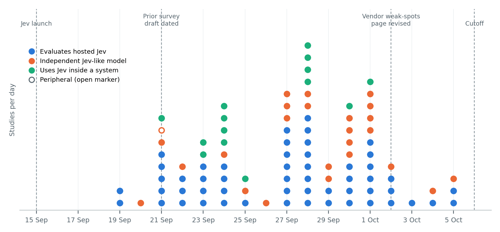
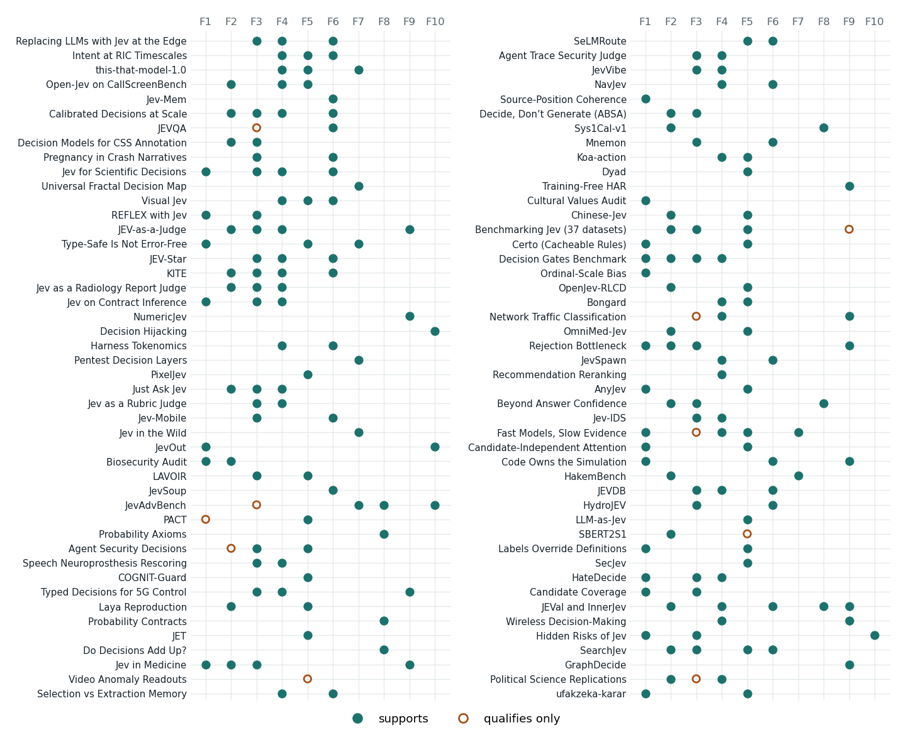
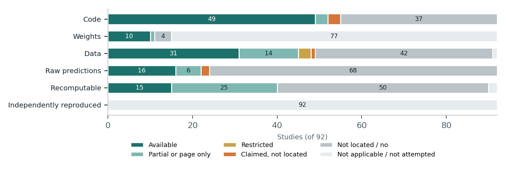

<!-- Generated by scripts/build-paper.py from paper/src/survey.src.md and data/*.json. Edit the source, then rebuild. -->

# Jev and Typed Decision Models: An Empirical Survey of Calibration, Selective Control, and Open Implementations

*[Meng Luo](https://eurekaleo.github.io/) · Draft 0.3.0 · Updated 6 Oct 2026 · Not peer-reviewed*

> **Abstract.** In September 2026 TypeSafe AI released Jev, a hosted "System One" model that answers typed questions about a text state with a probability distribution over declared options instead of generated text. Within three weeks a literature formed around it: evaluations of the hosted model, open models and readouts that reproduce its interface, and systems that delegate bounded decisions to it. We review this evidence as it stood on 6 Oct 2026: 91 core studies, 1 peripheral study and 73 background references, read in full and extracted into 196 claim-level evidence records with locators, measurement scopes, sample sizes and model versions, together with an audit of 128 open models, benchmarks, applications and tools. Ten findings emerge. A type-valid answer can still be wrong: labels outweigh definitions, middle options absorb errors, and with an explicit "None" option hosted Jev rejected only 7% of arithmetic menus that lacked the right value. A native probability makes calibration measurable but not guaranteed, and a calibrated probability is not a coherent belief: probabilities of a statement and its negation do not sum to one, and interfaces disagree. Typed decisions read what the input states but do not reliably compute what it implies, and they are not secure against text placed in the state. The most consistent use is a bounded first pass with confidence-gated escalation; the strongest designs fix thresholds in advance and test on new workloads, yet audited savings can shrink sharply. Speed and cost figures come from incompatible scopes, system gains need attribution, open implementations are compatible but not equivalent, and the evidence base is young, clustered and unreplicated. We contribute a versioned evidence base, a synthesis that keeps incomparable numbers apart, an implementation and ecosystem audit, and a proposed evaluation protocol.

## Introduction

Many software decisions are small and bounded: route a ticket, accept or escalate a judgment, pick the next tool, code a variable from a narrative, admit a network policy. Large language models can make such decisions, but they return strings that must be parsed, validated and retried, and the confidence they state is usually a verbalised estimate rather than a probability a program can threshold [[1](#ref-1), [2](#ref-2)]. Typed decision models change the contract. The caller declares the admissible answers; the model returns one of them with a probability for every option; no free text is generated, so a parse failure is impossible by construction.

TypeSafe AI's Jev, released in early access on 15 September 2026, made this contract prominent [[3](#ref-3)]. Its launch materials describe a new class of models trained with "Reinforcement Learning for Calibrated Decisions" (RLCD) and report end-to-end responses of 70–500 ms at $0.042 per million input tokens [[3](#ref-3), [4](#ref-4)]. Three weeks later the literature already spanned audits of option semantics and calibration, open models trained to copy the interface, and systems in judging, annotation, security, networks, databases, search, robotics and medicine. The claims range from schema validity to probability coherence, cost, latency and end-task success; the protocols range from 20 curated scientific choices to half a million police crash narratives.

Others have begun to map this literature. An early evidence audit reviewed the 28 papers posted between 19 and 24 September and derived a 14-item evaluation checklist [[5](#ref-5)]; a systematisation of knowledge examined semantic decision engines in network control loops [[6](#ref-6)]; a public survey draft places typed decisions in the history of classification, calibration and routing [[7](#ref-7)]; and community lists catalogue models, projects and benchmarks [[8](#ref-8), [9](#ref-9)]. This survey is an **empirical survey and evidence audit**: it reads every core study in full, re-reads studies when they post new versions, records each checkable claim with its locator and scope, and keeps incomparable numbers apart.

We keep three objects distinct throughout: (A) the **commercial model**, TypeSafe's hosted Jev, whose architecture and training data are undisclosed; (B) the **paradigm**, Jev-like typed decision models and readouts built by others; and (C) **systems** whose results depend on typed decisions. A result about one is not evidence about another.

We ask six questions. **RQ1 (definition and lineage):** how do runtime-defined finite-option decisions relate to classifiers, zero-shot labelling, rerankers, reward models and constrained generation? **RQ2 (probability quality):** what do returned probabilities and confidence mean, where do they hold, and are they coherent across related questions? **RQ3 (efficiency attribution):** how much of a speed or cost gain comes from the readout, and how much from model size, batching, prefix sharing, caching, pruning or the network? **RQ4 (selective control):** which decisions can be delegated, and when should software escalate, abstain or let code compute? **RQ5 (robustness and security):** how do option names, order, definitions, missing options, language, injected text and poisoned checkpoints change decisions? **RQ6 (openness):** what do alternatives release, and how much of the literature survives a common protocol?

Our contributions are concrete artefacts rather than claims of priority:

1. A versioned evidence base of 165 references and 196 evidence records. Each record carries a source locator, evidence type, test level, measurement scope, sample size and model version, with explicit reasons where a value is missing (§3).
2. A synthesis into ten findings, each listing supporting *and* qualifying evidence (§7). Study families are synthesised once, and nothing is pooled across incompatible scopes.
3. An implementation lineage of six readout families and an audit of the open ecosystem that separates code, weights, training code, evaluation material, data and raw predictions (§6, §9).
4. A catalogue of failure modes with sources and mitigations (§8), and a proposed evaluation protocol whose first experiments target binding, rejection, coherence and escalation together (§10).
5. A public website, generated README, BibTeX and CSV exports, all produced from the same data by scripts with validation and link checks.

## Scope, definitions and what is documented

### The interface

A caller sends a `state` (a string, JSON object or array of text values) and a map of typed questions; the model evaluates every question independently against the shared state and returns one answer per question [[10](#ref-10), [11](#ref-11)]. Three primitives exist. A **Choice** selects among named options, each defined by a description; the answer includes the chosen option, a probability for every option and a `confidence` value. The launch post states support for up to 255 options, with a two-stage procedure for high cardinality [[3](#ref-3)]. A **Score** places the answer on two to ten ordered, described levels; it returns a position that may fall between levels, probabilities per level and `confidence`, and the vendor warns against interpolating exact magnitudes from it [[12](#ref-12)]. A **Noul** returns the probability that a yes/no proposition holds and carries no separate confidence [[11](#ref-11), [13](#ref-13)].

At the cutoff the documented model was still `jev-1.13.0`; the aliases `jev-latest` and `jev-preview` both pointed to it, and the vendor advises pinning the versioned ID when thresholds are tuned to a version [[4](#ref-4)]. Input is text only; images, audio and video must first be converted to text or structured fields, and English is the primary training language [[4](#ref-4), [10](#ref-10)]. Visual and audio Jev-like models in the open ecosystem are independent projects, not TypeSafe releases.

### Probability semantics

Probabilities and confidence are different objects. The documentation defines `confidence` as a statistic computed from the returned distribution and recommends thresholds tested on the user's own data [[13](#ref-13)]; the exact statistic is not published. Empirically, one judging study found that native confidence detected errors about as well as the largest label probability (AUROC 0.745–0.876 across three benchmarks) [[14](#ref-14)], and a biosecurity audit read it as a chance-normalised maximum probability [[15](#ref-15)]. The vendor states that calibration is measured across groups of predictions and does not guarantee that an individual answer is correct [[16](#ref-16)]. Two independent sources observe that probabilities are returned on a 0.01 grid, which bounds calibration error for rare events from below and can put exactly zero on a correct answer [[17](#ref-17), [18](#ref-18)].

### What is documented as weak, and what is not disclosed

The vendor maintains a list of known weak spots of jev-1.13. On its 2 October revision the list names literal reading, math and numbers (including counting and numeric representations), date and time comparison, indirection, large states full of irrelevant detail, adversarial content, contradictory instructions and criteria, Choice option order — the model "leans toward the option that comes first" — and generation [[12](#ref-12)]. Several studies below measure exactly these edges. The architecture, training data and objective are not published; the documentation says one set of weights serves every account [[4](#ref-4)]. Community reconstructions exist and remain speculation about the commercial model [[19](#ref-19)].

### Vendor claims as hypotheses

The launch headline "193.6× faster, 444.6× cheaper" comes from the vendor's workflow evaluations, whose reference answers average two external frontier models and whose workflows were written by its capabilities team [[3](#ref-3)]. The vendor's public evaluation dashboard now averages four structured workflows against reference labels from two frontier models: in workflow mode it lists Jev at 67.8% agreement for $0.0004 and 0.4 s per case, against 74.1% for the best listed configuration and 73.1% for Opus 5, and every listed model agrees more often when the task is decomposed into a workflow than when it is asked as one prompt [[20](#ref-20)]. The plotted 0% type-error rate is analytical rather than empirical [[3](#ref-3)]. We record these figures as vendor claims, not as evaluations.

### Names that collide

Several names mean different things. TypeSafe's *System One* borrows Kahneman's System 1 metaphor, which AI research had already adopted [[21](#ref-21), [22](#ref-22)]. *RLCD* in the Jev context expands to Reinforcement Learning for Calibrated Decisions and is unrelated to Reinforcement Learning from Contrastive Distillation (2023), a distinction one core study also draws [[23](#ref-23)]; open reimplementations of the Jev meaning now exist [[24](#ref-24), [25](#ref-25)]. *OpenJev*, *Open-Jev* and *open-jev* name at least eight unrelated projects: frozen-decoder readouts, among them SemIf under its former name, two DiffusionGemma readouts, a family of fine-tuned decision models, an in-browser runtime, and the open model of one paper's title, JevLite [[26](#ref-26), [27](#ref-27), [28](#ref-28), [29](#ref-29), [30](#ref-30), [31](#ref-31), [32](#ref-32), [33](#ref-33)]. Adjacency in name implies neither the same algorithm nor copying.

## Review method

### Search

The snapshot of 23 September 2026 ran 17 accepted arXiv API queries. They returned 225 hits and 197 unique records after de-duplication by unversioned arXiv ID (Appendix A). Queries combined the brand and interface vocabulary (`jev`, `typesafe`, "System One", "typed decision", "calibrated decisions") with open-model names, survey terms and a date-bounded "decision model" query; arXiv `all:` searches metadata rather than full text, and that last query found a core study the brand-name queries missed [[23](#ref-23)]. A same-day increment added 19 expansion queries; queries whose phrases the API parsed so loosely that they returned thousands of records were rejected by rule.

Later increments re-ran every accepted and expansion query after the daily arXiv announcement and screened only records not seen before. The increment of 24 September added four core studies. The increment of 6 October retrieved 710 hits (444 unique records), of which 112 had not been screened: 74 became core studies, six were added as background or related reviews, and 32 were excluded with a recorded reason. Each run also refreshed the metadata of every included record; seven included studies had posted revised versions, which were re-read and their records updated. Every screening decision and reason is published with the data.

Repositories came from GitHub searches and from curated lists. For the lists we checked each entry against its own README or paper before inclusion, and entries whose README did not mention Jev or a typed decision model were excluded [[8](#ref-8)].

### Eligibility

A study is **core** if it evaluates TypeSafe Jev, a clearly identified Jev-like typed-decision implementation, or a system whose contribution materially depends on such decisions. **Peripheral** studies fall within reach of the scope but rest on contested, self-reported claims; they stay visible but are not pooled. **Background** references are adjacent methods, related reviews and earlier work the interface descends from, each with a stated role. We excluded name matches (Japanese encephalitis, JEPA, unrelated uses of "TypeSafe" or "System One", other expansions of RLCD) and work without a typed-decision link.

### Reading depth and extraction

We read the core and peripheral studies in full, checking key tables and limitation sections; background references were checked against metadata and abstracts. Code, weight and data links reported by the studies were checked to resolve, and releases that a paper announces but that could not be found are recorded as "claimed, not located". Repository evidence comes from READMEs and metadata at pinned commits, with selected source files for a few. Nothing was executed and no experiment was re-run.

Each checkable statement became an evidence record. A record stores its subject, text, headline and source locator, and an evidence type: author-reported experiment, vendor documentation, vendor-reported result or community report. It also stores the metric, value and baseline; the sample size, model version and hardware, each with a reason when unknown; the **test level** (model test, system test, hybrid, simulation); and the **measurement scope** (single request, amortized per question, batch, end to end, simulation, author estimate, vendor claim). Each record links to the findings of §7 as *supporting* or *qualifying* evidence. Openness is recorded as six independent fields per study: code visible, weights available, data available, raw predictions available, recomputable, independently reproduced.

### Synthesis and its limits

Tasks, metrics, binning and scopes are heterogeneous, so we pool nothing and rank nothing. Findings are stated at the strength their records allow, with qualifying records listed beside supporting ones. Studies that share authors are flagged as study families and read together: two edge and RAN studies by one group (which also wrote the network SoK), three studies by Rafe and Das, an agent architecture and an attack study by Wu and Lim, two studies by Yang and Zhao, and a Turkish benchmark whose author also built a model it ranks [[34](#ref-34), [35](#ref-35), [17](#ref-17), [36](#ref-36), [37](#ref-37), [38](#ref-38), [39](#ref-39), [40](#ref-40), [41](#ref-41), [42](#ref-42), [43](#ref-43)]. The review was carried out by one AI-assisted reviewer and is not a registered or PRISMA-compliant systematic review; §12 lists what this implies.

## Related reviews and positioning

*Typed Decision Models: An Early Evidence Audit* reviews the 28 studies posted between 19 and 24 September 2026 [[5](#ref-5)]. It concludes that the typed readout had not yet shown an accuracy advantage over comparable label-probability readouts and that the clearest gains were latency and cost, and it turns recurring weaknesses into a 14-item evaluation checklist. Our reading of the same window agrees; this survey extends it by two further weeks, records evidence claim by claim, re-reads studies when they are revised and audits the open ecosystem.

*SoK: Semantic Decision Engines in Network Control Loops* systematises 139 paper families by decision interface, execution path and check ownership [[6](#ref-6)]. Of 50 families that claim their engine fits a control loop or time budget, four support the claim with matched measurement, and bounded tests show that queueing can turn a deadline met by every isolated request into one met by none. It is written by the authors of two edge and RAN studies reviewed here, so we treat its examples of those studies as part of that family.

*Decisions, Not Tokens*, a public working draft dated 21 September 2026 and unchanged since, treats machine-native decision models broadly, from classical classifiers to Jev, with a five-dimensional taxonomy and four evaluation layers; its bibliography at the pinned commit cites none of the core studies reviewed here [[7](#ref-7)]. Community catalogues list models, projects, benchmarks and papers with one-line descriptions [[8](#ref-8), [9](#ref-9), [44](#ref-44)]; they were indispensable for discovery, and every entry we use was traced to its own source. A perspective essay proposes a conditional Jevons hypothesis: much cheaper machine evaluation may raise its use where demand is latent, while shared criteria and shared errors can scale mistakes [[45](#ref-45)].

Adjacent surveys cover uncertainty quantification and calibration in LLMs [[2](#ref-2)], the move from System 1 to System 2 reasoning [[22](#ref-22)], efficient reasoning under budgets [[46](#ref-46)] and decision-focused learning [[47](#ref-47)]. None addresses typed decision APIs.

## Lineage and an analytical frame

### Lineages

Typed decisions recombine long-standing ideas. **Discriminative classification** with bidirectional encoders [[48](#ref-48), [49](#ref-49)], few-shot classifiers [[50](#ref-50)] and generalist lightweight classifiers [[51](#ref-51), [52](#ref-52)] are the natural baselines; zero-shot labelling via label descriptions anticipated runtime-defined options [[53](#ref-53)]; cross-encoder rerankers score a supplied candidate without generation [[54](#ref-54)]; and controlled comparisons of encoder, autoregressive and diffusion classifiers map the trade-offs typed models inherit [[55](#ref-55)]. Reward models that score a whole response with one scalar [[56](#ref-56)] and safety classifiers that gate a model on a fixed policy [[57](#ref-57), [58](#ref-58)] are deployed non-generative judgment heads. **Calibration** and temperature scaling [[59](#ref-59)], the failure of calibration under shift [[60](#ref-60)], the loss of calibration after post-training [[61](#ref-61)], self-knowledge [[1](#ref-1)] and semantic uncertainty [[62](#ref-62)] frame every probability claim, and reinforcement learning with calibration rewards is the closest published relative of calibration-oriented decision training [[63](#ref-63), [64](#ref-64), [65](#ref-65)]. **Selective prediction** [[66](#ref-66), [67](#ref-67)], learning to defer [[68](#ref-68)] and conformal methods [[69](#ref-69), [70](#ref-70)] supply the theory of acting on confidence, and decision-aware calibration measures what matters downstream [[71](#ref-71), [72](#ref-72), [73](#ref-73), [74](#ref-74)]. **Structured output** research shows that constrained decoding guarantees validity but not semantics [[75](#ref-75), [76](#ref-76), [77](#ref-77)], that format restrictions can cost reasoning accuracy [[78](#ref-78)], that declarative typed signatures can be compiled into prompts [[79](#ref-79)], and that schema compliance needs its own benchmarks [[80](#ref-80), [81](#ref-81)], while forms that demand an answer invite invented ones [[82](#ref-82)]. **Serving** work explains much of any speed-up independently of the readout: paged KV caches and prefix sharing [[83](#ref-83), [84](#ref-84)] and parallel diffusion decoding [[85](#ref-85), [86](#ref-86)]. **Judges and reward models** [[87](#ref-87), [88](#ref-88), [89](#ref-89)], **routing and cascades** [[90](#ref-90), [91](#ref-91), [92](#ref-92), [93](#ref-93)] and **label and format sensitivity** [[94](#ref-94), [95](#ref-95), [96](#ref-96)] complete the background.

### Five places a claim can live

We read each study by where its claim sits on the path from a declared question to a workflow outcome (Table 1). This is an analytical organisation for comparing evidence. It is not the internal architecture of any model, and we do not claim it as the first such taxonomy.

**Table 1.** Five places a claim can live: an analytical organisation, not a model architecture.

| Stage | Question | Evidence to look for | Studies |
| --- | --- | --- | --- |
| Decision contract | What exactly is being asked, and what may the answer be? | Type validity; name and order invariance; closed-set failure when the right option is missing. | 26 |
| Inference & readout | How is a distribution over the declared options produced? | Same-backbone ablations; readout geometry; what is and is not disclosed. | 28 |
| Probability & calibration | What does a returned probability or confidence mean, and for which population? | Per-task reliability, high-confidence errors, recalibration on held-out labels. | 39 |
| Selective control | When should software act, ask, escalate or abstain? | Coverage at fixed risk; escalation rate; thresholds chosen on a separate selection set. | 30 |
| Downstream use | Does the whole workflow get better, cheaper or faster? | System-level baselines; module attribution; matched measurement scope. | 55 |

## Implementation families

Implementations share the request and response shape, not the mechanism that produces the probabilities. We distinguish six families by their readout (Table 2).

**Table 2.** Six readout families. Compatible interfaces do not imply equivalent mechanisms.

| Family | Principle | Public | Boundary |
| --- | --- | --- | --- |
| Hosted System One service | A closed, hosted model returns a distribution over declared options for each typed question about a shared text state. | Interface, primitives, pricing, limits, versioning and known failure modes are documented; architecture, training data and the exact confidence statistic are not. | Black-box evaluation only; the served model can change behind aliases; text-only input. |
| Encoder decision heads | A bidirectional encoder, or an encoder–decoder, reads state, question and options; a trained head scores each option and a softmax is taken over the legal set. | Weights and inference code for most members; several release training code; the readout geometry (marker token, span mean, blind per-option scoring) changes name and order sensitivity. | Short context windows; option labels can dominate written definitions; adjacent to GLiClass, SetFit and NLI zero-shot classifiers. |
| Frozen decoder option readout | An unmodified causal LM is prompted once and the next-token logits of short option identifiers are renormalised over the declared options, optionally debiased over label priors and option rotations. | Fully open and training-free; a frozen 4B model read this way matches community fine-tunes on public JevBench items — the natural baseline for any trained decision model. | Raw logits are order- and label-sensitive; one prefill cannot reason; rotation averaging multiplies cost by the number of rotations. |
| Fine-tuned decoder decision models | A decoder is adapted (LoRA or full fine-tuning) so that a designated position or pointer head yields calibrated option probabilities in one pass. | Many release weights, training code and evaluation data; lineages exist (this-that-model is adapted from decider-2b; SecJev builds on Kev); task-specialised variants beat general ones on their own tasks. | Gains may come from task coverage in training; benchmarks are often built by the same teams; derived checkpoints are not independent methods. |
| Diffusion structured readout | A discrete diffusion LM is seeded with the answer template; after one denoising step, the distribution at each answer slot is read directly. | Open servers with a Jev-compatible wire API; depends on request extensions proposed in an unmerged vLLM PR. | A different mechanism from last-token decoder readout; custom entropy-based confidence. |
| Generative & constrained adapters | A general LLM is asked (often under JSON-schema constraints) to emit a decision and probabilities, which are validated and returned in Jev-shaped responses. | Wire compatibility for controlled comparisons; probabilities are generated or verbalised, not read from logits. | Interface compatibility is not mechanism equivalence; retries, parsing and self-reported probabilities remain. |

**Hosted service.** TypeSafe's Jev documents its interface, prices, limits, versions and known weak spots. It is observable only as a black box that can change behind aliases.

**Encoder decision heads.** Laya uses ModernBERT-large and mmBERT-base checkpoints with a router [[97](#ref-97)]; an independent reproduction matched its reported accuracy but found it uniformly under-confident, fixed by one temperature [[98](#ref-98)]. The family has grown in three directions. Encoder–decoders: Bongard reads the state once with a bidirectional T5Gemma encoder and lets decoder branches answer many questions, reaching 78.05% on DecisionBench and 32 questions about one state in 221 ms on one GPU [[99](#ref-99)]. Languages: open encoders now exist for Chinese, Japanese and Turkish; the Chinese one slightly exceeded hosted Jev on a general Chinese subset with a third of its calibration error, and the Turkish one scores each option blind to the others, which makes it order-invariant by construction [[100](#ref-100), [101](#ref-101), [43](#ref-43)]. Domains: biomedical sentence encoders converted to decision heads, where retrieval pre-training helps one head and hurts another [[25](#ref-25)]. The readout geometry matters: in open models the short option label outweighed its written definition, and a single change to how options are rendered made three checkpoints exactly invariant [[102](#ref-102)].

**Frozen decoder readouts.** An unmodified instruction-tuned model, prompted once, already works as a decision model. Read through bracketed numeric identifiers, a frozen Qwen3.5-4B resolved 81.4% of the public JevBench items, matching community Jev-style models built on the same backbone [[103](#ref-103)]. Its weakness is bias: reversing the option list changed the answer on about a third of 20-option items across eleven models, and averaging over cyclic rotations roughly halved the flips at the cost of one prefill per rotation [[104](#ref-104)]. Many open projects implement this family [[26](#ref-26), [105](#ref-105), [106](#ref-106), [107](#ref-107)].

**Fine-tuned decoder models.** Kev, decider, this-that-model, NanoJev, Bespoke Nimble, JevLite, Open-Jev and others train a decoder so that a designated position or pointer head yields option probabilities in one pass [[19](#ref-19), [108](#ref-108), [109](#ref-109), [110](#ref-110), [111](#ref-111), [33](#ref-33), [31](#ref-31)]; a Thai–English model replaces the language-model head with a slot softmax [[112](#ref-112)]. Task specialisation now beats generality on the specialists' own tasks: a security-specialised 0.8B model outscored a general 9B by 20.5 points [[113](#ref-113)], a search-decision model beat hosted Jev on query rewriting while trailing on routing [[114](#ref-114)], and a browser-action model completed more than twice as many real-website tasks as Jev in the same agent although the two were close on single-step benchmarks [[115](#ref-115)]. Multimodal variants read screens, photos, pixels or medical images [[116](#ref-116), [117](#ref-117), [118](#ref-118), [119](#ref-119)]. Distilling an open LLM's reasoning into a single first-token decision produced a 27B model on par with Jev at about 0.1 s per query [[120](#ref-120)]. Architectural work makes candidates nearly order-invariant by blocking attention between them, cutting permutation flips for one model from 18.2% to 1.2% [[121](#ref-121)], while encoding candidates independently for caching cost rule sensitivity [[122](#ref-122)]. Open reimplementations of calibration-oriented training disagree: one beat SFT, STaR and GRPO at selective prediction [[24](#ref-24)]; another trailed plain cross-entropy by 2.5–3.0 points because of its reward normalisation [[25](#ref-25)].

**Diffusion structured reads.** djev and OpenJev seed a discrete diffusion model's canvas with the answer template and read each slot after one denoising step [[123](#ref-123), [29](#ref-29)]; another harness reads typed JSON decisions from DiffusionGemma without training [[30](#ref-30)].

**Generative adapters.** TypeSafe's official adapter routes typed questions to general LLM APIs for comparisons [[124](#ref-124)]; LocalJev asks a model for JSON probabilities and calls the result wire-compatible but "not mathematically equivalent" to a logit read [[125](#ref-125)].

The implication for RQ1 and RQ6 is direct. The interface can be reproduced by many mechanisms whose probabilities mean different things; frozen readouts are the baseline any trained decision model has to beat; and none of these projects reveals how the commercial model works.

## Evidence synthesis

### The evidence base

The core studies appeared between 19 September and 5 October 2026, beginning four days after the launch (Figure 1). Relationships overlap: 58 studies evaluate hosted Jev, 44 build or evaluate independent Jev-like models, and 17 embed typed decisions in a larger system (Table 3). In all, 72 studies call hosted Jev, as the object of study, a baseline or a component; 60 state the version they called and 12 state none. Every core study is an arXiv preprint.

**Figure 1.** Submission dates (arXiv v1) of the core and peripheral studies, one dot per study stacked by day and coloured by primary relationship to Jev, against context events.

**Table 3.** Core and peripheral studies (* peripheral; † same study family). Headline values are author-reported.

| Study | v1 (2026) | Test level | Version | Headline (as reported) | Ref. |
| --- | --- | --- | --- | --- | --- |
| Replacing LLMs with Jev at the Edge † | 09-19 | Hybrid | jev-1.13.0 | Median decision latency −22.7% to −64.5% vs the fastest LLM | [[34](#ref-34)] |
| Intent at RIC Timescales † | 09-19 | Hybrid | jev-1.13.0 | Meets the 1 s RIC budget on 99.8% of calls (LLMs: 17.9%, 0%) | [[35](#ref-35)] |
| this-that-model-1.0 | 09-20 | Model test | 1.0; not reported | 30.9 ms per decision on one laptop GPU; 32 decisions/s | [[109](#ref-109)] |
| Open-Jev on CallScreenBench | 09-21 | Model test | paper v1 (three seeds) | JevLite ensemble AUROC .974, ECE .052; no false alarms | [[33](#ref-33)] |
| Jev-Mem | 09-21 | System test | not reported | LoCoMo judge 0.777 (+11.0%); build 158 s; 0.93 s/query | [[126](#ref-126)] |
| Calibrated Decisions at Scale † | 09-21 | System test | jev-1.13.0 | 499,500 narratives screened for $25.23; 195,857 fully coded | [[17](#ref-17)] |
| JEVQA | 09-21 | Model test | jev-1.13 | PLCC vs VMAF: 0.737 (metadata) → 0.824 (+bitstream, pixel) | [[127](#ref-127)] |
| Decision Models for CSS Annotation | 09-21 | Model test | typesafe/jev1.13 | Behind best LLM on 14/15 tasks (−11.6 F1) at 44× lower cost | [[23](#ref-23)] |
| Pregnancy in Crash Narratives † | 09-21 | Model test | jev-1.13.0 | Population-scale reading audited by blind coders: sensitivity 0.999 | [[36](#ref-36)] |
| Jev for Scientific Decisions | 09-21 | System test | Jev 1.13 | Full semantic correctness; median 0.335 s, p95 0.442 s | [[128](#ref-128)] |
| Universal Fractal Decision Map * | 09-21 | Model test | not reported | Self-reported 81.65% on public JevBench items at 7.08 ms | [[129](#ref-129)] |
| Visual Jev | 09-22 | Model test | paper v1 | Macro accuracy 0.706 → 0.761 after post-training (seen families) | [[116](#ref-116)] |
| REFLEX with Jev † | 09-22 | System test | jev-1.13.0 | 95% success with 1.12 strong calls/task vs 88% and 4.10 (−72.7%) | [[38](#ref-38)] |
| JEV-as-a-Judge | 09-22 | Model test | jev-1.13.0 | Within 3 points of GPT-6 where the verdict can be read off the text | [[14](#ref-14)] |
| Type-Safe Is Not Error-Free | 09-22 | Model test | not reported | Hosted Jev AUROC .8146 → .5806 after name–rubric swap; 0% type errors | [[130](#ref-130)] |
| JEV-Star | 09-23 | System test | Jev 1.13 | 4/4 full-game wins incl. two vs Lv7 with GPT-6 plans; Jev-only never expanded | [[131](#ref-131)] |
| KITE | 09-23 | System test | jev-1.13.0 | 1.7% flagship anchors cut effect error 41%; decision gain 0.27 → 0.39 | [[132](#ref-132)] |
| Jev as a Radiology Report Judge | 09-23 | Model test | jev-1.13.0 | Kendall τ 0.573 / 0.398 with expert error counts; beats open NLI | [[133](#ref-133)] |
| Jev on Contract Inference | 09-23 | Model test | jev-1.13.0 | $0.000228 and 1.24 s per contract — lowest of ten models | [[134](#ref-134)] |
| NumericJev | 09-23 | Model test | jev-1.13 | Range refinement: 83.4% within 5% vs 80.5% direct choice | [[135](#ref-135)] |
| Decision Hijacking † | 09-23 | Model test | jev-1.13.0 | Injection shifts probabilities (+0.043) but rarely selects the target (1.8%) | [[39](#ref-39)] |
| Harness Tokenomics | 09-24 | Simulation | jev-1.13.0 | Emulated router saves 13–21% of coding-agent spend | [[136](#ref-136)] |
| Pentest Decision Layers | 09-24 | System test | jev-latest | One run each: 5 min faster, different severities — not a controlled test | [[137](#ref-137)] |
| PixelJev † | 09-24 | Model test | — | Typed readout and generation gain equally after adaptation | [[40](#ref-40)] |
| Just Ask Jev | 09-24 | Model test | jev-1.13.0 | Zero-shot failure detection: median AUROC 0.886 at 1/63 of judge cost | [[138](#ref-138)] |
| Jev as a Rubric Judge | 09-24 | Model test | jev-1.13.0 | Parity on most rubric criteria at 1/16–1/325 of the cost | [[139](#ref-139)] |
| Jev-Mobile | 09-24 | System test | not reported | AndroidWorld 79% (vs 84% step-wise) at 73% lower API cost | [[140](#ref-140)] |
| Jev in the Wild | 09-24 | Not applicable | not reported | Ecosystem: judgment 77%, scoring 52%, action selection 31% of projects | [[141](#ref-141)] |
| JevOut | 09-24 | Model test | jev-1.13.0 | Natural context flips 61% of correct decisions (vs 2% neutral) | [[142](#ref-142)] |
| Biosecurity Audit | 09-24 | Model test | jev-1.13.0 | Confidence = chance-normalised max probability; pooled ECE 0.034 | [[15](#ref-15)] |
| LAVOIR | 09-25 | Model test | — | Learned “when to ask” policy ≈ oracle (AUC 0.80 vs 0.80) | [[143](#ref-143)] |
| JevSoup | 09-25 | System test | jev-1.13.0 | Jev-routed LoRA composition: +0.2 to +1.2 points | [[144](#ref-144)] |
| JevAdvBench | 09-25 | Model test | jev-1.13.0 | An appended opinion flips 12% and drains 38% of confident answers below the gate | [[145](#ref-145)] |
| PACT | 09-26 | Model test | — | Open recipe holds up; extra terms buy robustness, not accuracy | [[146](#ref-146)] |
| Probability Axioms | 09-27 | Model test | jev-1.13 | P(X) + P(not X) misses 1 by 0.064 (open LLM readout: 0.293) | [[147](#ref-147)] |
| Agent Security Decisions | 09-27 | Model test | jev-1.13 | Safe automation coverage: 7.6% (symmetric) → 47% (separate thresholds) | [[148](#ref-148)] |
| Speech Neuroprosthesis Rescoring | 09-27 | Model test | jev-latest | Rescoring: WER 7.5% vs 7.8% for 7B LLMs, no GPU needed | [[149](#ref-149)] |
| COGNIT-Guard | 09-27 | Model test | — | Adapted open guard: AUC 0.83 → 0.997, with an OOD “alignment tax” | [[150](#ref-150)] |
| Typed Decisions for 5G Control | 09-27 | System test | jev-1.13.0 | Hosted Jev never meets 100 ms near-RT deadlines (warm p50 281 ms) | [[151](#ref-151)] |
| Laya Reproduction | 09-27 | Model test | — | Open Laya checkpoint under-confident (gap −0.214); one temperature fixes it | [[98](#ref-98)] |
| Probability Contracts | 09-27 | Model test | jev-1.13.0 | Two interfaces, same question: different decision on 32.8% of pairs | [[152](#ref-152)] |
| JET | 09-27 | Model test | Jev 1.13 | Local likelihood readout 85.1% vs Jev 89.1% on MMLU | [[153](#ref-153)] |
| Do Decisions Add Up? | 09-27 | Model test | jev-1.13.0 | Staged decisions disagree with direct ones; Jev loses 22.9 points on CLINC150 | [[154](#ref-154)] |
| Jev in Medicine | 09-27 | Model test | jev-1.13 | Medicine: parity on abstracts, −22 points on diagnostic cases | [[155](#ref-155)] |
| Video Anomaly Readouts | 09-28 | Model test | jev-1.13.0 | Same evidence, different readout: +18 AP on one dataset, none on the other | [[156](#ref-156)] |
| Selection vs Extraction Memory | 09-28 | System test | jev-1.13.0 | One Jev selection call ≈ LLM-extraction memory at 1/3,061 the write cost | [[157](#ref-157)] |
| SeLMRoute | 09-28 | System test | not reported | Typed-question features route LLMs: 72.1% vs 69.2% best single model | [[158](#ref-158)] |
| Agent Trace Security Judge | 09-28 | Model test | not reported | Trace security: F1 77.8 vs 74.1 for the best LLM judge | [[159](#ref-159)] |
| JevVibe | 09-28 | Model test | jev-1.13.0 | CWE triage: Top-1 0.46 vs 0.50 (frontier) at 1/56 of the cost | [[160](#ref-160)] |
| NavJev | 09-28 | System test | not reported | Navigation: 27% SR at 0.65 s/step; components, not just Jev, carry the gain | [[161](#ref-161)] |
| Source-Position Coherence | 09-28 | Model test | jev-1.13.0 | Jev’s argument scores move with the stated source | [[162](#ref-162)] |
| Decide, Don’t Generate (ABSA) | 09-28 | Model test | jev-1.13.0 | SemEval ABSA: best regression error with 488 fitted coefficients | [[163](#ref-163)] |
| Sys1Cal-v1 | 09-28 | Model test | not reported | Known-probability test: Noul 0.92, Score 0.89, Choice 0.76 | [[164](#ref-164)] |
| Mnemon | 09-28 | System test | jev-1.13 | Memory agent: LoCoMo 91.7% with Jev judging evidence (AUC 0.94) | [[165](#ref-165)] |
| Koa-action | 09-28 | Model test | — | Single-token LLM classifier: 85.5% at 0.53 s, flat across label spaces | [[166](#ref-166)] |
| Dyad | 09-28 | Model test | Jev 1.13 | Native typed-decision head: 86.2% vs Jev 85.0% on JevBench | [[167](#ref-167)] |
| Training-Free HAR | 09-28 | Model test | jev-1.13.0 | Sensor activity recognition from text: macro-F1 ≤ 0.12 | [[168](#ref-168)] |
| Cultural Values Audit | 09-28 | Model test | jev-1.13.0 | Persona shifts reproduce 87% (English) vs 62% (Arabic) of a human difference | [[169](#ref-169)] |
| Chinese-Jev | 09-29 | Model test | not reported | Language-specific open encoder ≈ hosted Jev in Chinese, better calibrated | [[100](#ref-100)] |
| Benchmarking Jev (37 datasets) | 09-29 | Model test | jev-1.13.0 | Ahead of a 27B open LLM on 27/37 datasets; pooled Choice ECE 0.028 | [[170](#ref-170)] |
| Certo (Cacheable Rules) | 09-29 | Model test | — | Cacheable scoring loses rule sensitivity (recall@1 1.00 → 0.24) | [[122](#ref-122)] |
| Decision Gates Benchmark † | 09-29 | Model test | jev-1.13.0 | Threshold for 5% risk still admits 31% of out-of-scope requests | [[37](#ref-37)] |
| Ordinal-Scale Bias | 09-30 | Model test | typesafe/jev-1.13-20260917 | ANLI: Neutral absorbs 51% of errors, at every position | [[171](#ref-171)] |
| OpenJev-RLCD | 09-30 | Model test | — | Open RLCD: best selective prediction among SFT, STaR, GRPO | [[24](#ref-24)] |
| Bongard | 09-30 | Model test | — | Open encoder–decoder: 78.05% on DecisionBench, 32 questions in 221 ms | [[99](#ref-99)] |
| Network Traffic Classification | 09-30 | Model test | typesafe/jev-1.13-20260917 | Packet numbers in, 28% accuracy out — trees trained on 8k records reach 70% | [[172](#ref-172)] |
| OmniMed-Jev | 09-30 | Model test | — | Same backbone, decision-native output: calibration error down up to 10× | [[119](#ref-119)] |
| Rejection Bottleneck | 09-30 | Model test | jev-1.13 | Present 99%, rejected when absent 7% — though Boolean checks get 99% | [[173](#ref-173)] |
| JevSpawn | 09-30 | System test | jev-1.13.0 | Agent with spawned finite actions: Maze 0.96 vs 0.52 | [[174](#ref-174)] |
| Recommendation Reranking | 09-30 | Model test | jev-latest | Strong reranking quality; latency between local models and pointwise LLMs | [[175](#ref-175)] |
| AnyJev | 09-30 | Model test | — | Order flips on a third of 20-option items; rotation averaging halves them | [[104](#ref-104)] |
| Beyond Answer Confidence | 10-01 | Model test | jev-1.13.0 | Confidence ≠ knowing: +0.21–0.33 overconfidence past the knowledge boundary | [[176](#ref-176)] |
| Jev-IDS | 10-01 | Model test | jev-1.13.0 | Intrusion pilot: F1 0.859, 4.8× faster than an LLM | [[177](#ref-177)] |
| Fast Models, Slow Evidence | 10-01 | Model test | jev-1.13.0 | Hosted beats open on 9 of 11 harness decisions; routing at chance for both | [[178](#ref-178)] |
| Candidate-Independent Attention | 10-01 | Model test | — | Isolate candidates: order flips 18.2% → 1.2% | [[121](#ref-121)] |
| Code Owns the Simulation | 10-01 | System test | jev-1.13.0 | Evaluates what is described; does not simulate what is not | [[179](#ref-179)] |
| HakemBench † | 10-01 | Model test | jev-1.13 | Turkish typed decisions: Jev fourth of 16 at a tenth of the leader’s time | [[42](#ref-42)] |
| JEVDB | 10-01 | System test | jev-1.13.0 | Semantic SQL: pruning + typed decisions finish 540K-pair joins | [[180](#ref-180)] |
| HydroJEV | 10-01 | Model test | jev-1.13.0 | Pre-registered gate: a third of SCADA reviews offloaded, accuracy kept | [[181](#ref-181)] |
| LLM-as-Jev | 10-01 | Model test | — | A frozen 4B LLM already matches community Jev-style models | [[103](#ref-103)] |
| SBERT2S1 | 10-01 | Model test | — | Open RLCD recipe trails plain cross-entropy by 2.5–3.0 points | [[25](#ref-25)] |
| Labels Override Definitions | 10-01 | Model test | — | The label wins over the definition — and the cause is one rendering line | [[102](#ref-102)] |
| SecJev | 10-02 | Model test | — | Security-specialised 0.8B beats general 9B by 20.5 points | [[113](#ref-113)] |
| HateDecide | 10-02 | Model test | jev-1.13.0 | Definitions move 28% of answers — without reliably improving them | [[182](#ref-182)] |
| Candidate Coverage | 10-02 | Model test | jev-1.13.0 | Missing answer noticed 24.8% of the time (Jev) — Laya over-rejects | [[183](#ref-183)] |
| JEVal and InnerJev | 10-02 | Model test | jev-1.13.0 | Right mode, wrong mass: 89% placed where the truth is 36% | [[120](#ref-120)] |
| Wireless Decision-Making | 10-03 | Model test | not reported | Wireless control: 3.5–8.5× faster than LLMs; quality depends on the task | [[184](#ref-184)] |
| Hidden Risks of Jev | 10-04 | Model test | not reported | Typed outputs, hijacked inputs: up to 100% injection success | [[185](#ref-185)] |
| SearchJev | 10-04 | Model test | jev-1.13.0 | Task-specialised open model beats Jev on rewriting, trails on routing | [[114](#ref-114)] |
| GraphDecide † | 10-05 | Model test | jev-1.13.0 | Reads every edge; counts degree right 68% of the time | [[41](#ref-41)] |
| Political Science Replications | 10-05 | Model test | typesafe/jev-1.13-20260917 | Same accuracy, no cost advantage at batch prices | [[186](#ref-186)] |
| ufakzeka-karar † | 10-05 | Model test | — | Order invariance by construction; sequential heads still flip 2–3% | [[43](#ref-43)] |

### F1 · A type-valid answer can still be the wrong answer

Typed interfaces remove parse and schema failures by construction; they do not make the chosen option right. The most direct test held question, state, rubric wording and the set of option names fixed and changed only which name was bound to which rubric [[130](#ref-130)]. For hosted Jev, rebinding the rubrics behind *no/yes* flipped 32.50% of answers against about 2% under neutral names, 24× the model's test–retest floor, and lowered AUROC from .8146 to .5806 while the type-error rate stayed at 0%. Swapping the meaning of yes and no flipped about half of Jev's answers in a decision-gate benchmark [[37](#ref-37)]. In open models the short label wins over its definition: deleting every definition left one model's accuracy unchanged, renaming options to A and B gained 0.151, and a label contradicting its definition dropped one model from 0.85 to 0.23 [[102](#ref-102)]. Supplying a dataset's definition of hate speech changed up to 28% of predictions without reliably improving them [[182](#ref-182)].

Two further patterns recur. **Missing answers go unnoticed.** With an explicit "None" option, Jev chose the right value on 99% of arithmetic menus that contained it but correctly rejected only 7% of menus that did not, although yes/no checks of the same candidates rejected every wrong one in 99% of those cases [[173](#ref-173)]; when a reference label was removed from the options, Jev noticed 24.8% of the time while an open encoder over-rejected valid menus [[183](#ref-183)]; on unanswerable medical questions it chose "I don't know" 10.5% of the time, a frontier model 8.6% [[155](#ref-155)]. **Middle options absorb errors.** On ANLI, Jev assigned 51% of its errors to Neutral and chose Neutral 37–40% of the time wherever it was placed, and across 36 ordinal datasets decisions used only two-thirds to three-quarters of the gold scale [[171](#ref-171)].

Order needs care. One community audit saw no argmax flips in 400 order trials on hosted Jev [[187](#ref-187)], and a 37-dataset benchmark found aggregate accuracy unchanged under rotation [[170](#ref-170)]; yet four cyclic rotations changed 37.4% of answers item by item on a cyber-knowledge benchmark, 28 points beyond run-to-run variation [[15](#ref-15)], and the vendor now lists option order among Jev's weak spots [[12](#ref-12)]. Aggregate accuracy can hide item-level instability. Consistency is not correctness either: on contract inference, five of Jev's 30 fixed anchors were answered wrongly in all twelve responses [[134](#ref-134)].

### F2 · A native probability makes calibration measurable, not guaranteed

Every call returns a distribution, so reliability can be audited on each run, and broad evaluations find it often good: pooled over 22 Choice datasets and 279,925 answers, ECE was 0.028 [[170](#ref-170)], and on familiar closed-choice tasks Jev was calibrated [[176](#ref-176)]. Measured reliability still varies by task, construct and language. Across 15 social-science tasks the median ECE was 0.157, better than the verbalised confidence of 16 of 19 LLMs but not of three frontier models, with a task ECE of 0.538 on empathy [[23](#ref-23)]; in political-science replications Jev was better calibrated than one commercial model's token probabilities but not consistently better than an open model's [[186](#ref-186)]. Probabilities rank better than they threshold: binary probabilities sat badly against a fixed 0.5, and tuned thresholds raised a legal benchmark's micro-F1 from 0.50 to 0.75 [[170](#ref-170)]; zero-shot failure detection ranked well (median AUROC 0.886) while its ECE exceeded a null baseline [[138](#ref-138)]. Thresholds do not travel: one chosen for 5% in-scope risk still admitted 31% of out-of-scope requests, and temperatures fitted on few options raised error with many [[37](#ref-37)].

Confidence is also not a signal of missing knowledge. With no answer-relevant information Jev still put up to 0.80 on a salient option, and on news past its knowledge boundary confidence exceeded accuracy by 0.21–0.33 even after recalibration on earlier months; targeted yes/no questions about whether the evidence suffices separated cases better than confidence [[176](#ref-176)]. On items where 100 annotators split, Jev's mean Choice confidence was 0.81 against 0.47 agreement among the annotators [[188](#ref-188)]. Recalibration on held-out target labels helps substantially [[17](#ref-17), [133](#ref-133)], and decision-native training improved calibration over a generative twin in medical imaging [[119](#ref-119)]. The background literature explains why per-workload checks are needed [[60](#ref-60), [189](#ref-189)].

### F3 · A bounded first pass with confidence-gated escalation

Across judging, annotation, moderation, security, infrastructure and agents, the typed model is usually the cheapest and fastest component and rarely the most accurate. The strongest designs now freeze thresholds in advance and test on new workloads. As a judge, Jev came within three points of GPT-6 wherever the verdict could be read off the text; a cascade with a threshold frozen before evaluation beat GPT-6 by 0.9 points on 1,610 held-out pairs at 41% of its fee, and in a pre-specified live test on two new workloads it matched GPT-6's accuracy exactly while escalating 74% of pairs [[14](#ref-14)]. In water-network alarm triage, four sealed, pre-registered rounds showed that accepting only benign Jev verdicts confirmed by a rule tree spared an LLM reviewer 35–38% of windows without loss of macro-F1, and the unchanged gate stayed non-inferior to its reviewer on two further networks [[181](#ref-181)]. A blind-coder audit of population-scale crash-narrative reading found sensitivity 0.999 [[36](#ref-36)]; an intrusion pilot found F1 0.859 at one example per category [[177](#ref-177)]; in hate-speech moderation the best hosted decision model came within 1.6 macro-F1 of the best commercial LLM at about 97% lower cost [[182](#ref-182)]. Earlier results point the same way in agents and annotation [[38](#ref-38), [23](#ref-23)].

Every gain is conditional. Trained classifiers win when labels exist: tree ensembles trained on 8,000 flows reached 70% on packet-level traffic classes where Jev with 40 examples reached 28% [[172](#ref-172)], and a classifier first stage escalating to Jev matched Jev's accuracy at 0.43 of its cost [[37](#ref-37)]. Judges can share the typed model's confident errors: LLM judges repeated 96% of Jev's most confident errors on rubric criteria, so cascades gained at most 2.7 points even with oracle thresholds [[139](#ref-139)]. Audited savings shrink: one study found that counting the pre-screen cost turned a reported 23.9% saving into 4.3% [[178](#ref-178)], and at batch prices Jev had no cost advantage over a commercial LLM because every option is billed as input [[186](#ref-186)]. Asking targeted questions can beat reading confidence [[176](#ref-176)]. The lesson for RQ4 is to include cheap trained classifiers and generative cascades as baselines, to fix thresholds on separate data, and to count every cost the gate adds.

### F4 · Speed and cost claims decompose into different mechanisms and scopes

Speed figures measure different things (Table 4). Single-request latencies range from 30.9 ms for a laptop-GPU open model [[109](#ref-109)] through 0.15 s for hosted judging [[14](#ref-14)] to 0.75 s for packet classification [[172](#ref-172)]. Amortized figures divide a batch over questions that share one state [[116](#ref-116), [99](#ref-99)]. Deadline attainment under load is another quantity: Jev met a 1 s RAN budget on 99.8% of calls where two hosted LLMs met it on 17.9% and 0%, but under load a small self-hosted JSON model also kept up [[35](#ref-35)], and hosted Jev never met 100 ms near-real-time classes [[151](#ref-151)]. Caching repeated descriptions gave all interpreters nearly the same latency, so the gain lay in fresh decisions [[34](#ref-34)]. Inside an agent, hosted Jev took 1.4–2.1 times as long as local scoring, including API communication [[174](#ref-174)], and a faster step made a slower agent: Jev action selection cut median episode time from 267 s to 161 s but lowered success from 77.6% to 66.1% and lengthened the slowest runs [[120](#ref-120)]. Billing every option as input can erase the price advantage against batch-priced LLMs [[186](#ref-186)]. For RQ3, no single speed or cost number describes a typed decision model; each figure is valid only within its scope.

**Table 4.** Speed and cost figures grouped by measurement scope. Figures in different groups are not comparable.

| Scope | Reported figure | Ref. |
| --- | --- | --- |
| Single request | Full semantic correctness; median 0.335 s, p95 0.442 s | [[128](#ref-128)] |
| Single request | 64.5 ms/decision; 4.9× faster than same backbone generating | [[33](#ref-33)] |
| Single request | 30.9 ms per decision on one laptop GPU; 32 decisions/s | [[109](#ref-109)] |
| Single request | Median decision latency −22.7% to −64.5% vs the fastest LLM | [[34](#ref-34)] |
| Single request | Self-reported 81.65% on public JevBench items at 7.08 ms | [[129](#ref-129)] |
| Single request | Meets the 1 s RIC budget on 99.8% of calls (LLMs: 17.9%, 0%) | [[35](#ref-35)] |
| Single request | Single-token LLM classifier: 85.5% at 0.53 s, flat across label spaces | [[166](#ref-166)] |
| Single request | Open encoder–decoder: 78.05% on DecisionBench, 32 questions in 221 ms | [[99](#ref-99)] |
| Single request | Strong reranking quality; latency between local models and pointwise LLMs | [[175](#ref-175)] |
| Single request | 0.75 s vs 6.0 s per request; accuracy difference not established | [[172](#ref-172)] |
| Single request | Intrusion pilot: F1 0.859, 4.8× faster than an LLM | [[177](#ref-177)] |
| Single request | Wireless control: 3.5–8.5× faster than LLMs; quality depends on the task | [[184](#ref-184)] |
| Single request | Order invariance by construction; sequential heads still flip 2–3% | [[43](#ref-43)] |
| Single request | Reranking: ties Cohere Rerank 4 Pro at half the latency |  |
| Single request | Local 4B readout: 76% on public JevBench at 48 ms |  |
| Amortized per question | 8.9× vs serial, 3.4× vs no-reuse batch; 5.7 ms/question amortized | [[116](#ref-116)] |
| End to end | 0.36% of GPT-6’s fee at 0.15 s median | [[14](#ref-14)] |
| End to end | 95% success with 1.12 strong calls/task vs 88% and 4.10 (−72.7%) | [[38](#ref-38)] |
| End to end | Behind best LLM on 14/15 tasks (−11.6 F1) at 44× lower cost | [[23](#ref-23)] |
| End to end | Low-confidence routing matches the LLM at ¼–½ of its cost | [[23](#ref-23)] |
| End to end | 499,500 narratives screened for $25.23; 195,857 fully coded | [[17](#ref-17)] |
| End to end | LoCoMo judge 0.777 (+11.0%); build 158 s; 0.93 s/query | [[126](#ref-126)] |
| End to end | With caching, latencies converge: the gain is in fresh decisions | [[34](#ref-34)] |
| End to end | $0.000228 and 1.24 s per contract — lowest of ten models | [[134](#ref-134)] |
| End to end | $0.0227 per 1,000 predictions; median 213 ms | [[132](#ref-132)] |
| End to end | Jev 0.422 s median; $0.15 of $3.71 per game | [[131](#ref-131)] |
| End to end | Live admission: 0.91–0.95 exact and on time where LLMs fall below 0.1 | [[34](#ref-34)] |
| End to end | Under load, slow interpreters saturate — a small local JSON model keeps up too | [[35](#ref-35)] |
| End to end | One run each: 5 min faster, different severities — not a controlled test | [[137](#ref-137)] |
| End to end | AndroidWorld 79% (vs 84% step-wise) at 73% lower API cost | [[140](#ref-140)] |
| End to end | Hosted Jev never meets 100 ms near-RT deadlines (warm p50 281 ms) | [[151](#ref-151)] |
| End to end | Agent with spawned finite actions: Maze 0.96 vs 0.52 | [[174](#ref-174)] |
| End to end | Hosted Jev inside the agent: better on 3 of 8 tasks, 1.4–2.1× slower | [[174](#ref-174)] |
| End to end | Let code simulate: ALFWorld solved 31% → 87% | [[179](#ref-179)] |
| End to end | Semantic SQL: pruning + typed decisions finish 540K-pair joins | [[180](#ref-180)] |
| End to end | Pre-registered gate: a third of SCADA reviews offloaded, accuracy kept | [[181](#ref-181)] |
| End to end | Self-audit: a 23.9% saving was really 4.3% | [[178](#ref-178)] |
| End to end | Faster steps, slower agent: success 77.6% → 66.1% | [[120](#ref-120)] |
| End to end | Search agent: 3.7–4.7× faster, accuracy 45% → 54% | [[114](#ref-114)] |
| End to end | Browser tasks: specialised open model 38.5% vs Jev 16.7%; single steps alike |  |
| End to end | Routing subagents with Jev: cheaper than one baseline, dearer than another |  |
| Simulated | Frozen cascade: +0.9 points over GPT-6 at 41% of its fee | [[14](#ref-14)] |
| Simulated | Radio conditions outweigh the interpreter; no LLM gain over Jev | [[35](#ref-35)] |
| Simulated | Emulated router saves 13–21% of coding-agent spend | [[136](#ref-136)] |
| Author estimate | $0.000217 electricity per suite pass vs $10.636 for a hosted model | [[109](#ref-109)] |
| Author estimate | Under $0.03 per 100 report pairs (judgment calls only) | [[133](#ref-133)] |
| Vendor claim | No type errors by construction; plotted 0% is analytical | [[3](#ref-3)] |
| Vendor claim | $0.042 / M input tokens; 70–500 ms end to end (vendor) | [[3](#ref-3)] |
| Vendor claim | 193.6× faster, 444.6× cheaper on vendor workflow evals | [[3](#ref-3)] |
| Vendor claim | Vendor dashboard: 67.8% agreement at $0.0004 and 0.4 s per case | [[20](#ref-20)] |

### F5 · Interface compatibility is not mechanism equivalence

§6 established that the interface is served by many mechanisms. The evidence adds four points. First, frozen readouts are strong baselines: a frozen 4B model matched community Jev-style models on the same backbone [[103](#ref-103)], and in an earlier same-backbone ablation a typed head gave no consistent gain over reading the LM head [[116](#ref-116)]. Second, rankings between hosted and open models change with the task: hosted Jev beat an open encoder on 9 of 11 agent-harness decision points [[178](#ref-178)] and on safety judging [[148](#ref-148)], while specialised open models beat Jev on their own tasks [[114](#ref-114), [115](#ref-115)] and a language-specific encoder matched it on a general Chinese subset with better calibration [[100](#ref-100)]. Third, reproducibility differs: repeating 1,080 decisions a day later changed 0.5% of hosted answers, while an open checkpoint reproduced 1,180 of 1,180 bit-for-bit on a second machine [[178](#ref-178)]. Fourth, projects state their own limits: SemIf that it does not reproduce Jev's model or training, LocalJev that it is wire-compatible but not mathematically equivalent to a logit read, and Kev that its architecture follows community speculation [[26](#ref-26), [125](#ref-125), [19](#ref-19)].

### F6 · System-level gains need module-level attribution

Systems improve for many reasons at once. A semantic database finished joins with up to 540,000 candidate pairs where baselines timed out, but pruning removed 87.4% of pairs before any decision was made [[180](#ref-180)]. A search agent cut active search time 3.7–4.7-fold and raised accuracy from 45% to as much as 54% by letting a small model take confident short decisions [[114](#ref-114)]. Memory systems and navigation agents report gains measured against different baselines [[126](#ref-126), [165](#ref-165), [161](#ref-161)]. The clearest attribution comes from letting code own what the model cannot do: Jev solved 31% of ALFWorld games alone and 87% with a code-supplied lookahead, and stating an opponent's move raised game accuracy from 33% to 98% [[179](#ref-179)]. A faster step can still cost the episode: replacing an agent's action selection with Jev lowered success as step errors compounded [[120](#ref-120)]. Attribution also needs references that measure what the workflow actually uses: administrative codes understated fidelity to the narratives by a median 0.26 in kappa [[17](#ref-17)], and wrong intermediate selections changed downstream counts while the final label stayed correct [[128](#ref-128)].

### F7 · The evidence is young, clustered and unreplicated

The core preprints appeared within three weeks of the launch, mostly as a single version, and several were substantially revised soon after: one edge-orchestration study was re-scoped into a different paper, and a judging study's cascade figures changed between versions [[35](#ref-35), [14](#ref-14)]. Several author groups contribute more than one study (§3), and in one case the author of a benchmark also ranks their own model on it, with results the author flags as not blind [[42](#ref-42), [43](#ref-43)]. Hosted answers drift: a re-run changed the Score value on 38.5% of Score questions in one audit [[145](#ref-145)], and 0.5% of decisions a day later in another [[178](#ref-178)]. Grading a model with its own labels inflates its gain: a reranking gain of +0.053 NDCG under Jev-made labels became −0.028 under an unrelated model's [[190](#ref-190)]. One study's audit of its own pipeline found three analysis errors that had distorted its headline deployment claims [[178](#ref-178)]. None of the core results has been independently reproduced, and some claimed releases could not be located (§9).

### F8 · A calibrated probability is not a coherent belief

Average calibration says nothing about whether probabilities obey basic rules across related questions. Jev's probabilities that "the label is X" and "the label is not X" missed summing to one by 0.064 on average, about five times its repeat noise, and three single-label probabilities summed to 1.14 [[147](#ref-147)]. Asking the same probability question through two interfaces changed the act-or-defer decision on 32.8% of pairs [[152](#ref-152)]. Staged decisions through categories disagreed with direct ones, costing 22.9 points on one intent benchmark [[154](#ref-154)]. On items with analytically known distributions, Jev picked the most likely option every time but put 89% of the mass on it where the true chance was 36% [[120](#ref-120)]. Against known probabilities, yes/no and Score answers were close but Choice answers were not [[164](#ref-164)]. The open readouts tested were less coherent still [[147](#ref-147), [154](#ref-154)]. Probabilities that rank well can still be used for selection; treating them as beliefs to combine requires coherence checks first.

### F9 · Typed decisions read what the input states; they do not reliably compute what it implies

Studies of very different tasks meet the same boundary. Jev answered 99% of Cognitive Reflection Test questions yet played one-shot games as if a rational opponent moved at random [[179](#ref-179)]. It landed within one of exact numerical answers on 97% of items but exactly on them on 44% [[120](#ref-120)], read every edge of a graph but counted vertex degree right on 68% [[41](#ref-41)], classified encrypted traffic from packet sizes and timings at 28% with 40 examples [[172](#ref-172)], recognised activities from sensor values far below supervised models [[168](#ref-168)], and rejected arithmetic menus lacking the right value only 7% of the time [[173](#ref-173)]. Medical questions answerable from an abstract were at parity with a frontier model while diagnostic cases trailed by over 20 points [[155](#ref-155)]. Range refinement through a sequence of choices recovered some numeric precision [[135](#ref-135)]. The vendor's guidance agrees: count, convert and compare in code, and keep the model for the judgment [[12](#ref-12)]. One qualification: calculation-heavy MMLU subjects were easier for Jev than its other subjects, the reverse of two open models, and the authors cannot rule out memorised question–answer pairs [[170](#ref-170)].

### F10 · A typed output does not make a decision safe from its inputs

Because the answer depends on the state, text placed in the state can move it. How far depends on the attack and the task. In one study, injected content raised the attacker's target probability but selected it in only 1.8% of cases, 3.5% with adaptive search [[39](#ref-39)]. In another, context-ignoring injection reached 96.5% attack success on support routing, and injections that declared the state outdated and added false information reached 100% on subscription cancellation and at least 96.8% on issue severity [[185](#ref-185)]. Optimised natural context redirected 61% of correct decisions [[142](#ref-142)], and an appended observer opinion flipped 12% of decisions and pushed 38% of confident answers below a 0.8 gate [[145](#ref-145)]. Open checkpoints add a supply chain: poisoning 5% of an open model's training records implanted backdoors that redirected most targeted inputs with clean accuracy intact [[185](#ref-185)]. Confidence gates themselves are attack surfaces: perturbations that lower confidence can drain an escalation tier [[191](#ref-191), [192](#ref-192)]. The same capability serves defence — as a detector, Jev reached ROC-AUC 0.95–1.0 on eight injection, jailbreak, harmful-content and AI-text benchmarks [[185](#ref-185)] — but a detector's own decisions remain manipulable. Constrained outputs limit what an attacker can make the model say, not what it decides.

**Figure 2.** Which study bears on which finding (F1–F10, §7), derived from the evidence records (filled: supports; open: qualifies only).

## Reliability and failure modes

Table 5 collects the failure modes reported so far, the stage where each arises, a mitigation and its sources. Most mitigations are procedural rather than architectural: neutral identifiers with meaning in the rubric; explicit exits verified by separate yes/no questions; per-item flip rates under rotation; complementary questions to check coherence; thresholds fitted on held-out data from the deployment distribution; arithmetic, counting, dates and simulation in code; trusted and untrusted state kept apart; pinned checkpoints; and episode-level evaluation of agents. Some have been tested on hosted Jev within single studies — held-out thresholds, yes/no verification, rule-confirmed acceptance — and others only on open models; none has been replicated.

**Table 5.** Failure modes reported so far, with mitigations (none replicated; several tested only on open models).

| Failure mode | Stage | Mitigation | Sources |
| --- | --- | --- | --- |
| Option names outweigh the rubric | Decision contract | Neutral identifiers with meaning carried in the rubric; name-invariance checks next to type-error rates. | [[130](#ref-130)], [[37](#ref-37)] |
| Labels outweigh definitions | Decision contract | Test with neutral labels and with labels that contradict their definitions; render options so the definition, not the label, carries the rule. | [[102](#ref-102)], [[182](#ref-182)] |
| Order flips hide in aggregates | Decision contract | Report per-item flip rates under rotation next to aggregate accuracy; average over rotations or isolate candidates. | [[187](#ref-187)], [[15](#ref-15)], [[104](#ref-104)], [[121](#ref-121)], [[12](#ref-12)] |
| The primitive changes the answer | Decision contract | Fix the primitive in a protocol; test both when a result depends on it. | [[187](#ref-187)], [[193](#ref-193)], [[152](#ref-152)], [[164](#ref-164)] |
| Missing answers go unnoticed | Decision contract | Keep an explicit exit, verify candidates with separate yes/no questions, and fit a rejection threshold on held-out answer-absent cases. | [[173](#ref-173)], [[183](#ref-183)], [[155](#ref-155)], [[187](#ref-187)] |
| Middle options absorb errors | Decision contract | Check how much of the label scale predictions use; compare ordinal and nominal framings of the same items. | [[171](#ref-171)] |
| Injected state redirects decisions | Decision contract | Separate trusted from untrusted state, verify facts in code, and red-team with false-state injections, not only instructions. | [[39](#ref-39)], [[185](#ref-185)], [[142](#ref-142)], [[145](#ref-145)] |
| Vendor-listed jagged edges | Decision contract | Keep arithmetic and date logic in code; filter state; split indirect questions; re-check answers under reordered options. | [[12](#ref-12)] |
| Consistent is not correct | Decision contract | Score every repeat against gold labels and report stable errors separately from changing ones. | [[134](#ref-134)] |
| Same request, different answer | Inference & readout | Measure a test–retest floor and report effects relative to it. | [[130](#ref-130)], [[145](#ref-145)], [[178](#ref-178)], [[187](#ref-187)] |
| Cacheable scoring loses the rules | Inference & readout | Keep the state and rules in every candidate’s view; re-measure rule sensitivity after any caching change. | [[122](#ref-122)], [[121](#ref-121)] |
| Poisoned open checkpoints | Inference & readout | Pin checkpoints by hash and source, and prefer releases whose training data and recipe are documented. | [[185](#ref-185)] |
| Confident on the wrong construct | Probability & calibration | Audit reliability per task and construct, not with one global ECE. | [[23](#ref-23)], [[194](#ref-194)] |
| Probabilities that do not add up | Probability & calibration | Ask complementary questions and check sums; use rankings rather than raw magnitudes where coherence was not tested. | [[147](#ref-147)], [[120](#ref-120)], [[152](#ref-152)] |
| Confident beyond what it knows | Probability & calibration | Ask targeted yes/no questions about whether the evidence suffices; do not read low confidence as missing knowledge. | [[176](#ref-176)] |
| Unknowable rules and distribution shift | Probability & calibration | Hold out domains and rule changes; recalibrate on target-domain labels. | [[18](#ref-18)] |
| Language shift costs accuracy | Probability & calibration | Evaluate in the deployment language; pin the model version. | [[195](#ref-195)], [[169](#ref-169)], [[4](#ref-4)] |
| Two-decimal probabilities | Probability & calibration | Treat rare-event probabilities with care; smooth before log-loss. | [[17](#ref-17)], [[18](#ref-18)] |
| Thresholds that do not travel | Selective control | Fit thresholds on held-out data from the deployment distribution, per option count, and re-check after any version change. | [[37](#ref-37)], [[170](#ref-170)], [[178](#ref-178)] |
| Asked to compute, it estimates | Downstream use | Compute in code and ask the model to judge the result; supply simulations or lookahead explicitly. | [[120](#ref-120)], [[41](#ref-41)], [[172](#ref-172)], [[179](#ref-179)] |
| Fast steps, slower agent | Downstream use | Evaluate at the episode level, including tail latency and success, not per step. | [[120](#ref-120)], [[174](#ref-174)] |
| Validity effects masquerade as quality | Downstream use | Count invalid outputs as errors and report parse rates separately. | [[14](#ref-14)] |
| Right label, wrong quantity | Downstream use | Score intermediate relations and derived quantities, not only final labels. | [[128](#ref-128)] |

## Openness and reproducibility

Openness is not a single property (Figure 3; Appendix C). Among the 92 core and peripheral studies, code was located in full for 49, in part or as a project page only for 3, and claimed but not located for 3. Weights were located for 10 studies and raw predictions for 16. Data restrictions are sometimes legitimate: police narratives cannot be redistributed under their data agreements [[17](#ref-17), [36](#ref-36)]. Several studies release everything needed to recompute their numbers, including every raw response [[23](#ref-23), [170](#ref-170), [181](#ref-181), [178](#ref-178)].

The open ecosystem is larger than the literature (Table 6). We audited 43 open models and readouts, 33 benchmarks and evaluations, 43 applications and 9 tools and catalogues. Among the open models, 20 release weights of their own and 16 have none to release, mostly because they read existing checkpoints; training code was located for 20 and evaluation material for 23. Benchmarks range from public leaderboards to single-author harnesses; some are maintained by teams that also publish a ranked model [[196](#ref-196), [42](#ref-42)]. Applications mostly report demonstrations or their builders' own measurements, and some publish candid negative results, such as a skill router its author removed after a week because the log could not separate its effect from the agent's own choices [[197](#ref-197)]. Licence fields reported by GitHub as `NOASSERTION` mean "not identified", not "no licence". We record "not located" rather than "absent" throughout.

**Figure 3.** Openness of the core and peripheral studies: number of studies per status in each of six independent fields.

**Table 6.** Open models and readouts, read from their READMEs at pinned commits (nothing executed). “n/a”: no weights of their own, e.g. readouts of existing checkpoints; “not loc.”: not located, which is not the same as absent.

| Resource | Family | Base model | Weights | Training | Eval. | Data | Ref. |
| --- | --- | --- | --- | --- | --- | --- | --- |
| alperiox/audio-jevlike | Encoder decision heads | Whisper / WavLM audio encoders | not loc. | yes | yes | not loc. | [[198](#ref-198)] |
| Heman10x-NGU/Verdict-open-jev | Encoder decision heads | ModernBERT (151M, GLiClass lineage) | yes | yes | yes | not loc. | [[199](#ref-199)] |
| hiroki-abe-58/sokudan | Encoder decision heads | sbintuitions/modernbert-ja-310m | yes | yes | yes | not loc. | [[101](#ref-101)] |
| mizorewww/laya-mlx | Encoder decision heads | Laya checkpoints (ModernBERT / mmBERT) | yes | not loc. | yes | not loc. | [[200](#ref-200)] |
| NandhaKishorM/laya | Encoder decision heads | ModernBERT-large; mmBERT-base | yes | not loc. | partial | not loc. | [[97](#ref-97)] |
| olanotolu/jevbetter | Encoder decision heads | From scratch (hashed n-gram encoder) | not loc. | yes | yes | not loc. | [[201](#ref-201)] |
| SamratDuttaOfficial/WaterSheep | Encoder decision heads | answerdotai/ModernBERT-base | yes | yes | yes | not loc. | [[202](#ref-202)] |
| daseinlabs/open-jev | Frozen decoder option readout | Gemma 3 4B | n/a | yes | partial | not loc. | [[27](#ref-27)] |
| ekzhang/openjev-sglang | Frozen decoder option readout | Qwen3.6-35B-A3B | n/a | not loc. | partial | not loc. | [[203](#ref-203)] |
| featherless-ai/simple-jev | Frozen decoder option readout | Open instruction-tuned models (e.g. Gemma 4 26B-A4B) | n/a | not loc. | yes | not loc. | [[106](#ref-106)] |
| nokia-applied-research/AnyJev | Frozen decoder option readout | any causal LM (Qwen3-8B in README) | n/a | not loc. | partial | not loc. | [[204](#ref-204)] |
| rorshopping/jev-on-a-laptop | Frozen decoder option readout | Stock 1.5B–8B open models | n/a | not loc. | yes | not loc. | [[205](#ref-205)] |
| TheoLeeCJ/SemIf | Frozen decoder option readout | frozen Qwen3.5-4B and others | n/a | not loc. | partial | not loc. | [[26](#ref-26)] |
| Yinsongxu/LLM2Jev | Frozen decoder option readout | Qwen3.5 (e.g. 4B) and other local LLMs | n/a | not loc. | yes | not loc. | [[105](#ref-105)] |
| zhengxuyu/litjev | Frozen decoder option readout | Qwen model family | n/a | not loc. | not loc. | not loc. | [[107](#ref-107)] |
| zhihz/openjev | Frozen decoder option readout | Qwen3-4B-Instruct-2507 (frozen) | n/a | not loc. | yes | not loc. | [[28](#ref-28)] |
| bespokelabsai/nimble | Fine-tuned decoder decision models | Qwen3.5-9B (LoRA) | yes | yes | not loc. | yes | [[111](#ref-111)] |
| FLock-io/this-that-model | Fine-tuned decoder decision models | decider-2b (Qwen3.5-2B lineage) | yes | not loc. | yes | partial | [[206](#ref-206)] |
| getainode/jebadiah | Fine-tuned decoder decision models | Qwen3.8-27B, Qwen3.5-9B, Qwen3.5-4B (LoRA) | yes | yes | yes | yes | [[207](#ref-207)] |
| guanxuyu-sv/Visual-Jev | Fine-tuned decoder decision models | Qwen3-VL-4B | n/a | not loc. | not loc. | not loc. | [[208](#ref-208)] |
| iapp-technology/openthai-systemone | Fine-tuned decoder decision models | Qwen3.5-0.8B (continued pre-training on Thai) | yes | yes | not loc. | not loc. | [[112](#ref-112)] |
| jaredpalmer/kev | Fine-tuned decoder decision models | Qwen3.5 (0.8B, 4B, 9B) | yes | yes | yes | yes | [[19](#ref-19)] |
| lexmount/WebJev | Fine-tuned decoder decision models | Qwen3.5-35B-A3B-Base | yes | yes | yes | yes | [[115](#ref-115)] |
| Mapika/decider | Fine-tuned decoder decision models | Qwen3.5-2B/4B/35B-A3B | yes | partial | not loc. | not loc. | [[108](#ref-108)] |
| nico-martin/open-jev | Fine-tuned decoder decision models | Kev and DeBERTa-v3 ONNX exports | yes | not loc. | not loc. | not loc. | [[32](#ref-32)] |
| OmniJev/OneJev | Fine-tuned decoder decision models | Qwen3.5-0.8B to Qwen3.8-27B (vision tower kept) | yes | yes | yes | yes | [[117](#ref-117)] |
| OmniJev/PlayJev | Fine-tuned decoder decision models | Qwen3.5-0.8B-Base | yes | yes | not loc. | yes | [[118](#ref-118)] |
| PsiACE/dohnuts | Fine-tuned decoder decision models | 0.8B multimodal base (LoRA) | yes | yes | yes | not loc. | [[209](#ref-209)] |
| Rizzo-AI-Academy/rizzo-flow | Fine-tuned decoder decision models | Spark-X2.5 4B and 1.7B (LoRA) | yes | yes | yes | not loc. | [[210](#ref-210)] |
| shamazharikh/qwen-rlcd | Fine-tuned decoder decision models | Qwen3.5-0.8B | not loc. | partial | not loc. | not loc. | [[211](#ref-211)] |
| TianyuCodings/NanoJev | Fine-tuned decoder decision models | 0.6B decoder | yes | not loc. | partial | yes | [[110](#ref-110)] |
| uspraveen/Jevify | Fine-tuned decoder decision models | Gemma 4 E4B, Qwen3.5-2B/9B, Qwen3-VL-2B | yes | yes | yes | yes | [[212](#ref-212)] |
| Zefan-Cai/Open-Jev | Fine-tuned decoder decision models | Open-Jev 2B, 9B and 27B checkpoints | yes | yes | yes | yes | [[31](#ref-31)] |
| JoshuaSP/open-jev | Diffusion structured readout | DiffusionGemma 26B-A4B | n/a | not loc. | yes | not loc. | [[30](#ref-30)] |
| mmastrac/djev | Diffusion structured readout | DiffusionGemma | n/a | not loc. | not loc. | not loc. | [[123](#ref-123)] |
| razorback16/openjev | Diffusion structured readout | DiffusionGemma 26B-A4B | n/a | not loc. | not loc. | not loc. | [[29](#ref-29)] |
| githubnext/localjev | Generative & constrained adapters | DiffusionGemma via chat completions | n/a | not loc. | not loc. | not loc. | [[125](#ref-125)] |
| typesafe-ai/system-one-adapter-python | Generative & constrained adapters | — | n/a | not loc. | not loc. | not loc. | [[124](#ref-124)] |
| feder-cr/jev | — | — | not loc. | not loc. | yes | not loc. | [[213](#ref-213)] |
| PAI-CUHK/MEDJEV | — | Qwen3 backbones (e.g. Qwen3-0.6B) | not loc. | yes | partial | not loc. | [[214](#ref-214)] |
| PAI-CUHK/SLEEPJEV | — | Polysomnography signal encoder | not loc. | yes | yes | not loc. | [[215](#ref-215)] |
| pCwOrM/werr | — | — | n/a | not loc. | not loc. | not loc. | [[216](#ref-216)] |
| vinnylarouge/jevlike | — | — | not loc. | yes | yes | not loc. | [[217](#ref-217)] |

## A proposed evaluation protocol

No experiment is reported in this survey. The protocol below is proposed so that the open questions of §7 can be answered with comparable numbers.

**Tasks.** Seven compact tracks: intent and semantic classification; pairwise judging; tool and model routing; narrative variable coding; sequential agent control; open-set decisions with the right answer present or absent; and numerically grounded decisions in which the needed quantity must be computed. Visual inputs form a separate track, and text-only systems receive the same extracted features.

**Systems and baselines.** A majority or rule baseline; TF-IDF or embedding plus a linear classifier; SetFit, ModernBERT and GLiClass [[50](#ref-50), [49](#ref-49), [51](#ref-51)]; frozen-LM option readouts with and without rotation averaging; constrained JSON generation with the same backbone [[77](#ref-77)]; open decision models, general and specialised; version-pinned hosted Jev; a strong LLM; and two cascades (cheap trained or generative first stage, Jev first stage). Supervised systems report their training data and cost.

**Metrics.** Accuracy or macro-F1 with invalid outputs counted as errors; NLL, Brier and ECE with stated binning and bootstrap intervals, keeping primitives separate; coherence residuals for complementary questions and for the same question asked through different interfaces; missing-answer detection and false rejection; risk–coverage curves and coverage at fixed risk, with thresholds and temperatures fitted on validation data only; per-item flip rates under option rotation, name–rubric rebinding, label–definition conflict, neutral and random names and language variants, each against a test–retest floor; attack success for instruction-style and false-state injections; single-request p50/p95, amortized per-question time, throughput, deadline attainment under load and end-to-end time as separate columns; API bills per correct decision, including every pre-screen and escalation call.

**Splits and records.** Group splits and bootstraps by scenario or document. For each item keep the input, schema, option order, full distribution, model ID and version, timestamp, errors, retries and cost. Register the analysis plan, fix thresholds before held-out evaluation, and repeat a slice on a later day.

**First experiments.** (i) Name–rubric binding × native calibration × selective escalation on a fixed test set: does low-confidence escalation catch binding-induced errors, and at what cost? (ii) Missing-answer menus × yes/no verification × held-out rejection thresholds. (iii) Coherence of complementary questions × interface × recalibration. Each asks whether structured, probabilistic errors are in fact easier to intercept (F1 × F2 × F3 × F8).

## Open problems

1. **Semantic invariance by design.** Train or render readouts so that decisions follow definitions rather than labels or option-name polarity, and report name invariance next to type-error rates.
2. **Exits that work.** Make "none of the above" a real decision, not an option the model ignores, and evaluate it on answer-absent menus.
3. **Coherent probabilities.** Enforce or test consistency across complementary questions, granularities and interfaces before probabilities are combined.
4. **Computation boundaries.** Detect when a decision needs counting, arithmetic or simulation, and hand it to code automatically.
5. **Per-construct reliability.** Identify, before deployment, the constructs and languages on which confidence is uninformative, using small labelled pilots and recalibration.
6. **Escalation that transfers.** Find threshold rules that survive distribution shift, option-count changes and a change of fallback model, under explicit risk budgets [[70](#ref-70), [69](#ref-69)].
7. **Security of the decision layer.** Separate trusted from untrusted state, defend against false-state injection, audit open checkpoints for backdoors, and protect escalation tiers from draining attacks.
8. **Reproducible commercial evaluation.** Pinned versions, raw responses and dated repeats are needed to separate model drift from effects.
9. **Honest efficiency accounting.** Report the scope of every timing and cost figure and attribute gains to readout, batching, caching, pruning and network.

## Limitations

This survey was carried out by one AI-assisted reviewer, without a second independent screener or a registered protocol. Literature search used the arXiv API (metadata fields), GitHub and curated lists; other databases were not searched exhaustively, and the field changes daily. Background references were checked at abstract depth. Repositories were read, not executed. No result was reproduced, and every number is author-, vendor- or community-reported. Assigning a study to findings, stages and applications involves judgment; the records make every assignment inspectable. The five stages and six families are an analytical organisation, not an architecture. DOI and peer-review status are intentionally unset.

## Conclusion

Typed decision models make an old requirement concrete: software needs answers it can parse, probabilities it can act on and a principled route to escalate when unsure. Three weeks of evidence on Jev show that the first requirement is met by construction; the second holds on average for many tasks but must be verified per workload, and coherence across questions cannot be assumed; and the third works as a first pass with thresholds fixed in advance rather than as a replacement for stronger models. The same evidence draws a sharp boundary: typed decisions read well and compute poorly, and they are no safer than the state they are given. An open ecosystem already reproduces the interface in many ways and beats the commercial model on specialised tasks, which is a strength for research and a warning against reading any of them as the commercial model. The most useful next steps are version-pinned, same-protocol experiments that measure binding, rejection, coherence and escalation together, with raw predictions released.

## References

1. Saurav Kadavath, Tom Conerly, Amanda Askell, Tom Henighan, Dawn Drain, Ethan Perez, et al. (2022). *Language Models (Mostly) Know What They Know*. arXiv:2207.05221v4. <https://arxiv.org/abs/2207.05221v4>
2. Xiaoou Liu, Tiejin Chen, Longchao Da, Chacha Chen, Zhen Lin, Hua Wei (2025). *Uncertainty Quantification and Confidence Calibration in Large Language Models: A Survey*. arXiv:2503.15850v2. <https://arxiv.org/abs/2503.15850v2>
3. Diogo Almeida (2026). *Introducing System One Models & Jev*. TypeSafe AI. <https://typesafe.ai/blog/introducing-system-one-models-and-jev> (accessed 2026-09-23).
4. TypeSafe AI (2026). *Models (Jev 1.13)*. TypeSafe AI. <https://docs.typesafe.ai/models> (accessed 2026-10-06).
5. Lijuan Tang, Yuemeng Zheng (2026). *Typed Decision Models: An Early Evidence Audit and Evaluation Checklist*. arXiv:2609.32160v1. <https://arxiv.org/abs/2609.32160v1>
6. Delong Li, Chen Li, Xu Wang, Haochen Gong, Rui Lang, Guangsheng Yu (2026). *SoK: Semantic Decision Engines in Network Control Loops*. arXiv:2610.06425v1. <https://arxiv.org/abs/2610.06425v1>
7. Anonymous Authors (2026). *Decisions, Not Tokens: A Survey of Typed, Calibrated, and Machine-Native Decision Models from Classical Classifiers to Jev*. Public working draft, dated 21 September 2026. <https://github.com/youzizzz1028/Awesome-Jev/blob/f3703012b0034eefe0d59936c44cd33ea11b2990/paper/main.tex>.
8. OmniJev/awesome-jev-gallery. GitHub repository, commit `1607fe762c`. <https://github.com/OmniJev/awesome-jev-gallery/blob/1607fe762c03b4aa219709e216facdcb1686efbe/README.md> (accessed 2026-10-06).
9. OmniJev/awesome-jev-papers. GitHub repository, commit `a3339e373d`. <https://github.com/OmniJev/awesome-jev-papers/blob/a3339e373d10398073d8ca4c3dd5d8c936cff50b/README.md> (accessed 2026-10-06).
10. TypeSafe AI (2026). *State*. TypeSafe AI. <https://docs.typesafe.ai/concepts/state> (accessed 2026-09-23).
11. TypeSafe AI (2026). *Primitives: Choice, Score and Noul*. TypeSafe AI. <https://docs.typesafe.ai/primitives> (accessed 2026-09-23).
12. TypeSafe AI (2026). *Jev 1.13 jaggedness*. TypeSafe AI. <https://docs.typesafe.ai/model-jaggedness/jev-1.13> (accessed 2026-10-06).
13. TypeSafe AI (2026). *Confidence*. TypeSafe AI. <https://docs.typesafe.ai/confidence> (accessed 2026-09-23).
14. Yubo Li, Yidi Miao, Ramayya Krishnan, Rema Padman (2026). *JEV-as-a-Judge: Accept When Confident, Escalate When Unsure*. arXiv:2609.26550v3. <https://arxiv.org/abs/2609.26550v3>
15. Kimon Antonios Provatas, Ilias Georgakopoulos-Soares (2026). *Auditing System-1 Models on Biosecurity-Relevant Benchmarks: Calibration, Selective Prediction, and Permutation Instability in a Non-Generative Model*. arXiv:2609.30454v1. <https://arxiv.org/abs/2609.30454v1>
16. TypeSafe AI (2026). *System One*. TypeSafe AI. <https://docs.typesafe.ai/concepts/system-one> (accessed 2026-09-23).
17. Amir Rafe, Subasish Das (2026). *Calibrated Decisions at Scale: Converting Police Crash Narratives into Probabilistic Crash Variables with a System One Model (Jev)*. arXiv:2609.24052v1. <https://arxiv.org/abs/2609.24052v1>
18. scienthoon/jev-ood-calibration. GitHub repository, commit `914d87ab16`. <https://github.com/scienthoon/jev-ood-calibration/blob/914d87ab16517f14e833cff63d73b51235b14bd6/README.md> (accessed 2026-09-23).
19. jaredpalmer/kev. GitHub repository, commit `557598fced`. <https://github.com/jaredpalmer/kev/blob/557598fced1dada75dfbf36ed144dce309ac6ceb/README.md> (accessed 2026-09-23).
20. TypeSafe AI (2026). *Workflow evals*. TypeSafe AI. <https://evals.typesafe.ai/> (accessed 2026-10-06).
21. Grady Booch, Francesco Fabiano, Lior Horesh, Kiran Kate, Jon Lenchner, Nick Linck, et al. (2020). *Thinking Fast and Slow in AI*. arXiv:2010.06002v2. Proceedings of the AAAI Conference on Artificial Intelligence 2021, 35(17), 15042-15046 (per arXiv journal reference). <https://arxiv.org/abs/2010.06002v2>
22. Zhong-Zhi Li, Duzhen Zhang, Ming-Liang Zhang, Jiaxin Zhang, Zengyan Liu, Yuxuan Yao, et al. (2025). *From System 1 to System 2: A Survey of Reasoning Large Language Models*. arXiv:2502.17419v6. <https://arxiv.org/abs/2502.17419v6>
23. Hazem Ibrahim, Yasir Zaki (2026). *Evaluating Decision Models for Text Annotation in Computational Social Science*. arXiv:2609.24574v2. <https://arxiv.org/abs/2609.24574v2>
24. Zhimin Gao, Pichao Wang (2026). *OpenJev-RLCD: A Working RLCD Implementation*. arXiv:2609.38850v1. <https://arxiv.org/abs/2609.38850v1>
25. Pritam Deka (2026). *From Retrieval to Typed Decisions: Calibrated System One Models from Biomedical Sentence Encoders*. arXiv:2610.02486v1. <https://arxiv.org/abs/2610.02486v1>
26. TheoLeeCJ/SemIf. GitHub repository, commit `1f2dea3e25`. <https://github.com/TheoLeeCJ/SemIf/blob/1f2dea3e25379f9dfc98cb83c324f00ab5deda37/README.md> (accessed 2026-09-23).
27. daseinlabs/open-jev. GitHub repository, commit `4627a04a07`. <https://github.com/daseinlabs/open-jev/blob/4627a04a075bf714f4b60b69de19fa2de0a8a431/README.md> (accessed 2026-10-06).
28. zhihz/openjev. GitHub repository, commit `ff94f61ec3`. <https://github.com/zhihz/openjev/blob/ff94f61ec3b2d6a71b4c2b01e76104dfe37da4e6/README.md> (accessed 2026-10-06).
29. razorback16/openjev. GitHub repository, commit `3e296f085c`. <https://github.com/razorback16/openjev/blob/3e296f085ce88e5da3850288646b3429eb476774/README.md> (accessed 2026-09-23).
30. JoshuaSP/open-jev. GitHub repository, commit `50d32c7e54`. <https://github.com/JoshuaSP/open-jev/blob/50d32c7e542dd714c89bb223e8fc8c0b2b3d0d9c/README.md> (accessed 2026-10-06).
31. Zefan-Cai/Open-Jev. GitHub repository, commit `bd4118882f`. <https://github.com/Zefan-Cai/Open-Jev/blob/bd4118882f733574a3250a4b65fe4d884130c08b/README.md> (accessed 2026-10-06).
32. nico-martin/open-jev. GitHub repository, commit `52667199e8`. <https://github.com/nico-martin/open-jev/blob/52667199e8a55553e1865a41f43fcb7d4dd92779/README.md> (accessed 2026-10-06).
33. Simiao Ren, Kidus Zewde, Xingyu Shen, Yuchen Zhou, Dennis Ng, Ankit Raj, et al. (2026). *Open-Jev Judgments on CallScreenBench: Calibrated One-Pass Scam Screening with a Small Language Model*. arXiv:2609.23959v1. <https://arxiv.org/abs/2609.23959v1>
34. Delong Li, Xu Wang, Haochen Gong, Rui Lang, Guangsheng Yu (2026). *Replacing Large Language Models with Jev Decision Models for Low-Latency Edge Service Orchestration*. arXiv:2609.22753v2. <https://arxiv.org/abs/2609.22753v2>
35. Delong Li, Xu Wang, Haochen Gong, Rui Lang, Guangsheng Yu (2026). *Intent Interpretation at RIC Timescales: Jev Decision Models versus Large Language Models in 6G Open RAN*. arXiv:2609.23136v2. <https://arxiv.org/abs/2609.23136v2>
36. Amir Rafe, Subasish Das (2026). *Counting the Uncounted: Population-Level Surveillance of Documented Pregnancy and Fetal Harm in Police Crash Narratives with a System One Model (Jev)*. arXiv:2610.00213v1. <https://arxiv.org/abs/2610.00213v1>
37. Amir Rafe, Subasish Das (2026). *Benchmarking System One decision models against trained classifiers and language models for automated decision gates*. arXiv:2610.00346v1. <https://arxiv.org/abs/2610.00346v1>
38. Tiantong Wu, Wei Yang Bryan Lim (2026). *REFLEX with Jev for Efficient Selective Control in LLM Agents*. arXiv:2609.26532v1. <https://arxiv.org/abs/2609.26532v1>
39. Tiantong Wu, Wei Yang Bryan Lim (2026). *Decision Hijacking: Prompt Injection Attacks on Jev's Typed Probabilistic Decisions*. arXiv:2609.28613v1. <https://arxiv.org/abs/2609.28613v1>
40. Xunlan Zhou, Xianliang Yang, Li Zhao (2026). *From Text Decisions to Pixels: An Study of Jev-Style Visual Choice Model*. arXiv:2609.29283v1. <https://arxiv.org/abs/2609.29283v1>
41. Xianliang Yang, Yapu Zhang, Li Zhao (2026). *GraphDecide: Benchmarking System One Models on Graph Tasks*. arXiv:2610.06354v1. <https://arxiv.org/abs/2610.06354v1>
42. Sait Furkan Teke (2026). *HakemBench: A Turkish Benchmark of Typed Decisions*. arXiv:2610.02293v1. <https://arxiv.org/abs/2610.02293v1>
43. Sait Furkan Teke (2026). *ufakzeka-karar: An Open Turkish Typed-Decision Model with Order-Invariant Option Scoring*. arXiv:2610.06744v1. <https://arxiv.org/abs/2610.06744v1>
44. Yifan-Lan/awesome-jev-robustness. GitHub repository, commit `24c8b50576`. <https://github.com/Yifan-Lan/awesome-jev-robustness/blob/24c8b505765bc5d3b36530fc3e6b55ab37e62382/README.md> (accessed 2026-09-23).
45. Richard Hill (2026). *Judgement in the Age of Jev: From Evaluation Scarcity to Evaluation Abundance*. arXiv:2610.01231v1. <https://arxiv.org/abs/2610.01231v1>
46. Rui Wang, Hongru Wang, Boyang Xue, Yixia Li, Jianhui Pang, Shudong Liu, et al. (2025). *Harnessing the Reasoning Economy: A Survey of Efficient Reasoning for Large Language Models*. arXiv:2503.24377v3. <https://arxiv.org/abs/2503.24377v3>
47. Jayanta Mandi, James Kotary, Senne Berden, Maxime Mulamba, Victor Bucarey, Tias Guns, et al. (2023). *Decision-Focused Learning: Foundations, State of the Art, Benchmark and Future Opportunities*. arXiv:2307.13565v4. Journal of Artificial Intelligence Research 81 (2024) 1623-1701 (per arXiv journal reference). <https://arxiv.org/abs/2307.13565v4>
48. Jacob Devlin, Ming-Wei Chang, Kenton Lee, Kristina Toutanova (2018). *BERT: Pre-training of Deep Bidirectional Transformers for Language Understanding*. arXiv:1810.04805v2. <https://arxiv.org/abs/1810.04805v2>
49. Benjamin Warner, Antoine Chaffin, Benjamin Clavié, Orion Weller, Oskar Hallström, Said Taghadouini, et al. (2024). *Smarter, Better, Faster, Longer: A Modern Bidirectional Encoder for Fast, Memory Efficient, and Long Context Finetuning and Inference*. arXiv:2412.13663v2. <https://arxiv.org/abs/2412.13663v2>
50. Lewis Tunstall, Nils Reimers, Unso Eun Seo Jo, Luke Bates, Daniel Korat, Moshe Wasserblat, et al. (2022). *Efficient Few-Shot Learning Without Prompts*. arXiv:2209.11055v1. <https://arxiv.org/abs/2209.11055v1>
51. Ihor Stepanov, Mykhailo Shtopko, Dmytro Vodianytskyi, Oleksandr Lukashov, Alexander Yavorskyi, Mykyta Yaroshenko (2025). *GLiClass: Generalist Lightweight Model for Sequence Classification Tasks*. arXiv:2508.07662v1. <https://arxiv.org/abs/2508.07662v1>
52. Urchade Zaratiana, Nadi Tomeh, Pierre Holat, Thierry Charnois (2023). *GLiNER: Generalist Model for Named Entity Recognition using Bidirectional Transformer*. arXiv:2311.08526v1. <https://arxiv.org/abs/2311.08526v1>
53. Wenpeng Yin, Jamaal Hay, Dan Roth (2019). *Benchmarking Zero-shot Text Classification: Datasets, Evaluation and Entailment Approach*. arXiv:1909.00161v1. EMNLP 2019 (per arXiv comment). <https://arxiv.org/abs/1909.00161v1>
54. Rodrigo Nogueira, Kyunghyun Cho (2019). *Passage Re-ranking with BERT*. arXiv:1901.04085v5. <https://arxiv.org/abs/1901.04085v5>
55. Siva Rajesh Kasa, Karan Gupta, Sumegh Roychowdhury, Ashutosh Kumar, Yaswanth Biruduraju, Santhosh Kumar Kasa, et al. (2025). *Generative or Discriminative? Revisiting Text Classification in the Era of Transformers*. arXiv:2506.12181v3. EMNLP 2025 (per arXiv comment). <https://arxiv.org/abs/2506.12181v3>
56. Long Ouyang, Jeff Wu, Xu Jiang, Diogo Almeida, Carroll L. Wainwright, Pamela Mishkin, et al. (2022). *Training language models to follow instructions with human feedback*. arXiv:2203.02155v1. <https://arxiv.org/abs/2203.02155v1>
57. Hakan Inan, Kartikeya Upasani, Jianfeng Chi, Rashi Rungta, Krithika Iyer, Yuning Mao, et al. (2023). *Llama Guard: LLM-based Input-Output Safeguard for Human-AI Conversations*. arXiv:2312.06674v1. <https://arxiv.org/abs/2312.06674v1>
58. Mrinank Sharma, Meg Tong, Jesse Mu, Jerry Wei, Jorrit Kruthoff, Scott Goodfriend, et al. (2025). *Constitutional Classifiers: Defending against Universal Jailbreaks across Thousands of Hours of Red Teaming*. arXiv:2501.18837v1. <https://arxiv.org/abs/2501.18837v1>
59. Chuan Guo, Geoff Pleiss, Yu Sun, Kilian Q. Weinberger (2017). *On Calibration of Modern Neural Networks*. arXiv:1706.04599v2. ICML 2017 (per arXiv comment). <https://arxiv.org/abs/1706.04599v2>
60. Yaniv Ovadia, Emily Fertig, Jie Ren, Zachary Nado, D Sculley, Sebastian Nowozin, et al. (2019). *Can You Trust Your Model's Uncertainty? Evaluating Predictive Uncertainty Under Dataset Shift*. arXiv:1906.02530v2. NeurIPS 2019 (per arXiv comment). <https://arxiv.org/abs/1906.02530v2>
61. OpenAI, Josh Achiam, Steven Adler, Sandhini Agarwal, Lama Ahmad, Ilge Akkaya, et al. (2023). *GPT-4 Technical Report*. arXiv:2303.08774v6. <https://arxiv.org/abs/2303.08774v6>
62. Lorenz Kuhn, Yarin Gal, Sebastian Farquhar (2023). *Semantic Uncertainty: Linguistic Invariances for Uncertainty Estimation in Natural Language Generation*. arXiv:2302.09664v3. ICLR 2023 (per arXiv comment). <https://arxiv.org/abs/2302.09664v3>
63. Mehul Damani, Isha Puri, Stewart Slocum, Idan Shenfeld, Leshem Choshen, Yoon Kim, et al. (2025). *Beyond Binary Rewards: Training LMs to Reason About Their Uncertainty*. arXiv:2507.16806v2. <https://arxiv.org/abs/2507.16806v2>
64. David Bani-Harouni, Chantal Pellegrini, Paul Stangel, Ege Özsoy, Kamilia Zaripova, Nassir Navab, et al. (2025). *Rewarding Doubt: A Reinforcement Learning Approach to Calibrated Confidence Expression of Large Language Models*. arXiv:2503.02623v6. <https://arxiv.org/abs/2503.02623v6>
65. Duygu Nur Yaldiz, Evangelia Spiliopoulou, Zheng Qi, Siddharth Varia, Srikanth Doss, Nikolaos Pappas (2026). *Balancing Classification and Calibration Performance in Decision-Making LLMs via Calibration Aware Reinforcement Learning*. arXiv:2601.13284v1. <https://arxiv.org/abs/2601.13284v1>
66. Yonatan Geifman, Ran El-Yaniv (2017). *Selective Classification for Deep Neural Networks*. arXiv:1705.08500v2. <https://arxiv.org/abs/1705.08500v2>
67. Yonatan Geifman, Ran El-Yaniv (2019). *SelectiveNet: A Deep Neural Network with an Integrated Reject Option*. arXiv:1901.09192v4. ICML 2019 (per arXiv comment). <https://arxiv.org/abs/1901.09192v4>
68. Hussein Mozannar, David Sontag (2020). *Consistent Estimators for Learning to Defer to an Expert*. arXiv:2006.01862v3. ICML 2020 (per arXiv comment). <https://arxiv.org/abs/2006.01862v3>
69. Anastasios N. Angelopoulos, Stephen Bates (2021). *A Gentle Introduction to Conformal Prediction and Distribution-Free Uncertainty Quantification*. arXiv:2107.07511v6. <https://arxiv.org/abs/2107.07511v6>
70. Jordan Lekeufack, Anastasios N. Angelopoulos, Andrea Bajcsy, Michael I. Jordan, Jitendra Malik (2023). *Conformal Decision Theory: Safe Autonomous Decisions from Imperfect Predictions*. arXiv:2310.05921v3. <https://arxiv.org/abs/2310.05921v3>
71. Lunjia Hu, Yifan Wu (2024). *Calibration Error for Decision Making*. arXiv:2404.13503v5. FOCS 2024 (per arXiv comment). <https://arxiv.org/abs/2404.13503v5>
72. Jason Hartline, Yifan Wu, Yunran Yang (2025). *Smooth Calibration and Decision Making*. arXiv:2504.15582v1. FORC 2025 (per arXiv comment). <https://arxiv.org/abs/2504.15582v1>
73. Parikshit Gopalan, Konstantinos Stavropoulos, Kunal Talwar, Pranay Tankala (2025). *Efficient Calibration for Decision Making*. arXiv:2511.13699v1. <https://arxiv.org/abs/2511.13699v1>
74. Wenbin Zhou, Shixiang Zhu (2025). *Calibrating Decision Robustness via Inverse Conformal Risk Control*. arXiv:2510.07750v3. <https://arxiv.org/abs/2510.07750v3>
75. Torsten Scholak, Nathan Schucher, Dzmitry Bahdanau (2021). *PICARD: Parsing Incrementally for Constrained Auto-Regressive Decoding from Language Models*. arXiv:2109.05093v1. EMNLP 2021 (per arXiv comment). <https://arxiv.org/abs/2109.05093v1>
76. Brandon T. Willard, Rémi Louf (2023). *Efficient Guided Generation for Large Language Models*. arXiv:2307.09702v4. <https://arxiv.org/abs/2307.09702v4>
77. Yixin Dong, Charlie F. Ruan, Yaxing Cai, Ruihang Lai, Ziyi Xu, Yilong Zhao, et al. (2024). *XGrammar: Flexible and Efficient Structured Generation Engine for Large Language Models*. arXiv:2411.15100v3. MLSys 2025 (per arXiv comment). <https://arxiv.org/abs/2411.15100v3>
78. Zhi Rui Tam, Cheng-Kuang Wu, Yi-Lin Tsai, Chieh-Yen Lin, Hung-yi Lee, Yun-Nung Chen (2024). *Let Me Speak Freely? A Study on the Impact of Format Restrictions on Performance of Large Language Models*. arXiv:2408.02442v3. <https://arxiv.org/abs/2408.02442v3>
79. Omar Khattab, Arnav Singhvi, Paridhi Maheshwari, Zhiyuan Zhang, Keshav Santhanam, Sri Vardhamanan, et al. (2023). *DSPy: Compiling Declarative Language Model Calls into Self-Improving Pipelines*. arXiv:2310.03714v1. <https://arxiv.org/abs/2310.03714v1>
80. Saibo Geng, Hudson Cooper, Michał Moskal, Samuel Jenkins, Julian Berman, Nathan Ranchin, et al. (2025). *JSONSchemaBench: A Rigorous Benchmark of Structured Outputs for Language Models*. arXiv:2501.10868v3. <https://arxiv.org/abs/2501.10868v3>
81. Abhinav Kumar Singh, Harsha Vardhan Khurdula, Yoeven D Khemlani, Vineet Agarwal (2026). *The Structured Output Benchmark: A Multi-Source Benchmark for Evaluating Structured Output Quality in Large Language Models*. arXiv:2604.25359v1. <https://arxiv.org/abs/2604.25359v1>
82. Rana Muhammad Usman (2026). *PhantomFill: When the Form Demands an Answer, Language Models Invent One*. arXiv:2607.20492v2. <https://arxiv.org/abs/2607.20492v2>
83. Woosuk Kwon, Zhuohan Li, Siyuan Zhuang, Ying Sheng, Lianmin Zheng, Cody Hao Yu, et al. (2023). *Efficient Memory Management for Large Language Model Serving with PagedAttention*. arXiv:2309.06180v1. SOSP 2023 (per arXiv comment). <https://arxiv.org/abs/2309.06180v1>
84. Lianmin Zheng, Liangsheng Yin, Zhiqiang Xie, Chuyue Sun, Jeff Huang, Cody Hao Yu, et al. (2023). *SGLang: Efficient Execution of Structured Language Model Programs*. arXiv:2312.07104v2. <https://arxiv.org/abs/2312.07104v2>
85. Shen Nie, Fengqi Zhu, Zebin You, Xiaolu Zhang, Jingyang Ou, Jun Hu, et al. (2025). *Large Language Diffusion Models*. arXiv:2502.09992v3. <https://arxiv.org/abs/2502.09992v3>
86. Inception Labs, Samar Khanna, Siddhant Kharbanda, Shufan Li, Harshit Varma, Eric Wang, et al. (2025). *Mercury: Ultra-Fast Language Models Based on Diffusion*. arXiv:2506.17298v1. <https://arxiv.org/abs/2506.17298v1>
87. Lianmin Zheng, Wei-Lin Chiang, Ying Sheng, Siyuan Zhuang, Zhanghao Wu, Yonghao Zhuang, et al. (2023). *Judging LLM-as-a-Judge with MT-Bench and Chatbot Arena*. arXiv:2306.05685v4. NeurIPS Datasets and Benchmarks 2023 (per arXiv comment). <https://arxiv.org/abs/2306.05685v4>
88. Seungone Kim, Jamin Shin, Yejin Cho, Joel Jang, Shayne Longpre, Hwaran Lee, et al. (2023). *Prometheus: Inducing Fine-grained Evaluation Capability in Language Models*. arXiv:2310.08491v2. ICLR 2024 (per arXiv comment). <https://arxiv.org/abs/2310.08491v2>
89. Nathan Lambert, Valentina Pyatkin, Jacob Morrison, LJ Miranda, Bill Yuchen Lin, Khyathi Chandu, et al. (2024). *RewardBench: Evaluating Reward Models for Language Modeling*. arXiv:2403.13787v2. <https://arxiv.org/abs/2403.13787v2>
90. Lingjiao Chen, Matei Zaharia, James Zou (2023). *FrugalGPT: How to Use Large Language Models While Reducing Cost and Improving Performance*. arXiv:2305.05176v1. <https://arxiv.org/abs/2305.05176v1>
91. Isaac Ong, Amjad Almahairi, Vincent Wu, Wei-Lin Chiang, Tianhao Wu, Joseph E. Gonzalez, et al. (2024). *RouteLLM: Learning to Route LLMs with Preference Data*. arXiv:2406.18665v4. <https://arxiv.org/abs/2406.18665v4>
92. Hao Li, Yiqun Zhang, Zhaoyan Guo, Chenxu Wang, Shengji Tang, Qiaosheng Zhang, et al. (2026). *LLMRouterBench: A Massive Benchmark and Unified Framework for LLM Routing*. arXiv:2601.07206v1. <https://arxiv.org/abs/2601.07206v1>
93. Nandakishor M (2025). *Confidence-Aware Routing for Large Language Model Reliability Enhancement: A Multi-Signal Approach to Pre-Generation Hallucination Mitigation*. arXiv:2510.01237v1. <https://arxiv.org/abs/2510.01237v1>
94. Adian Liusie, Potsawee Manakul, Mark J. F. Gales (2023). *Mitigating Word Bias in Zero-shot Prompt-based Classifiers*. arXiv:2309.04992v1. <https://arxiv.org/abs/2309.04992v1>
95. Melanie Sclar, Yejin Choi, Yulia Tsvetkov, Alane Suhr (2023). *Quantifying Language Models' Sensitivity to Spurious Features in Prompt Design or: How I learned to start worrying about prompt formatting*. arXiv:2310.11324v2. ICLR 2024 (per arXiv comment). <https://arxiv.org/abs/2310.11324v2>
96. Sin-Ying Lin (2026). *Your Prompt Is Not the Only Prompt: How Much Do LLMs Weight Structured-Output Schema Descriptions?*. arXiv:2608.08254v1. <https://arxiv.org/abs/2608.08254v1>
97. NandhaKishorM/laya. GitHub repository, commit `c7527708f9`. <https://github.com/NandhaKishorM/laya/blob/c7527708f9f5220c669d8aa385077cd28d04708a/README.md> (accessed 2026-09-23).
98. Gowthamkumar Nandakishore (2026). *Laya as a Typed Probabilistic Assessor: An Independent Reproduction and a Preregistered Study of Calibration and Selective Escalation*. arXiv:2609.33843v1. <https://arxiv.org/abs/2609.33843v1>
99. Li Ding, Haidi Jin, Chen Ji (2026). *Bongard: Training Machine Intuition*. arXiv:2609.39111v1. <https://arxiv.org/abs/2609.39111v1>
100. Zexiao Wang, Zihao Zhang, Xudong Wang, Pan Wang, Ziyi Ye, Haoyu Zhao, et al. (2026). *Chinese-Jev: Bringing System One Model to Chinese-Language Tasks*. arXiv:2609.36965v1. <https://arxiv.org/abs/2609.36965v1>
101. hiroki-abe-58/sokudan. GitHub repository, commit `f491077d72`. <https://github.com/hiroki-abe-58/sokudan/blob/f491077d729f982e06193b0cb85a51214a88b88a/README.md> (accessed 2026-10-06).
102. Seyedarmin Azizi, Erfan Baghaei Potraghloo, Massoud Pedram (2026). *Labels Override Definitions in Jev-Style Typed Decision Models*. arXiv:2610.02586v1. <https://arxiv.org/abs/2610.02586v1>
103. Yinheng Li, Justin Wagle (2026). *LLM-as-Jev: LLMs Are Already Jev-Style Decision Models -- When and How to Fine-Tune Them*. arXiv:2610.02076v2. <https://arxiv.org/abs/2610.02076v2>
104. Jiamu Zhang, Tianze Yang, Yucheng Shi, Evan Chen, Zixiang Nie, Kelly Wan, et al. (2026). *AnyJev Technical Report*. arXiv:2610.00831v1. <https://arxiv.org/abs/2610.00831v1>
105. Yinsongxu/LLM2Jev. GitHub repository, commit `a4aafa85e1`. <https://github.com/Yinsongxu/LLM2Jev/blob/a4aafa85e1aba95329db36e085373d1572ab6917/README.md> (accessed 2026-10-06).
106. featherless-ai/simple-jev. GitHub repository, commit `9c11582d3e`. <https://github.com/featherless-ai/simple-jev/blob/9c11582d3e631e0b118f3f3132ebbb00c62020c5/README.md> (accessed 2026-10-06).
107. zhengxuyu/litjev. GitHub repository, commit `2cd915aff9`. <https://github.com/zhengxuyu/litjev/blob/2cd915aff989b37bb1c46ef5ae480c4a01501404/README.md> (accessed 2026-10-06).
108. Mapika/decider. GitHub repository, commit `7557fe058e`. <https://github.com/Mapika/decider/blob/7557fe058e0b31ffcf754b7c5bb31a452454ce89/README.md> (accessed 2026-09-23).
109. Zehua Cheng, Wei Dai, Jiahao Sun (2026). *this-that-model-1.0: A typed decision model that decides in 30 ms, for a millionth of a cent*. arXiv:2609.23886v1. <https://arxiv.org/abs/2609.23886v1>
110. TianyuCodings/NanoJev. GitHub repository, commit `76fdfc9ecd`. <https://github.com/TianyuCodings/NanoJev/blob/76fdfc9ecdca45a9bcef17991a07d3041a87685a/README.md> (accessed 2026-09-23).
111. bespokelabsai/nimble. GitHub repository, commit `38edc3b576`. <https://github.com/bespokelabsai/nimble/blob/38edc3b576f13179df785d412621d5cb1128d02d/README.md> (accessed 2026-09-23).
112. iapp-technology/openthai-systemone. GitHub repository, commit `5d04bcca0c`. <https://github.com/iapp-technology/openthai-systemone/blob/5d04bcca0c58bd10e7dac2d3d369d8f760bea6cf/README.md> (accessed 2026-10-06).
113. Zheng Chen, Fei Yu, Haohao Huang, Yang Li, Anlong Chen, Lei Chen (2026). *SecJev: Bringing Security Expertise to System One Decision Models*. arXiv:2610.03073v1. <https://arxiv.org/abs/2610.03073v1>
114. Congfeng Cao, Lipeng Zuo, Konstantinos Papakostas, Qiwei Xu, Songwei Xu, Lun Zhou, et al. (2026). *SearchJev: A Fast and Calibrated System-1 Model for Search Agents*. arXiv:2610.05107v1. <https://arxiv.org/abs/2610.05107v1>
115. lexmount/WebJev. GitHub repository, commit `e7692e7716`. <https://github.com/lexmount/WebJev/blob/e7692e7716bb04799286c4c2276c883cda8ce160/README.md> (accessed 2026-10-06).
116. Guanxu Yu, Yuhang Yao (2026). *Visual Jev: Accurate and Efficient Decisions from Shared Visual Context*. arXiv:2609.25845v1. <https://arxiv.org/abs/2609.25845v1>
117. OmniJev/OneJev. GitHub repository, commit `81ce62f159`. <https://github.com/OmniJev/OneJev/blob/81ce62f1597c91e46767d4d02d6ac2e18534fe94/README.md> (accessed 2026-10-06).
118. OmniJev/PlayJev. GitHub repository, commit `ea3a514d2f`. <https://github.com/OmniJev/PlayJev/blob/ea3a514d2fcbc0756c36eabe052439db54544542/README.md> (accessed 2026-10-06).
119. Luyao Tang, Cheng Chen (2026). *OmniMed-Jev: Calibrating LVLM Confidence for Trustworthy Medical Multimodal Decisions via System One*. arXiv:2610.00381v1. <https://arxiv.org/abs/2610.00381v1>
120. Feiyu Duan, Jiayu Lin, Jia Wang, Jun Xiang, Jialiang Wu, Xinnong Zhang, et al. (2026). *General Decision Models: Benchmarking and Insights Beyond Jev*. arXiv:2610.03935v1. <https://arxiv.org/abs/2610.03935v1>
121. Guy Amit (2026). *Permutation-Robust Decision Modeling with Candidate-Independent Block-Causal Attention*. arXiv:2610.01601v1. <https://arxiv.org/abs/2610.01601v1>
122. Dushyant Rajput, Nirdesh Chauhan, Siddharth Kosaraju (2026). *Can a Cacheable Decision Model Follow Rules?*. arXiv:2609.37832v1. <https://arxiv.org/abs/2609.37832v1>
123. mmastrac/djev. GitHub repository, commit `442eab6ed4`. <https://github.com/mmastrac/djev/blob/442eab6ed4a7694e20ae5f9171cfc5e4e5455771/README.md> (accessed 2026-09-23).
124. typesafe-ai/system-one-adapter-python. GitHub repository, commit `e1d4cc9382`. <https://github.com/typesafe-ai/system-one-adapter-python/blob/e1d4cc938204b22fc5a3c3aca7044072fe3f712d/README.md> (accessed 2026-09-23).
125. githubnext/localjev. GitHub repository, commit `3f23e36e1a`. <https://github.com/githubnext/localjev/blob/3f23e36e1a3bff46c7e83e8e3781d3512bc82021/README.md> (accessed 2026-09-23).
126. Dongming Jiang, Yi Li, Bingzhe Li (2026). *Jev-Mem: System-One-Controlled Agentic Memory for Efficient AI Agents*. arXiv:2609.23986v1. <https://arxiv.org/abs/2609.23986v1>
127. Werner Robitza (2026). *JEVQA - Video Quality from Metadata, Bitstream, and Pixel Features with a General-Purpose Decision Model*. arXiv:2609.24395v1. <https://arxiv.org/abs/2609.24395v1>
128. Boyuan Deng, Shuyi Fan, Hongyang Zhang, Xinhong Xie (2026). *Jev for Scientific Decisions: Evaluating Semantic Choices and Their Consequences*. arXiv:2609.24965v2. <https://arxiv.org/abs/2609.24965v2>
129. Volkan Dağlı, Zerrin Dağlı, Dağhan Dağlı (2026). *Universal Fractal Natural Language Decision Map: Real-Time Edge Triage Across Heterogeneous Domains*. arXiv:2609.25498v2. <https://arxiv.org/abs/2609.25498v2>
130. Yu Sun, Junhao Xu (2026). *Type-Safe Is Not Error-Free: A Constrained Decision Head Follows the Option Name, Not the Rubric Bound to It*. arXiv:2609.26758v2. <https://arxiv.org/abs/2609.26758v2>
131. Weiyu Ma, Liangbing Zhao, Yongcheng Zeng, Jian Zhao (2026). *JEV-Star: Fast, Low-Cost StarCraft II Control with Language-Model Planning*. arXiv:2609.27331v1. <https://arxiv.org/abs/2609.27331v1>
132. Hengyu Li (2026). *KITE: Scaling Jev Population Experiments with Sparse Flagship Calibration*. arXiv:2609.27535v1. <https://arxiv.org/abs/2609.27535v1>
133. Jiaju Huang, Hao Yang, Xinyu Ma, Xinglong Liang, Kunyan Cai, Junqiang Ma, et al. (2026). *Can Jev Judge Radiology Reports? Evaluating a System One Model for Clinical Factuality*. arXiv:2609.27607v1. <https://arxiv.org/abs/2609.27607v1>
134. Fan Zhang, Yankai Chen, Zhuohan Xie, Yixi Zhou, Sijia Peng, Lei Fan, et al. (2026). *Same Scores, Different Decisions: Evaluating JEV and Language Models for Legal Document Understanding*. arXiv:2609.27678v1. <https://arxiv.org/abs/2609.27678v1>
135. Weiwei Ye, Hangchen Liu, Renhe Jiang (2026). *NumericJev: Jev-like LLM Numerical Decoding with Multiway Decision Trees*. arXiv:2609.28587v1. <https://arxiv.org/abs/2609.28587v1>
136. Ted Kwartler, Alan Aqrawi, Arian Abbasi (2026). *Harness Tokenomics: A Router for the Enterprise Agentic Control Plane*. arXiv:2609.28919v2. <https://arxiv.org/abs/2609.28919v2>
137. Joas Antonio dos Santos Barbosa (2026). *Calibrated Decision Models for Autonomous Penetration-Testing Harnesses: JEV and Laya as System One Decision Layers for LLM-Driven Pentest Agents*. arXiv:2609.28940v1. <https://arxiv.org/abs/2609.28940v1>
138. Ruoqi Guo, Yi Liu, Gelei Deng, Yuekang Li, Lida Zhao, Yutao Wu, et al. (2026). *Just Ask Jev: Reinforcement Learning for Calibrated Decisions as a Zero-Shot Detector of AI Alignment Failures*. arXiv:2609.29429v1. <https://arxiv.org/abs/2609.29429v1>
139. Delip Rao, Chris Callison-Burch (2026). *JEV vs. LLMs as Rubric Judges: Cheaper, Faster, and Wrong in the Same Places*. arXiv:2609.29769v2. <https://arxiv.org/abs/2609.29769v2>
140. Linghua Zhang (2026). *Jev-Mobile: Jev as an Executor for Mobile GUI Agents*. arXiv:2609.30186v1. <https://arxiv.org/abs/2609.30186v1>
141. Guoming Ling, Muen Xue, Zijian Ye (2026). *Jev in the Wild: A Data-Driven Analysis of the Jev Model's Functionality, Applications and Ecosystem*. arXiv:2609.30216v1. <https://arxiv.org/abs/2609.30216v1>
142. Zixiang Xu (2026). *JevOut: Natural Context Can Flip Decision Models*. arXiv:2609.30243v1. <https://arxiv.org/abs/2609.30243v1>
143. Furkan Yilmaz, Habibe Aleyna Tasdemir, Muhammed Faruk Gozay (2026). *LAVOIR: Teaching a Single-Pass Decision Encoder When and What to Ask with Amortized Value of Information*. arXiv:2609.30706v1. <https://arxiv.org/abs/2609.30706v1>
144. Xiuying Wang, Jiahua Cheng, Shuotian Li, Yufan Cheng, Bowen Deng, Zhexuan Bai, et al. (2026). *JevSoup: System-One Routing for Training-Free LoRA Composition*. arXiv:2609.30922v1. <https://arxiv.org/abs/2609.30922v1>
145. Jianyi Hu, Hangtao Zhang, Yi Liu, Yeqi Zeng, Li Zeng, Xianlong Wang, et al. (2026). *JevAdvBench: A Benchmark and Black-Box Attacks for Reinforcement Learning for Calibrated Decisions Models*. arXiv:2609.31142v1. <https://arxiv.org/abs/2609.31142v1>
146. Yida Lin (2026). *PACT: Pairwise-Anchored Calibrated Tuning for Single-Token Typed Decisions*. arXiv:2609.35865v1. <https://arxiv.org/abs/2609.35865v1>
147. Keyi Li, Yihao He, Quanyi Li (2026). *Beyond Calibration: Do a Typed-Decision Model's Probabilities Obey the Probability Axioms?*. arXiv:2609.33209v1. <https://arxiv.org/abs/2609.33209v1>
148. Yixuan Liu (2026). *Evaluating System One Models for Agent Security Decisions: Reliability, Calibration, and Selective Automation*. arXiv:2609.33401v3. <https://arxiv.org/abs/2609.33401v3>
149. Gabriele Cinà (2026). *Jev Matches 7B Language Models for Speech-Neuroprosthesis Rescoring*. arXiv:2609.33538v1. <https://arxiv.org/abs/2609.33538v1>
150. Hao Chen (2026). *COGNIT-Guard: Calibrated Standalone Direct-Decision Guardrails with Heterogeneous CPU-NPU Confidence Cascading under Explicit Latency and False-Positive Constraints*. arXiv:2609.33671v1. <https://arxiv.org/abs/2609.33671v1>
151. Michail-Alexandros Kourtis, George Xilouris (2026). *Type-Safe Decision Frameworks for Agentic 5G Control: A Theory-Driven Testbed Characterization of Where They Can Be Applied*. arXiv:2609.33689v1. <https://arxiv.org/abs/2609.33689v1>
152. Han Chen, Yingrui Li (2026). *Probability Contracts: Accuracy, Coherence, and Decisions Across LLM Interfaces*. arXiv:2609.37470v2. <https://arxiv.org/abs/2609.37470v2>
153. Shenghao Ding (2026). *JET: Justification Evaluation in Transformer*. arXiv:2609.33874v2. <https://arxiv.org/abs/2609.33874v2>
154. Saman Sarker Joy (2026). *Do System One Decisions Add Up? A Study of Probabilistic Coherence*. arXiv:2609.33971v1. <https://arxiv.org/abs/2609.33971v1>
155. Alfredo Madrid-García, Beatriz Merino-Barbancho (2026). *Jev in Medicine: A Benchmark Evaluation*. arXiv:2609.34024v3. <https://arxiv.org/abs/2609.34024v3>
156. Xukui Qin, Youting Wang, Xinjie He, Ziyang Luo, Runxiong Wu, Yan-Syuan Chen, et al. (2026). *Decision Readouts for Text-Mediated Video Anomaly Detection: An Exploratory Evaluation of Jev and Qwen*. arXiv:2609.34180v1. <https://arxiv.org/abs/2609.34180v1>
157. Rishabh Sharma, Rishika Lall (2026). *When Does Selection Replace Extraction? A Pre-Registered Test of Agent Memory with a Typed Decision Model*. arXiv:2609.34227v1. <https://arxiv.org/abs/2609.34227v1>
158. Vasilis Perifanis, Nikolaos Pavlidis, Symeon Symeonidis (2026). *SeLMRoute: Probabilistic Semantic Evidence for Large Language Model Routing*. arXiv:2609.34736v1. <https://arxiv.org/abs/2609.34736v1>
159. Zhiqiang Wang, Yichao Gao (2026). *JEV as a Judge for Agent Trace Security: An Empirical Comparison with Generative LLM Judges*. arXiv:2609.34862v1. <https://arxiv.org/abs/2609.34862v1>
160. Arshak Rezvani, Sasha Behrouzi, Ahmad-Reza Sadeghi (2026). *JevVibe: Efficient Classification-Guided Secure Code Generation*. arXiv:2609.34963v1. <https://arxiv.org/abs/2609.34963v1>
161. Kai Sheng, Liuyi Wang, Jinlong Li, Haojie Dai, Chengju Liu, Qijun Chen (2026). *NavJev: Efficient Vision-Language Navigation via Action-Centric Visual Compression and Discriminative Action-Semantic Memory*. arXiv:2609.34969v1. <https://arxiv.org/abs/2609.34969v1>
162. Michele Loi (2026). *The Argument and the Letterhead: Source-Position Coherence in AI Evaluation*. arXiv:2609.35286v1. <https://arxiv.org/abs/2609.35286v1>
163. Yiqun Zhang, Peidong Wang, Zihan Wang, Shi Feng (2026). *Decide, Don't Generate: Competitive Dimensional ABSA with Jev's Typed Decisions*. arXiv:2609.35293v1. <https://arxiv.org/abs/2609.35293v1>
164. Riccardo Porcedda (2026). *Jev thinks "I don't know'', but doesn't say it: Introducing Sys1Cal-v1 Dataset for Probability Calibration*. arXiv:2609.35342v1. <https://arxiv.org/abs/2609.35342v1>
165. Guangren Wang (2026). *Mnemon: Raw Records, Fast Judgments, Slow Thoughts*. arXiv:2609.36059v1. <https://arxiv.org/abs/2609.36059v1>
166. Shenghong Dai, Shiva Kumar Pentyala, Yingchi Liu, Shubham Mehrotra, Suman Banerjee, James Zhu, et al. (2026). *Koa-action: Fast and Consistent Structured Decision Making with Generative LLMs*. arXiv:2609.36115v1. <https://arxiv.org/abs/2609.36115v1>
167. Yundaichuan Zhan, Weishi Wang, Wenbiao Liu, Daniel Dahlmeier, Chengwei Qin, Juncheng Li, et al. (2026). *Dyad: Extending Large Language Models with Native Typed Decision-Making*. arXiv:2609.36116v1. <https://arxiv.org/abs/2609.36116v1>
168. Orhan Konak (2026). *More Features Are Not More Evidence: Limits of Training-Free Human Activity Recognition with Jev*. arXiv:2609.36154v1. <https://arxiv.org/abs/2609.36154v1>
169. Bushra Asseri, Abdulaziz Asseri (2026). *Calibrated to Whom? Persona and Language Effects on Cultural Values in JEV*. arXiv:2609.36399v2. <https://arxiv.org/abs/2609.36399v2>
170. Tobias Deußer, Lorenz Sparrenberg, Rafet Sifa (2026). *Evaluating and Benchmarking the System One Model Jev*. arXiv:2609.37647v1. <https://arxiv.org/abs/2609.37647v1>
171. Tianxiang Gao, Jinzhe Li, Zhiyuan Li, Yi Chang, Yuan Wu (2026). *More Choices, Fewer Decisions: Ordinal-Scale Bias in JEV-like Direct-Decision Models*. arXiv:2609.38827v1. <https://arxiv.org/abs/2609.38827v1>
172. Shenghe Xu, Lifan Mei (2026). *A First Glance at Jev for Network Traffic Classification: Accuracy, Processing Time, and Cost*. arXiv:2610.00376v1. <https://arxiv.org/abs/2610.00376v1>
173. Jike Zhong, Ming Li, Yuxiang Lai (2026). *When the Right Answer Is Missing: An Arithmetic-Dependent Rejection Bottleneck in Jev*. arXiv:2609.39496v1. <https://arxiv.org/abs/2609.39496v1>
174. Haoyang Su, Weiran Huang (2026). *JevSpawn: Adaptive Agentic Inference through Compositional Action Spaces*. arXiv:2610.00437v1. <https://arxiv.org/abs/2610.00437v1>
175. Hanjia Lyu, Yinglong Xia (2026). *Decision-Oriented Recommendation Reranking: An Empirical Study of Jev*. arXiv:2609.40241v1. <https://arxiv.org/abs/2609.40241v1>
176. Sharath M Shankaranarayana, Davor Runje, Jan Jannink (2026). *Beyond Answer Confidence: A Controlled Audit of Self-Knowledge in a Black-Box Decision Model*. arXiv:2610.01006v1. <https://arxiv.org/abs/2610.01006v1>
177. Paulo Severo, Silvio E. Quincozes, Amanda Dias (2026). *Jev-IDS: System One Models for Network Intrusion Detection*. arXiv:2610.01079v1. <https://arxiv.org/abs/2610.01079v1>
178. Jiawei Li (2026). *Fast Models, Slow Evidence: A Paired and Self-Audited Evaluation of System-1 Decision Models for LLM Agent Harnesses*. arXiv:2610.02267v1. <https://arxiv.org/abs/2610.02267v1>
179. Yaodong Yang, Hongyao Tang, Yi Ma, Xingyu Fan, Weixun Wang, Jinpeng Li, et al. (2026). *Code Owns the Simulation, Jev Owns the Evaluation*. arXiv:2610.01834v1. <https://arxiv.org/abs/2610.01834v1>
180. Zhengle Wang, Hanxu Yan, Fuheng Zhao, Chunwei Liu (2026). *Prune First, Decide Fast: Scalable Semantic Query Processing with JEVDB*. arXiv:2610.02046v1. <https://arxiv.org/abs/2610.02046v1>
181. Tianwei Mu, Shengyan Jiang, Mingzhe Yuan, Qing Luo, Min Xiao, Wenhong Wang, et al. (2026). *HydroJEV: A one-second, training-free screen for cyber-attack and fault attribution in water distribution networks*. arXiv:2610.02048v1. <https://arxiv.org/abs/2610.02048v1>
182. Demetris Paschalides, George Pallis, Marios D. Dikaiakos (2026). *To Jev or Not? Evaluating the Accuracy and Efficiency of Structured Decision Models for Hate-Speech Moderation*. arXiv:2610.03324v1. <https://arxiv.org/abs/2610.03324v1>
183. Jiawen Lu, Tongtong Wu (2026). *Benchmarking Candidate Coverage in Typed Decision Models*. arXiv:2610.03387v1. <https://arxiv.org/abs/2610.03387v1>
184. Masoud Rahimi, S. M. Matin Alemohammad, Hamid Behroozi, Mahdi Nouri (2026). *System One Models for Wireless Decision-Making:Applications and Performance Evaluation*. arXiv:2610.04345v1. <https://arxiv.org/abs/2610.04345v1>
185. Shang Wang, Tianqing Zhu, Huajie Chen, Jiayang Li, Meng Yang, Bo Liu (2026). *Hidden Risks of Jev: An Empirical Study of Security, Privacy, and Dual Use*. arXiv:2610.04985v1. <https://arxiv.org/abs/2610.04985v1>
186. Matthew DiGiuseppe, Steven Denney (2026). *JEV versus LLMs: Accuracy, Cost and Calibration on Seven Political Science Replications*. arXiv:2610.06625v1. <https://arxiv.org/abs/2610.06625v1>
187. jujumilk3/jev-calibration-audit. GitHub repository, commit `daab9e2c2d`. <https://github.com/jujumilk3/jev-calibration-audit/blob/daab9e2c2d5d5683bf07f3482deb653c26856219/README.md> (accessed 2026-09-23).
188. GautamTalksDev/jevbench. GitHub repository, commit `dd01029922`. <https://github.com/GautamTalksDev/jevbench/blob/dd010299221ac7232b08407d59c4398d47192547/README.md> (accessed 2026-10-06).
189. Zihao Zheng, Baichuan Li, Junyi Yao, Jiayu Long (2026). *Reliable Financial Named Entity Recognition Under Domain Shift: Confidence Estimation and Selective Prediction*. arXiv:2608.19558v2. <https://arxiv.org/abs/2608.19558v2>
190. zhuyansen/jev-search-rerank-eval. GitHub repository, commit `c896f14e94`. <https://github.com/zhuyansen/jev-search-rerank-eval/blob/c896f14e944182e17a002dd7546f06ba3788d586/README.md> (accessed 2026-10-06).
191. Zonghua Gu, Julian Singh-Smith, Junlin Liao, Di Liu (2026). *GateDrain: Availability Attacks and Admission-Side Defense for Confidence-Gated Edge-Cloud Inference*. arXiv:2609.33992v1. <https://arxiv.org/abs/2609.33992v1>
192. Reza Khanmohammadi, Ivan Brugere, Simerjot Kaur, Charese H. Smiley, Kundan Thind, Mohammad M. Ghassemi (2026). *Vision-Language Model Confidence Is Not a Property of the Answer*. arXiv:2608.06571v2. <https://arxiv.org/abs/2608.06571v2>
193. jjd-lab/jev-synthetic-survey. GitHub repository, commit `8dbb40db3a`. <https://github.com/jjd-lab/jev-synthetic-survey/blob/8dbb40db3a69e4d174b5962ffef3bdb8ee7e7a68/README.md> (accessed 2026-09-23).
194. jourdanlabs/assay-001. GitHub repository, commit `b7f71053a8`. <https://github.com/jourdanlabs/assay-001/blob/b7f71053a88025a5af80af00801c5ce725c9547d/README.md> (accessed 2026-09-23).
195. marcosmartinez/jev-acento. GitHub repository, commit `7e007b4c2b`. <https://github.com/marcosmartinez/jev-acento/blob/7e007b4c2bd552471b56eff035f9a3df7593f9fe/README.md> (accessed 2026-09-23).
196. Hanno-Labs/decision-bench. GitHub repository, commit `9a6328ee06`. <https://github.com/Hanno-Labs/decision-bench/blob/9a6328ee066a3dec0ed94ea9e57ddd3f63c57aa9/README.md> (accessed 2026-10-06).
197. shimo4228/jev-skill-router. GitHub repository, commit `730000501a`. <https://github.com/shimo4228/jev-skill-router/blob/730000501a986e1da71aebbced447efa7bd42bd0/README.md> (accessed 2026-10-06).
198. alperiox/audio-jevlike. GitHub repository, commit `c3dc700cf1`. <https://github.com/alperiox/audio-jevlike/blob/c3dc700cf1d9ebe71b28eb1754d797d2c4c83653/README.md> (accessed 2026-10-06).
199. Heman10x-NGU/Verdict-open-jev. GitHub repository, commit `30f1556482`. <https://github.com/Heman10x-NGU/Verdict-open-jev/blob/30f15564821626ca5c1ad5b2638c4eb7078787dd/README.md> (accessed 2026-10-06).
200. mizorewww/laya-mlx. GitHub repository, commit `ca5940aa92`. <https://github.com/mizorewww/laya-mlx/blob/ca5940aa9286dbbdfaacbecbdb7b337295ad36a2/README.md> (accessed 2026-10-06).
201. olanotolu/jevbetter. GitHub repository, commit `bb0ebc8263`. <https://github.com/olanotolu/jevbetter/blob/bb0ebc82632b1148345970b7f94ff2c63e564e56/README.md> (accessed 2026-10-06).
202. SamratDuttaOfficial/WaterSheep. GitHub repository, commit `3ccf02b383`. <https://github.com/SamratDuttaOfficial/WaterSheep/blob/3ccf02b3839fd2d72e6fb29750488010c7d76360/README.md> (accessed 2026-10-06).
203. ekzhang/openjev-sglang. GitHub repository, commit `bf6a53bbb1`. <https://github.com/ekzhang/openjev-sglang/blob/bf6a53bbb1f75040b06de39abff1230524553ab5/README.md> (accessed 2026-10-06).
204. nokia-applied-research/AnyJev. GitHub repository, commit `54f1b35336`. <https://github.com/nokia-applied-research/AnyJev/blob/54f1b3533639f52a406941706a4fdf08b2193589/README.md> (accessed 2026-09-23).
205. rorshopping/jev-on-a-laptop. GitHub repository, commit `5821d91061`. <https://github.com/rorshopping/jev-on-a-laptop/blob/5821d910610331a695f5185a6ad1d6b514e8a62f/README.md> (accessed 2026-10-06).
206. FLock-io/this-that-model. GitHub repository, commit `542d445efa`. <https://github.com/FLock-io/this-that-model/blob/542d445efa5f68b14bfbd1f8ed25aacd8379d839/README.md> (accessed 2026-09-23).
207. getainode/jebadiah. GitHub repository, commit `04d620413f`. <https://github.com/getainode/jebadiah/blob/04d620413ff071c93120c92f3836942d504891ef/README.md> (accessed 2026-10-06).
208. guanxuyu-sv/Visual-Jev. GitHub repository, commit `2c3451b20d`. <https://github.com/guanxuyu-sv/Visual-Jev/blob/2c3451b20d282545aa7372aa78b06fc795804738/README.md> (accessed 2026-09-23).
209. PsiACE/dohnuts. GitHub repository, commit `e22b01cba0`. <https://github.com/PsiACE/dohnuts/blob/e22b01cba0f83c0b4e8fe065f946d775c0336a4c/README.md> (accessed 2026-10-06).
210. Rizzo-AI-Academy/rizzo-flow. GitHub repository, commit `b9ba007ee4`. <https://github.com/Rizzo-AI-Academy/rizzo-flow/blob/b9ba007ee4d2928bbab5b1d8bfe9009c3696b6de/README.md> (accessed 2026-10-06).
211. shamazharikh/qwen-rlcd. GitHub repository, commit `d41a9aa2f3`. <https://github.com/shamazharikh/qwen-rlcd/blob/d41a9aa2f3317f99e82c835dafaac424c6cfdca7/README.md> (accessed 2026-10-06).
212. uspraveen/Jevify. GitHub repository, commit `a1308666b5`. <https://github.com/uspraveen/Jevify/blob/a1308666b5460291772161260f43ed95afa65815/README.md> (accessed 2026-10-06).
213. feder-cr/jev. GitHub repository, commit `4b34eebf31`. <https://github.com/feder-cr/jev/blob/4b34eebf31c03709e13964f1d4c0d43ff30ed88e/README.md> (accessed 2026-10-06).
214. PAI-CUHK/MEDJEV. GitHub repository, commit `64248609fa`. <https://github.com/PAI-CUHK/MEDJEV/blob/64248609fae6c56128b8a8df64113921b067f506/README.md> (accessed 2026-10-06).
215. PAI-CUHK/SLEEPJEV. GitHub repository, commit `505a765884`. <https://github.com/PAI-CUHK/SLEEPJEV/blob/505a7658847cd51aa9e254f6ee5b4e241b4af46c/README.md> (accessed 2026-10-06).
216. pCwOrM/werr. GitHub repository, commit `2c3138200f`. <https://github.com/pCwOrM/werr/blob/2c3138200f1725f0efd8598b8b84729abde67c95/README.md> (accessed 2026-09-23).
217. vinnylarouge/jevlike. GitHub repository, commit `94f5fd1b0b`. <https://github.com/vinnylarouge/jevlike/blob/94f5fd1b0b11d52bbdfdf4e0ee6aa96b568f8452/README.md> (accessed 2026-10-06).

## Appendix A · Search queries

**Table 7.** arXiv API queries: the 17 accepted snapshot queries (Q) and the expansion queries (X), with hits on 23 September and in the run of 6 Oct 2026. Date-bounded queries were re-run with the upper bound moved to the run date; a query returning implausibly many records was rejected by rule, not screened.

| ID | Query | 23 Sep | 6 Oct |
| --- | --- | --- | --- |
| Q01_jev | all:jev | 14 | 83 |
| Q02_typesafe | all:typesafe | 5 | 20 |
| Q03_system_one | all:"System One" AND submittedDate:[202601010000 TO 202609232359] | 84 | 108 |
| Q04_typed_decision | all:"typed decision" | 20 | 42 |
| Q05_calibrated_decisions | all:"calibrated decisions" | 46 | 56 |
| Q06_jevqa | all:jevqa | 1 | 1 |
| Q07_jev_survey | (all:jev OR all:typesafe OR all:"System One") AND (ti:survey OR ti:review) | 25 | 25 |
| Q08_decision_survey | (all:"decision model" OR all:"decision models") AND (ti:survey OR ti:review) AND submittedDate:[202501010000 TO 202609232359] | 5 | 5 |
| Q09_rlcd | all:RLCD AND (cat:cs.AI OR cat:cs.CL OR cat:cs.LG) | 2 | 7 |
| Q10_recent_decision_models | (ti:"decision model" OR abs:"decision model" OR abs:"decision-only" OR abs:"typed decisions" OR abs:"typed questions") AND submittedDate:[202609140000 TO 202609232359] | 12 | 71 |
| Q11_recent_systemone | (all:"system-one" OR all:systemone OR all:"TypeSafe AI") AND submittedDate:[202609140000 TO 202609232359] | 6 | 32 |
| Q12a_openjev | ti:openjev OR abs:openjev | 0 | 1 |
| Q12b_nanojev | ti:nanojev OR abs:nanojev | 0 | 1 |
| Q12c_jevlite | ti:jevlite OR abs:jevlite | 1 | 1 |
| Q12d_jevlike | ti:jevlike OR abs:jevlike | 0 | 0 |
| Q13_rlcd_expanded | all:"Reinforcement Learning for Calibrated Decisions" | 0 | 3 |
| Q14_typed_surveys | (ti:survey OR ti:review OR ti:overview) AND (all:"typed decision" OR all:"decision-only" OR all:"non-generative") AND submittedDate:[202001010000 TO 202609232359] | 4 | 4 |
| X01_machine_native | all:"machine-native" AND submittedDate:[202601010000 TO 202609232359] | 3 | 3 |
| X02_decision_head | (abs:"decision head" OR abs:"decision heads") AND submittedDate:[202606010000 TO 202609232359] | 3 | 6 |
| X03_open_model_names | (all:laya OR all:anyjev OR all:semif OR all:djev OR all:localjev OR all:"this-that-model" OR all:"visual jev") AND submittedDate:[202609010000 TO 202609232359] | rejected | retired |
| X03a_laya | (ti:laya OR abs:laya) AND submittedDate:[202609010000 TO 202609232359] | 0 | 11 |
| X03b_anyjev | ti:anyjev OR abs:anyjev | 0 | 2 |
| X03c_semif | ti:semif OR abs:semif | 1 | 2 |
| X03d_djev | ti:djev OR abs:djev | 0 | 0 |
| X03e_localjev | ti:localjev OR abs:localjev | 0 | 0 |
| X03f_this_that | ti:"this-that-model" OR abs:"this-that-model" | rejected | rejected |
| X03g_visual_jev | ti:"visual jev" OR abs:"visual jev" | 1 | 1 |
| X04_system1_model | (all:"System 1 model" OR all:"System-1 model" OR all:"system one model" OR all:"System One models") AND submittedDate:[202609010000 TO 202609232359] | 2 | 23 |
| X05_typed_outputs | (abs:"typed output" OR abs:"typed outputs" OR abs:"typed probabilistic" OR abs:"option probabilities") AND submittedDate:[202606010000 TO 202609232359] | 5 | 9 |
| X06_confidence_gating | (abs:"confidence-gated" OR abs:"confidence gated" OR abs:"selective escalation" OR abs:"escalate when") AND submittedDate:[202606010000 TO 202609232359] | 73 | 93 |
| X07_benchmark_names | (all:jevbench OR all:callscreenbench OR all:"sysone" OR all:"workflow evals") | 4 | 4 |
| X08_decision_models_plural | (ti:"decision models" OR abs:"decision models") AND (cat:cs.CL OR cat:cs.AI OR cat:cs.LG) AND submittedDate:[202609140000 TO 202609232359] | 4 | 45 |
| X09_structured_decisions | (abs:"structured decisions" OR abs:"fast structured decisions" OR abs:"smart if-statements" OR abs:"semantic if") AND submittedDate:[202606010000 TO 202609232359] | rejected | retired |
| X09a_structured_decisions | abs:"structured decisions" AND submittedDate:[202606010000 TO 202609232359] | 42 | 51 |
| X09b_smart_if | abs:"smart if-statements" OR abs:"smart if statements" | 0 | 0 |
| X09c_semantic_if | abs:"semantic if" OR abs:"semantic ifs" | rejected | rejected |

## Appendix B · Evidence record fields

Each record in `data/claims.json` contains: `id`, `subject` (paper, repository or vendor source), `claim_text`, `headline`, `source_url`, `locator`, `evidence_type`, `reported_by`, `independently_reproduced` (false unless a public run log exists), `metric`, `value`, `unit`, `baseline`, `task`, `sample_size` (n and unit, or a reason), `model`, `model_version` (value or reason), `hardware` (value or reason), `test_level`, `measurement_scope`, `findings` (F1–F10 with relation), `limitations` and `note`.

## Appendix C · Openness of the core and peripheral studies

**Table 8.** Openness of core and peripheral studies: six separate fields ("not located" is not "absent").

| Study | Code | Weights | Data | Predictions | Recomputable | Reproduced |
| --- | --- | --- | --- | --- | --- | --- |
| Replacing LLMs with Jev at the Edge | not located | n/a | partial | not located | no | no |
| Intent at RIC Timescales | not located | n/a | partial | not located | no | no |
| this-that-model-1.0 | available | available | partial | not located | partial | no |
| Open-Jev on CallScreenBench | not located | not located | not located | not located | no | no |
| Jev-Mem | available | n/a | available | not located | · | no |
| Calibrated Decisions at Scale | available | n/a | restricted | partial | partial | no |
| JEVQA | not located | n/a | partial | not located | no | no |
| Decision Models for CSS Annotation | available | n/a | available | available | available | no |
| Pregnancy in Crash Narratives | available | n/a | restricted | not located | no | no |
| Jev for Scientific Decisions | not located | n/a | partial | not located | no | no |
| Universal Fractal Decision Map | partial | n/a | partial | not located | · | no |
| Visual Jev | page only | not located | available | partial | partial | no |
| REFLEX with Jev | not located | n/a | partial | not located | no | no |
| JEV-as-a-Judge | claimed | n/a | partial | claimed | no | no |
| Type-Safe Is Not Error-Free | claimed | not located | claimed | claimed | no | no |
| JEV-Star | available | n/a | partial | partial | no | no |
| KITE | available | n/a | partial | not located | partial | no |
| Jev as a Radiology Report Judge | not located | n/a | restricted | not located | no | no |
| Jev on Contract Inference | available | n/a | available | available | available | no |
| NumericJev | available | n/a | not located | not located | partial | no |
| Decision Hijacking | not located | n/a | not located | not located | no | no |
| Harness Tokenomics | not located | n/a | not located | not located | no | no |
| Pentest Decision Layers | available | n/a | not located | not located | no | no |
| PixelJev | not located | n/a | not located | not located | no | no |
| Just Ask Jev | available | n/a | available | available | available | no |
| Jev as a Rubric Judge | not located | n/a | not located | not located | no | no |
| Jev-Mobile | not located | n/a | not located | not located | no | no |
| Jev in the Wild | available | n/a | partial | not located | no | no |
| JevOut | available | n/a | available | partial | partial | no |
| Biosecurity Audit | available | n/a | available | available | available | no |
| LAVOIR | available | available | available | not located | partial | no |
| JevSoup | available | n/a | not located | not located | no | no |
| JevAdvBench | available | n/a | available | available | available | no |
| PACT | available | available | available | available | available | no |
| Probability Axioms | available | n/a | available | available | available | no |
| Agent Security Decisions | available | n/a | available | available | available | no |
| Speech Neuroprosthesis Rescoring | available | n/a | available | available | available | no |
| COGNIT-Guard | available | available | available | not located | partial | no |
| Typed Decisions for 5G Control | not located | n/a | not located | not located | no | no |
| Laya Reproduction | partial | available | available | available | available | no |
| Probability Contracts | not located | n/a | not located | not located | no | no |
| JET | available | n/a | not located | not located | no | no |
| Do Decisions Add Up? | available | n/a | available | available | available | no |
| Jev in Medicine | not located | n/a | available | available | partial | no |
| Video Anomaly Readouts | not located | n/a | not located | not located | no | no |
| Selection vs Extraction Memory | available | n/a | available | not located | partial | no |
| SeLMRoute | available | n/a | not located | not located | no | no |
| Agent Trace Security Judge | not located | n/a | not located | not located | no | no |
| JevVibe | not located | n/a | not located | not located | no | no |
| NavJev | not located | n/a | not located | not located | no | no |
| Source-Position Coherence | available | n/a | available | not located | partial | no |
| Decide, Don’t Generate (ABSA) | available | n/a | available | not located | partial | no |
| Sys1Cal-v1 | not located | n/a | not located | not located | no | no |
| Mnemon | available | n/a | not located | available | partial | no |
| Koa-action | not located | n/a | not located | not located | no | no |
| Dyad | not located | n/a | not located | not located | no | no |
| Training-Free HAR | not located | n/a | not located | not located | no | no |
| Cultural Values Audit | not located | n/a | not located | not located | no | no |
| Chinese-Jev | not located | n/a | not located | not located | no | no |
| Benchmarking Jev (37 datasets) | available | n/a | available | available | available | no |
| Certo (Cacheable Rules) | not located | n/a | not located | not located | no | no |
| Decision Gates Benchmark | not located | n/a | not located | not located | no | no |
| Ordinal-Scale Bias | available | n/a | available | not located | partial | no |
| OpenJev-RLCD | available | n/a | not located | not located | partial | no |
| Bongard | available | available | not located | not located | partial | no |
| Network Traffic Classification | not located | n/a | available | not located | no | no |
| OmniMed-Jev | available | n/a | available | not located | no | no |
| Rejection Bottleneck | not located | n/a | not located | not located | no | no |
| JevSpawn | available | n/a | n/a | not located | no | no |
| Recommendation Reranking | not located | n/a | not located | not located | no | no |
| AnyJev | available | n/a | not located | not located | partial | no |
| Beyond Answer Confidence | available | n/a | partial | not located | no | no |
| Jev-IDS | available | n/a | available | partial | partial | no |
| Fast Models, Slow Evidence | available | n/a | available | available | available | no |
| Candidate-Independent Attention | available | partial | available | not located | partial | no |
| Code Owns the Simulation | not located | n/a | not located | not located | no | no |
| HakemBench | available | n/a | available | not located | available | no |
| JEVDB | claimed | n/a | not located | not located | no | no |
| HydroJEV | available | n/a | available | available | available | no |
| LLM-as-Jev | not located | n/a | not located | not located | no | no |
| SBERT2S1 | available | available | available | not located | partial | no |
| Labels Override Definitions | not located | n/a | not located | not located | no | no |
| SecJev | available | available | partial | not located | partial | no |
| HateDecide | not located | n/a | not located | not located | no | no |
| Candidate Coverage | not located | n/a | not located | not located | no | no |
| JEVal and InnerJev | available | not located | available | not located | partial | no |
| Wireless Decision-Making | not located | n/a | not located | not located | no | no |
| Hidden Risks of Jev | available | n/a | not located | not located | partial | no |
| SearchJev | available | available | not located | not located | partial | no |
| GraphDecide | available | n/a | not located | partial | no | no |
| Political Science Replications | not located | n/a | not located | not located | no | no |
| ufakzeka-karar | available | available | partial | not located | partial | no |
